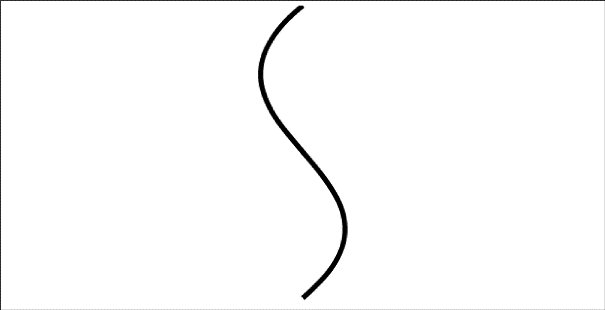

### 2.5.2　贝塞尔曲线

贝塞尔曲线要比弧线灵活得多，它有立方和平方两种形式：

+ context.bezierCurveTo(cp1x, cp1y, cp2x, cp2y, x, y)；
+ context.quadraticCurveTo(cpx, cpy, x, y)。

在二维空间中，贝塞尔曲线通过“起点”、“终点”以及两个决定曲线走向的“控制”点定义完成。一个普通的立方贝塞尔曲线使用两个点，平方贝塞尔曲线使用一个点。平方贝塞尔曲线是最简单的曲线（见图2-8），只需要终点以及一个控制点即可完成绘制。

```javascript
context.moveTo(0,0);
context.quadraticCurveTo(100,25,0,50);
```


<center class="my_markdown"><b class="my_markdown">图2-8　简单平方贝塞尔曲线</b></center>

这条曲线从（0，0）开始，到（0，50）结束。用来创建弧线的点位于（100，25），这个点大致上是圆弧的圆心。控制点的x值为100，把弧线拉伸成一个细长的曲线。

立方贝塞尔曲线具有两个控制点，因此带来了更多的选择，从而能够很容易地绘制出经典的“S”形曲线，如图2-9所示。

```javascript
context.moveTo(150,0);
context.bezierCurveTo(0,125,300,175,150,300);
```


<center class="my_markdown"><b class="my_markdown">图2-9　有两个控制点的贝塞尔曲线</b></center>

