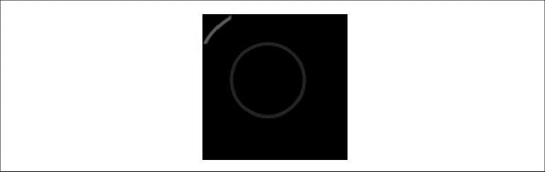

### 2.5.3　Canvas裁切区域

> 也可以将其他Canvas方法配合裁切区域使用，最常见的是arc()函数。
> 可以创建一个圆形的裁切区域，而不是矩形的裁切区域。

使用Canvas裁切区域可以限制路径及其子路径的绘制区域。首先，通过rect()函数设置一个用来绘图的矩形区域的环境属性；然后，调用clip()函数把用rect()函数定义的矩形设置为裁切区域。现在，无论在当前环境绘制什么内容，它只显示裁切区域以内的部分。这也可以理解成是绘图操作的一种蒙版。例2-5展示了它是如何工作的，裁切结果如图2-10所示。

```javascript
arc(float x, float y, float radius, float startAngle, 
float endAngle, boolean anticlockwise) 
```

本例将通过执行 save()和 restore() 函数来实现在红色圆圈周围进行剪裁。如果不这样做，就无法画出蓝色圆。读者不妨把例2-5中的save()and restore()行注释去掉，自己测试一下。

例2-5　Canvas裁切区域

```javascript
function drawScreen(){
　　　//在屏幕上绘制一个大方块
　　　context.fillStyle = "black";
　　　context.fillRect(10, 10, 200, 200);
　　　context.save();
　　　context.beginPath();
　　　//裁切画布从（0，0）点至50×50的正方形
　　　context.rect(0, 0, 50, 50);
　　　context.clip();
　　　//红色圆
　　　context.beginPath();
　　　context.strokeStyle = "red"; 
　　　context.lineWidth = 5;
　　　context.arc(100, 100, 100, (Math.PI/180)*0, (Math.PI/180)*360, false);
　　　//整圆
　　　context.stroke();
　　　context.closePath();
　　　context.restore();
　　　//再次裁切整个画布
　　　context.beginPath();
　　　context.rect(0, 0, 500, 500);
　　　context.clip();
　　　//绘制一个没有裁切的蓝线
　　　context.beginPath();
　　　context.strokeStyle = "blue";
　　　context.lineWidth = 5;
　　　context.arc(100, 100, 50, (Math.PI/180)*0, (Math.PI/180)*360, false);
　　　//整圆
　　　context.stroke();
　　　context.closePath();
}
```


<center class="my_markdown"><b class="my_markdown">图2-10　Canvas裁切区域</b></center>

例2-5首先在画布上画了一个200×200的黑色矩形，然后将Canvas裁切区域设置为rect(0,0,50,50)。clip()函数按照这些参数对画布进行裁切设置，所画的红色圆弧形只能看到在这个矩形以内的部分。最后，将裁切区域调整回rect(0,0,500,500)，画一个新的蓝色圆弧。此时，整个圆都能够看到。

提示

