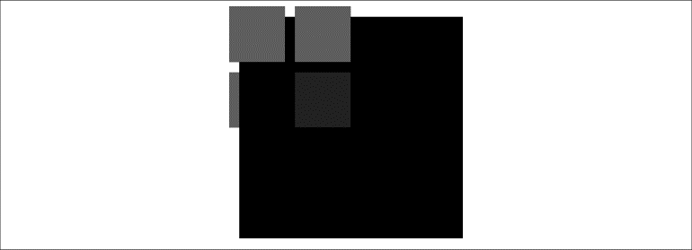

### 2.6　在画布上合成

合成是指如何精细控制画布上对象的透明度和分层效果。有两个属性可以控制Canvas合成操作：globalAlpha和globalCompositeOperation。

+ globalAlpha：globalAlpha Canvas属性的默认值为1.0（完全不透明），并且可以设置从0.0（完全透明）～1.0的值。这项Canvas属性必须在图形绘制之前设置。
+ globalCompositeOperation：globalCompositeOperation的值在globalalpha以及所有变换都生效后控制在当前canvas位图中绘制图形。

在下面的列表中，“源图形”是指要绘制在画布上的形状，“目标图形”是指显示在画布上的位图。

+ Copy：二者重叠，显示源图形而不显示目标图形。
+ destination-atop：目标图形位于源图形上，二者重叠且都不透明的地方显示目标图形，源图形不透明而目标图形透明的地方显示源图形，其余显示透明。
+ destination-in：目标图形在源图形内，二者都不透明的地方显示目标图形，其余显示透明。
+ destination-out：目标图形在源图形外，目标图形不透明而源图形透明的地方显示目标图形，其余显示透明。
+ destination-over：目标图形覆盖源图形，目标图形不透明的地方显示目标图形，其余显示源图形。
+ lighter：源图形加目标图形，显示源图形和目标图形之和，色值趋近于1.0。
+ source-atop：源图形在目标图形之上，二者重叠且都不透明的地方显示源图形，目标图形不透明而源图形透明的地方显示目标图形，其余显示透明。
+ source-in：源图形在目标图形内，二者都不透明的地方显示源图形，其余显示透明。
+ source-out：源图形在目标图形外，源图形不透明而目标图形透明的地方显示源图形，其余显示透明。
+ source-over：（默认）源图形覆盖目标图形，源图形不透明的地方显示源图形，其余显示目标图形。
+ xor：源图形xor目标图形，即异或源图形和目标图形。

例2-6显示了这些值如何影响形状绘制，结果如图2-11所示。

例2-6　Canvas合成示例

```javascript
function drawScreen(){
　　　//在屏幕上绘制一个大方块
　　　context.fillStyle = "black"; //
　　　context.fillRect(10, 10, 200, 200);
　　　//保留 globalCompositeOperation 原有值不变
　　　//现在绘制一个红色正方形
　　　context.fillStyle = "red";
　　　context.fillRect(1, 1, 50, 50);
　　　//现在设置为source-over
　　　context.globalCompositeOperation = "source-over";
　　　//在旁边再画一个红色正方形
　　　context.fillRect(60, 1, 50, 50);
　　　//现在设置为destination-atop
　　　context.globalCompositeOperation = "destination-atop";
　　　context.fillRect(1, 60, 50, 50);
　　　//现在设置globalAlpha
　　　context.globalAlpha = .5;
　　　//现在设置为source-atop
　　　context.globalCompositeOperation = "source-atop";
　　　context.fillRect(60, 60, 50, 50);
}
```


<center class="my_markdown"><b class="my_markdown">图2-11　Canvas合成示例</b></center>

提示

> 不幸地是，context.globalCompositeOperation = "destinationatop"在浏览器上不能再正常使用了。

如例2-6所示，这里测试了globalCompositeOperation和globalAlpha Canvas属性。当指定字符串为sourceover时，实际上是将globalCompositeOperation重设回默认值。然后创建了几个红色方形来显示不同的合成选项和组合。注意，destination-atop切换到当前Canvas位图之下的新绘制形状，globalAlpha属性只影响设置之后所画的形状。这意味着，不必为绘制新的形状设定新的透明度而使用save()和restore() Canvas对状态进行操作。

本书将在2.7节讲解一些影响整个画布的变换。因此，如果要变换新绘制的形状，必须使用save()和restore()函数。

