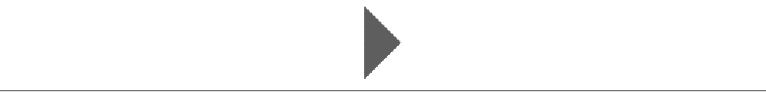
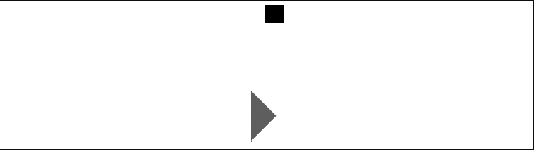
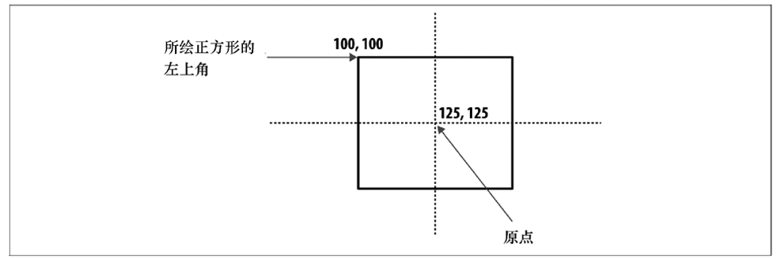
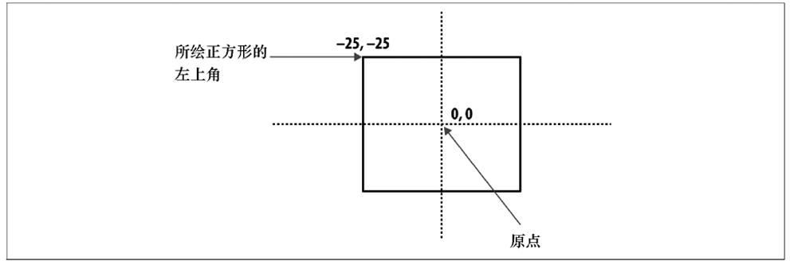
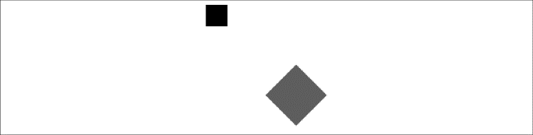
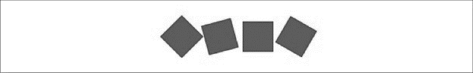

### 2.7.1　旋转和平移变换

首先指定画布上的对象面向左侧时处于角度为0的旋转状态（如果对象有“面”，则很重要；如果对象没有“面”，也可将其作为参照）。例如，画一个方框（四边等长），它并没有一个与其他边相比而言初始就朝向左侧的“面”。现在，将其画出来作为参考。

```javascript
//绘制一个红色正方形
context.fillStyle = "red";
context.fillRect(100,100,50,50);
```

如果将画布旋转45°，那么需要进行以下操作。将Canvas变换设置为identity（或“reset”）矩阵。

```javascript
context.setTransform(1,0,0,1,0,0);
```

由于Canvas使用的是弧度，而不是角度，在设定变换时应将45°角转换成弧度。

```javascript
var angleInRadians = 45 * Math.PI / 180;
context.rotate(angleInRadians);
```

#### 1．在调用setTransform()或其他变换函数后，将变换应用到形状和路径上

如果照抄这段代码运行，将发生很有趣的运行结果：屏幕上什么也没有！这是因为只有对画布应用setTransform()函数后才对形状起作用。示例中先绘制了一个正方形，然后设置变换属性。这将不会对这个使正方形发生改变（或者变换）。例2-7给出了能产生预想结果的正确代码顺序，结果如图2-12所示。

例2-7　简单旋转变换

```javascript
function drawScreen(){
　　　//绘制一个红色正方形
　　　context.setTransform(1,0,0,1,0,0);
　　　var angleInRadians = 45 * Math.PI / 180;
　　　context.rotate(angleInRadians);
　　　context.fillStyle = "red";
　　　context.fillRect(100,100,50,50);
　 }
```


<center class="my_markdown"><b class="my_markdown">图2-12　简单旋转变换</b></center>

虽然得到了变换结果，但是估计和读者想要的结果会有所不同。虽然红色的方框旋转了，但是好像画布也跟着一起旋转了。实际上，画布并没有旋转，context.rotate()函数调用后只有部分被绘制出来。那么，为什么这个正方形旋转到了屏幕外？因为旋转原点设在了“nontranslated”（0，0）点，所以导致了正方形从整个画布的左上角旋转。

例2-8提供了一个略微不同的场景：先画一个黑色方块，然后设置旋转变换，最后再画这个红色方块。结果如图2-13所示。

例2-8　旋转以及Canvas状态

```javascript
function drawScreen(){
　　　//绘制黑色正方形
　　　context.fillStyle = "black";
　　　context.fillRect(20,20,25,25);
　　　//绘制红色正方形
　　　context.setTransform(1,0,0,1,0,0);
　　　var angleInRadians = 45 * Math.PI / 180;
　　　context.rotate(angleInRadians);
　　　context.fillStyle = "red";
　　　context.fillRect(100,100,50,50);
　 }
```


<center class="my_markdown"><b class="my_markdown">图2-13　旋转以及画布状态</b></center>

这个黑色小方块没受到旋转的影响，因为只有调用context.rotate()函数之后绘制的形状才会受到影响。

同样，红方块移到了左侧之外。重申一下，这是因为画布不知道旋转的原点在哪里而造成的。如果没有平移到实际的原点，Canvas就会认为就在点（0，0），结果导致context.rotate()函数围绕点（0，0）旋转。这将会使读者领会到下面的内容。

#### 2．只有将原点平移至形状中心，对象才会围着自己转

将例2-8加以改变，使红色正方形能在旋转45°的同时保持位置不变。

首先，设置好控制红色正方形属性的fillRect()函数的变量。虽然不必这样做，但是这会使代码更易于阅读和调整。

```javascript
var x = 100;
var y = 100;
var width = 50;
var height = 50;
```

接下来，使用context.translate()函数，将画布原点平移到红色正方形的中心点。这个函数可以将画布原点移到（x，y）处。这里将原点x坐标值设为红色正方形左上角的x值（100）加上其一半的宽度。使用前面创建的变量即可控制这个红色正方形的属性，如下所示：

```javascript
x+0.5*width
```

接下来，确定原点平移的y坐标值。这次使用左上角的y值和形状的高度值，如下：

```javascript
y+.05*height
```

translate()函数语句如下：

```javascript
context.translate(x+.05*width, y+.05*height)
```

既然画布已经平移到了正确的原点，下面就可以进行旋转变换了，代码不变。

```javascript
context.rotate(angleInRadians);
```

最后，绘制出形状。由于画布原点已经移动到将要绘制形状的位置，因此不能简单重复使用例2-8中同样的数值。现在，将（125，125）作为一切绘制操作的原点。125是将正方形左上角的x值（100）加上其一半宽度（25）得来的。y值同上。translate()方法调用完成。

绘制对象需要从正确的左上角坐标值（x，y）开始，进而从原点的x值减去宽的一半，从y值减去高的一半。

```javascript
context.fillRect(-0.5*width,-0.5*height, width, height);
```

为什么要这样做？如图2-14所示。


<center class="my_markdown"><b class="my_markdown">图2-14　新建平移点</b></center>

试想一下，从左上角开始绘制正方形，如果原点在（125，125），左上角实际上是（100，100）。然而原点已经平移过了，也就是说，（125，125）现在相当于（0，0）。如果在未平移的画布上画这个方块，则应从（−25，−25）点开始。

因此，必须把绘制正方形当成从（0，0）开始，而不是从（125，125）开始。实际绘图的时候，必须使用图2-15所示的坐标。


<center class="my_markdown"><b class="my_markdown">图2-15　基于平移点绘制</b></center>

小结：变换需要将原点平移到正方形的中心，以使其围绕自己旋转。绘图的时候，需要使代码将（125，125）当作实际的（0，0）点。如果不平移原点，那么也可以使用（125，125）作为正方形的中心，如图2-14所示。例2-9说明了代码如何运行，结果如图2-16所示。

例2-9　围绕中心点旋转

```javascript
function drawScreen(){
　　　//绘制黑色正方形
　　　context.fillStyle = "black";
　　　context.fillRect(20,20 ,25,25);
　　　//绘制红色正方形
　　　context.setTransform(1,0,0,1,0,0);
　　　var angleInRadians = 45 * Math.PI / 180;
　　　var x = 100;
　　　var y = 100;
　　　var width = 50;
　　　var height = 50;
　　　context.translate(x+.5*width, y+.5*height);
　　　context.rotate(angleInRadians);
　　　context.fillStyle = "red";
　　　context.fillRect(-.5*width,-.5*height , width, height);
　 }
```


<center class="my_markdown"><b class="my_markdown">图2-16　围绕中心点旋转</b></center>

再看一个旋转的例子。例2-10在例2-9的基础上增加了4个单独的40×40的正方形，每个稍加旋转，结果如图2-17所示。

例2-10　旋转多个正方形

```javascript
function drawScreen(){
　　　//绘制一个红色正方形
　　　context.setTransform(1,0,0,1,0,0);
　　　var angleInRadians = 45 * Math.PI / 180;
　　　var x = 50;
　　　var y = 100;
　　　var width = 40;
　　　var height = 40;
　　　context.translate(x+.5*width, y+.5*height);
　　　context.rotate(angleInRadians);
　　　context.fillStyle = "red";
　　　context.fillRect(-.5*width,-.5*height , width, height);
　　　context.setTransform(1,0,0,1,0,0);
　　　var angleInRadians = 75 * Math.PI / 180;
　　　var x = 100;
　　　var y = 100;
　　　var width = 40;
　　　var height = 40;
　　　context.translate(x+.5*width, y+.5*height);
　　　context.rotate(angleInRadians);
　　　context.fillStyle = "red";
　　　context.fillRect(-.5*width,-.5*height , width, height);
　　　context.setTransform(1,0,0,1,0,0);
　　　var angleInRadians = 90 * Math.PI / 180;
　　　var x = 150;
　　　var y = 100;
　　　var width = 40;
　　　var height = 40;
　　　context.translate(x+.5*width, y+.5*height);
　　　context.rotate(angleInRadians);
　　　context.fillStyle = "red";
　　　context.fillRect(-.5*width,-.5*height , width, height);
　　　context.setTransform(1,0,0,1,0,0);
　　　var angleInRadians = 120 * Math.PI / 180;
　　　var x = 200;
　　　var y = 100;
　　　var width = 40;
　　　var height = 40;
　　　context.translate(x+.5*width, y+.5*height);
　　　context.rotate(angleInRadians);
　　　context.fillStyle = "red";
　　　context.fillRect(-.5*width,-.5*height , width, height);
}
```


<center class="my_markdown"><b class="my_markdown">图2-17　旋转多个正方形</b></center>

