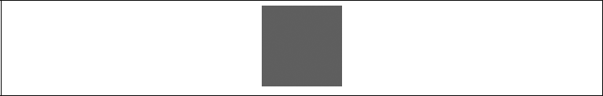

### 2.7.2　缩放变换

context.scale()函数有两个参数：第一个是x轴的缩放属性，第二个是y轴的缩放属性。一个对象的正常缩放大小数值是1。因此，如果要将一个对象放大两倍，就可以将两个参数都设为2。在drawScreen()中使用下面这段代码可以产生一个红色正方形，如图2-18所示。

```javascript
context.setTransform(1,0,0,1,0,0);
context.scale(2,2);
context.fillStyle = "red";
context.fillRect(100,100 ,50,50);
```


<center class="my_markdown"><b class="my_markdown">图2-18　简单缩放正方形</b></center>

如果测试这段代码，就会发现缩放的工作方式与旋转差不多。由于没有平移原点来对正方形进行缩放，而仍用画布左上角作为画布原点，因此红色的正方形向右下方移动了。如果从正方形的中心缩放，就需要在缩放之前将原点平移到正方形中心，然后再围绕这个中心点绘图（见例2-9）。例2-11的结果如图2-19所示。

例2-11　从中心点缩放

```javascript
function drawScreen(){
　　　//绘制一个红色正方形
　　　context.setTransform(1,0,0,1,0,0);
　　　var x = 100;
　　　var y = 100;
　　　var width = 50;
　　　var height = 50;
　　　context.translate(x+.5*width, y+.5*height);
　　　context.scale(2,2);
　　　context.fillStyle = "red";
　　　context.fillRect(-.5*width,-.5*height , width, height);
　 }
```


<center class="my_markdown"><b class="my_markdown">图2-19　从中心点缩放</b></center>

