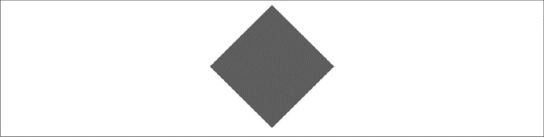
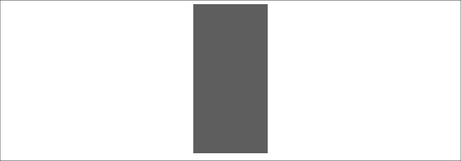

### 2.7.3　缩放和旋转组合变换

如果对对象进行缩放和旋转操作，Canvas变换可以轻松地组合并生成想要的效果，如图2-20所示。例2-12显示了如何在前面的示例中使用scale(2,2)和rotate(angleInRadians)进行组合变换。


<center class="my_markdown"><b class="my_markdown">图2-20　缩放和旋转组合</b></center>

例2-12　缩放和旋转组合

```javascript
function drawScreen(){
　　　context.setTransform(1,0,0,1,0,0);
　　　var angleInRadians = 45 * Math.PI / 180;
　　　var x = 100;
　　　var y = 100;
　　　var width = 50;
　　　var height = 50;
　　　context.translate(x+.5*width, y+.5*height);
　　　context.scale(2,2);
　　　context.rotate(angleInRadians);
　　　context.fillStyle = "red";
　　　context.fillRect(-.5*width,-.5*height , width, height);
　 }
```

例2-13也组合了旋转和缩放，这个例子是对矩形进行操作，如图2-21所示。

例2-13　非正方形对象的缩放和旋转

```javascript
function drawScreen(){
　　　//绘制一个红色矩形
　　　context.setTransform(1,0,0,1,0,0);
　　　var angleInRadians = 90 * Math.PI / 180;
　　　var x = 100;
　　　var y = 100;
　　　var width = 100;
　　　var height = 50;
　　　context.translate(x+.5*width, y+.5*height);
　　　context.rotate(angleInRadians);
　　　context.scale(2,2);
　　　context.fillStyle = "red";
　　　context.fillRect(-.5*width,-.5*height , width, height);
　 }
```


<center class="my_markdown"><b class="my_markdown">图2-21　非正方形对象的缩放和旋转</b></center>

> **找到任何形状的中心**
> 对矩形或其他形状进行旋转和缩放与对正方形非常类似，实际上只要在缩放、旋转或者组合缩放旋转前将原点平移到形状的中心，都可以得到想要的效果。记住，任何形状的中心点都是半宽的x值和半高的y值！这需要使用边界框理论找到中心点。
> 图2-22说明了这个理论，尽管不是简单形状，也可以找到包含对象任一点的边界框。图2-22接近正方形，但是同样符合矩形的边界框理论。
> 
> <center class="my_markdown"><b class="my_markdown">图2-22　复杂形状的边界框</b></center>

