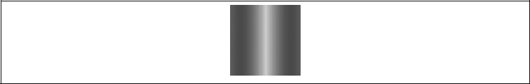
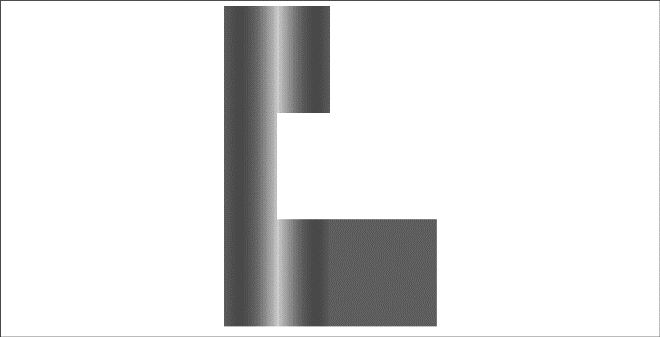
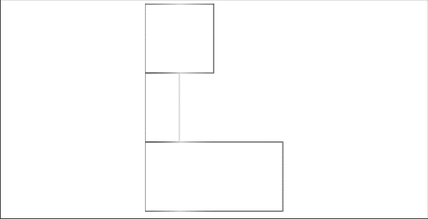
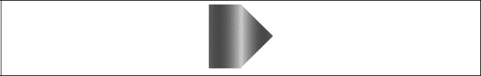
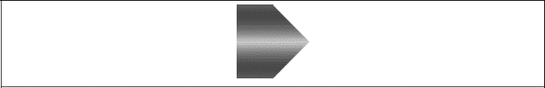
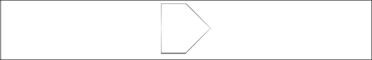
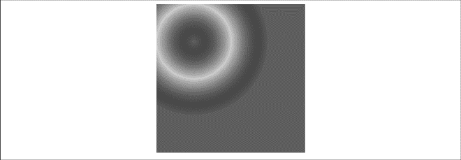
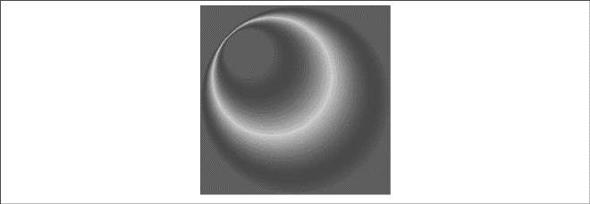
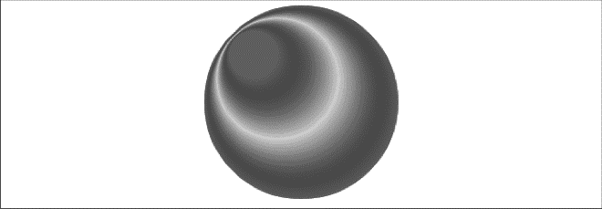
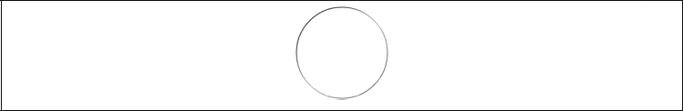

### 2.8.2　填充渐变形状

在画布上创建渐变填充有两个基本选项：线性或径向。线性渐变创建一个水平、垂直或者对角线的填充图案。径向渐变自中心点创建一个放射状填充。下面是它们的一些示例。

#### 1．线性渐变

线性渐变有3种基本样式：水平、垂直和对角线。

（1）线性水平渐变：通过沿对象设置的颜色断点来控制渐变颜色。

例2-14为创建一个简单水平渐变，如图2-23所示。

例2-14　线性水平渐变

```javascript
function drawScreen(){
　　　// 水平渐变值必须保持为0
　　　var gr = context.createLinearGradient(0, 0, 100, 0);
　　　// 添加颜色断点
　　　gr.addColorStop(0,'rgb(255,0,0)');
　　　gr.addColorStop(.5,'rgb(0,255,0)');
　　　gr.addColorStop(1,'rgb(255,0,0)');
　　　// 应用fillStyle生成渐变
　　　context.fillStyle = gr;
　　　context.fillRect(0, 0,100,100);
　 }
```


<center class="my_markdown"><b class="my_markdown">图2-23　线性水平渐变</b></center>

创建一个水平渐变，必须先创建一个变量（gr）来指代一个新的渐变，设置方式如下。

```javascript
var gr = context.createLinearGradient(0,0,100,0);
```

createLinearGradient方法调用中的4个值是开始渐变的左上角的x坐标和y坐标，以及结束渐变的右下角的x坐标和y坐标。示例从（0，0）开始，到（100，0）结束。请注意，当创建一个水平渐变的时候，y值都是0，创建垂直渐变的时候正好相反。

一旦定义了渐变的大小，就需要使用两个参数值来加入颜色断点。第一个是相对位置的开始渐变颜色的渐变原点，第二个是渐变的颜色。相对位置的值必须在0.0～1.0之间。

```javascript
gr.addColorStop(0,'rgb(255,0,0)');
gr.addColorStop(.5,'rgb(0,255,0)');
gr.addColorStop(1,'rgb(255,0,0)');
```

例2-14中设置的渐变是起点（0）为红色、中心点（0.5）为绿色、终点（1）为红色。这将填充一个“红—绿—红”渐变形状。

接下来，应用context.fillStyle生成刚才创建的渐变。

```javascript
context.fillStyle = gr;
```

最后，在画布上创建一个矩形。

```javascript
context.fillRect(0, 0, 100, 100);
```

请注意，刚刚创建了一个与渐变大小完全相同的矩形。这里还可以改变输出矩形的大小，方法如下。

```javascript
context.fillRect(0, 100, 50, 100);
context.fillRect(0, 200, 200, 100);
```

在例2-14的基础上，例2-15增加了两个新的填充矩形，如图2-24所示。请注意，渐变充满可用空间，最终的颜色填充的区域比定义的渐变区域要大。

例2-15　多个渐变填充对象

```javascript
function drawScreen(){
　　　var gr = context.createLinearGradient(0, 0, 100, 0);
　　　// 添加颜色断点
　　　gr.addColorStop(0,'rgb(255,0,0)');
　　　gr.addColorStop(.5,'rgb(0,255,0)');
　　　gr.addColorStop(1,'rgb(255,0,0)');
　　　// 应用fillStyle生成渐变
　　　context.fillStyle = gr;
　　　context.fillRect(0, 0, 100, 100);
　　　context.fillRect(0, 100, 50, 100);
　　　context.fillRect(0, 200, 200, 100);
　　　 }
```


<center class="my_markdown"><b class="my_markdown">图2-24　多对象线性水平渐变</b></center>

① 在边框上应用水平渐变色。

渐变可以应用到任何形状，甚至是形状边框。例2-16使用例2-15中的填充矩形创建了一个strokeRect形状，而不是创建填充矩形。图2-25显示了不同的结果。

例2-16　水平描边渐变

```javascript
function drawScreen(){
　　　var gr = context.createLinearGradient(0, 0, 100, 0);
　　　// 添加颜色断点
　　　gr.addColorStop(0,'rgb(255,0,0)');
　　　gr.addColorStop(.5,'rgb(0,255,0)');
　　　gr.addColorStop(1,'rgb(255,0,0)');
　　　// 将水平渐变应用到描边
　　　// 应用fillStyle生成渐变
　　　context.strokeStyle = gr;
　　　context.strokeRect(0, 0, 100, 100);
　　　context.strokeRect(0, 100, 50, 100);
　　　context.strokeRect(0, 200, 200, 100);
　 }
```


<center class="my_markdown"><b class="my_markdown">图2-25　水平描边渐变</b></center>

② 在复杂形状上应用水平渐变色。

读者也可以将线性渐变应用到由点组成的封闭形状，如例2-17所示。如果形状的起止点相同，就是封闭的。

例2-17　复杂形状水平渐变

```javascript
function drawScreen(){
　　　var gr = context.createLinearGradient(0, 0, 100, 0);
　　　//添加颜色断点
　　　gr.addColorStop(0,'rgb(255,0,0)');
　　　gr.addColorStop(.5,'rgb(0,255,0)');
　　　gr.addColorStop(1,'rgb(255,0,0)');
　　　// 应用fillStyle生成渐变
　　　context.fillStyle = gr;
　　　context.beginPath();
　　　context.moveTo(0,0);
　　　context.lineTo(50,0);
　　　context.lineTo(100,50);
　　　context.lineTo(50,100);
　　　context.lineTo(0,100);
　　　// 将水平渐变应用到复杂形状
　　　context.lineTo(0,0);
　　　context.stroke();
　　　context.fill();
　　　context.closePath();
　 }
```

例2-17使用了context.fill()命令将当前的fillStyle填充到形状中，输出效果如图2-26所示。


<center class="my_markdown"><b class="my_markdown">图2-26　复杂形状水平渐变</b></center>

图2-26显示了通过点创建的新形状，只要点是封闭的，填充就会按需要呈现。

（2）垂直渐变色：垂直渐变与水平渐变的创建方式非常类似。不同点在于：y值不全是0，而x值必须全是0。

例2-18显示了例2-17中创建的水平渐变形状显示为垂直渐变的情况，输出结果如图2-27所示。

例2-18　垂直渐变

```javascript
function drawScreen(){
　　　var gr = context.createLinearGradient(0, 0, 0, 100);
　　　//添加颜色断点
　　　gr.addColorStop(0,'rgb(255,0,0)');
　　　gr.addColorStop(.5,'rgb(0,255,0)');
　　　gr.addColorStop(1,'rgb(255,0,0)');
　　　// 应用fillStyle生成渐变
　　　context.fillStyle = gr;
　　　context.beginPath();
　　　context.moveTo(0,0);
　　　context.lineTo(50,0);
　　　context.lineTo(100,50);
　　　context.lineTo(50,100);
　　　context.lineTo(0,100);
　　　context.lineTo(0,0);
　　　context.stroke();
　　　context.fill();
　　　context.closePath();
　 }
```


<center class="my_markdown"><b class="my_markdown">图2-27　垂直渐变示例</b></center>

例2-18和例2-17的唯一不同之处在于创建线性渐变的线。

水平渐变（例2-17）如下所示。

```javascript
var gr = context.createLinearGradient(0, 0, 100, 0);
```

垂直渐变（例2-18）如下所示。

```javascript
var gr = context.createLinearGradient(0, 0, 0, 100);
```

形状边框水平渐变的规则同样适用于垂直渐变。例2-19将例2-18中的形状从填充改成描边，边框效果如图2-28所示。

例2-19　垂直渐变描边

```javascript
function drawScreen(){
　　　var gr = context.createLinearGradient(0, 0, 0, 100);
　　　//添加颜色断点
　　　gr.addColorStop(0,'rgb(255,0,0)');
　　　gr.addColorStop(.5,'rgb(0,255,0)');
　　　gr.addColorStop(1,'rgb(255,0,0)');
　　　//应用fillStyle生成渐变
　　　context.strokeStyle = gr;
　　　context.beginPath();
　　　context.moveTo(0,0);
　　　context.lineTo(50,0);
　　　context.lineTo(100,50);
　　　context.lineTo(50,100);
　　　context.lineTo(0,100);
　　　context.lineTo(0,0);
　　　context.stroke();
　　　context.closePath();
　 }
```


<center class="my_markdown"><b class="my_markdown">图2-28　垂直渐变描边</b></center>

（3）对角线渐变：读者可以轻松创建一个对角线渐变，只需修改createLinearGradient()函数的第二个x值和y值。

```javascript
var gr= context.createLinearGradient(0, 0, 100, 100);
```

为创建一个图2-29所示的完美对角线渐变，可以填充一个与对角线渐变相同大小的正方形。代码如例2-20所示。

例2-20　对角线渐变

```javascript
function drawScreen(){
　　　var gr = context.createLinearGradient(0, 0, 100, 100);
　　　//添加颜色断点
　　　gr.addColorStop(0,'rgb(255,0,0)');
　　　gr.addColorStop(.5,'rgb(0,255,0)');
　　　gr.addColorStop(1,'rgb(255,0,0)');
　　　//应用fillStyle生成渐变
　　　context.fillStyle = gr;
　　　context.beginPath();
　　　context.moveTo(0,0);
　　　context.fillRect(0,0,100,100)
　　　context.closePath();
　 }
```


<center class="my_markdown"><b class="my_markdown">图2-29　对角线渐变示例</b></center>

#### 2．径向渐变

径向渐变的定义过程和线性渐变非常类似。尽管径向渐变需要6个参数设置而线性渐变仅需4个，但是它同样采用颜色断点的概念来创建颜色变化。

6个参数用来定义两个圆的圆心和半径。第一个圆是开始圈，第二个圆是结束圈。举例如下。

```javascript
var gr = context.createRadialGradient(50,50,25,50,50,100);
```

第一个圆的圆心位于（50，50），半径为25；第二个圆的圆心位于（50，50），半径为100。

这将会创建两个同心圆，然后向线性渐变那样设置颜色断点。

```javascript
gr.addColorStop(0,'rgb(255,0,0)');
gr.addColorStop(.5,'rgb(0,255,0)');
gr.addColorStop(1,'rgb(255,0,0)');
```

例2-21将这些代码合并起来，结果如图2-30所示。

例2-21　简单径向渐变

```javascript
function drawScreen(){
　　　var gr = context.createRadialGradient(50,50,25,50,50,100);
　　　//添加颜色断点
　　　gr.addColorStop(0,'rgb(255,0,0)');
　　　gr.addColorStop(.5,'rgb(0,255,0)');
　　　gr.addColorStop(1,'rgb(255,0,0)');
　　　//应用fillStyle生成渐变
　　　context.fillStyle = gr;
　　　context.fillRect(0, 0, 200, 200);
　 }
```


<center class="my_markdown"><b class="my_markdown">图2-30　简单径向渐变</b></center>

例2-22将第二个圆远离第一个圆，产生的效果如图2-31所示。

例2-22　复杂径向渐变

```javascript
function drawScreen(){
　　　var gr = context.createRadialGradient(50,50,25,100,100,100);
　　　//添加颜色断点
　　　gr.addColorStop(0,'rgb(255,0,0)');
　　　gr.addColorStop(.5,'rgb(0,255,0)');
　　　gr.addColorStop(1,'rgb(255,0,0)');
　　　//应用fillStyle生成渐变
　　　context.fillStyle = gr;
　　　context.fillRect(0, 0, 200, 200);
}
```


<center class="my_markdown"><b class="my_markdown">图2-31　复杂径向渐变</b></center>

如同线性渐变一样，复杂形状同样可以进行径向渐变填充。例2-23对本章前面的弧形示例应用了径向渐变，结果如图2-32显示。

例2-23　圆形径向渐变

```javascript
function drawScreen(){
　　　var gr = context.createRadialGradient(50,50,25,100,100,100);
　　　//添加颜色断点
　　　gr.addColorStop(0,'rgb(255,0,0)');
　　　gr.addColorStop(.5,'rgb(0,255,0)');
　　　gr.addColorStop(1,'rgb(255,0,0)');
　　　//应用fillStyle生成渐变
　　　context.fillStyle = gr;
　　　context.arc(100, 100, 100, (Math.PI/180)*0, (Math.PI/180)*360, false);
　　　context.fill();
　 }
```


<center class="my_markdown"><b class="my_markdown">图2-32　圆形径向渐变</b></center>

例2-23将例2-22的径向渐变应用到圆上，而不是应用到矩形上。这样就清除了形状背景的红色正方形。

也可以将径向渐变应用到弧形描边，就像填充那样。代码如例2-24所示，效果如图2-23所示。

例2-24　弧形描边渐变

```javascript
function drawScreen(){
　　　var gr = context.createRadialGradient(50,50,25,100,100,100);
　　　//添加颜色断点
　　　gr.addColorStop(0,'rgb(255,0,0)');
　　　gr.addColorStop(.5,'rgb(0,255,0)');
　　　gr.addColorStop(1,'rgb(255,0,0)');
　　　//应用fillStyle生成渐变
　　　context.strokeStyle = gr;
　　　context.arc(100, 100, 50, (Math.PI/180)*0, (Math.PI/180)*360, false)
　　　context.stroke();
　 }
```


<center class="my_markdown"><b class="my_markdown">图2-33　弧形描边渐变</b></center>

例2-24创建了一个比例2-23中小一点的圆，径向渐变将显示在弧形的边框上。如果与例2-23中的圆大小相同，这里将得到一个纯红色填充，因为径向渐变在圆形直径边缘将是纯红色。

