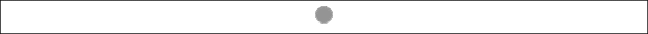
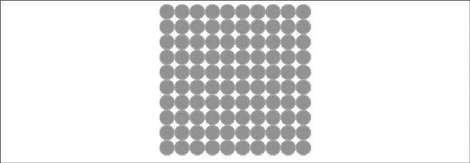
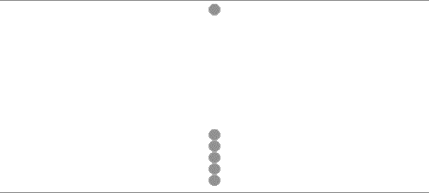
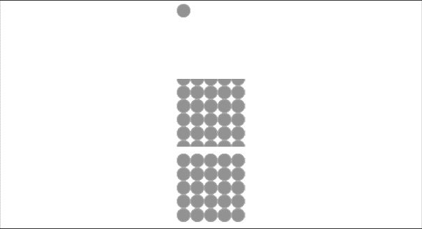

### 2.9　用图案填充形状

本书将在第4章讲解如何在画布上使用位图，这里仅快速介绍如何将图像用作形状填充图案。

填充图案通过createPattern()函数进行初始化。它有两个参数：第一个是Image对象实例，第二个是String表示在形状中如何显示repeat图案。读者可以使用一个加载图像或者整个画布作为形状的填充图案。

有以下4种图像填充类型：

+ repeat；
+ repeat-x；
+ repeat-y；
+ no-repeat。

现代的浏览器对这4种类型的支持程度不同，不过，普遍都能支持标准的repeat类型。先来介绍repeat类型，然后简单介绍其他3称类型。

图2-34显示了一个简单位图填充图案的功能测试，这是一个透明背景上的20×20的绿色圆形，存储为fill_20x20.gif文件。


<center class="my_markdown"><b class="my_markdown">图2-34　填充用的fill_20x20.gif图像</b></center>

例2-25测试了使用repeat字符串创建一个充满小圆点的正方形，如图2-35所示。

例2-25　使用repeat填充图像文件

```javascript
function drawScreen(){
　　　var fillImg = new Image();
　　　fillImg.src = 'fill_20x20.gif';
　　　fillImg.onload = function(){
　　　　 var fillPattern = context.createPattern(fillImg,'repeat');
　　　　 context.fillStyle = fillPattern;
　　　　 context.fillRect(0,0,200,200);
　　 }
}
```


<center class="my_markdown"><b class="my_markdown">图2-35　重复填充示例</b></center>

如果没有加载完成，最好不要使用Image实例。第4章将会进行详细讨论，现在只需简单创建一个在线onload事件处理器功能，在Image就绪之后就会调用此事件。repeat图案字符串非常好地填充到了200×200的正方形中。repeat字符串代码如例2-26所示，结果如图2-36～图2-38所示。

例2-26　使用no-repeat、repeat-x和repeat-y字符串

```javascript
function drawScreen(){
　　　var fillImg = new Image();
　　　fillImg.src = 'fill_20x20.gif';
　　　fillImg.onload = function(){
　　　　 var fillPattern1 = context.createPattern(fillImg,'no-repeat');
　　　　 var fillPattern2 = context.createPattern(fillImg,'repeat-x');
　　　　 var fillPattern3 = context.createPattern(fillImg,'repeat-y');
　　　　 context.fillStyle = fillPattern1;
　　　　 context.fillRect(0,0,100,100);
　　　　 context.fillStyle = fillPattern3;
　　　　 context.fillRect(0,220,100,100);
　　　　 context.franslate(0,110);
　　　　 context.fillStyle = fillPattern2;
　　　　 context.fillRect(0,0,100,100);
　　　}
}
```

提示

> 每种浏览器显示这些图案的方式都不一样，而且总在变化。所以，在开发时要用新浏览器检验一下。


<center class="my_markdown"><b class="my_markdown">图2-36　no-repeat、repeat-x和repeat-y在Safari浏览器中的效果</b></center>


<center class="my_markdown"><b class="my_markdown">图2-37　no-repeat、repeat-x和repeat-y在Firefox浏览器中的效果</b></center>


<center class="my_markdown"><b class="my_markdown">图2-38　no-repeat、repeat-x和repeat-y在Chrome浏览器中的效果</b></center>

当repeat参数使用repeat-x和repeat-y字符串时，只有Firefox看起来差别明显。第4章将更多地讲解位图填充和其他用法的示例。

请注意，如果要让repeat-x填充模式生效，则需要先平移到所绘制点的x、y坐标，然后使用是(0,0)作为fillRect函数的x、y坐标的参数。

