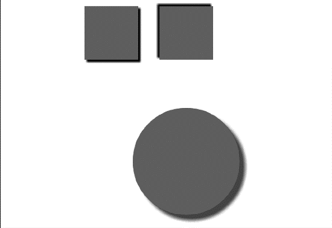

### 2.10　创建阴影

读者可以使用4个参数给画布上的形状添加阴影。与2.9节所讲的填充图案一样，这项功能还没有被所有兼容HTML5的浏览器完全支持。

可以通过设置以下4个Canvas参数来添加阴影：

+ shadowOffsetX；
+ shadowOffsetY；
+ shadowBlur；
+ shadowColor。

shadowOffsetX和shadowOffsetY值可以为正值或负值——负值将会在左侧和上方创建阴影，反之将会在底部和右侧创建阴影。shadowBlur属性用来设置阴影模糊效果的程度。这3个参数都不受当前Canvas变换矩阵影响。shadowColor属性可以是任何HTML4颜色的常量字符串——rgb()或rgba()——或者是十六进制数值字符串。

例2-27和图2-39显示了几个不同阴影效果的方块。


<center class="my_markdown"><b class="my_markdown">图2-39　给对象添加阴影</b></center>

例2-27　给对象添加阴影

```javascript
function drawScreen(){
　　　context.fillStyle = 'red';
　　　context.shadowOffsetX = -4;
　　　context.shadowOffsetY = -4;
　　　context.shadowColor = 'black';
　　　context.shadowBlur = 4;
　　　context.fillRect(10,10,100,100);
　　　context.shadowOffsetX = -4;
　　　context.shadowOffsetY = -4;
　　　context.shadowColor = 'black';
　　　context.shadowBlur = 4;
　　　context.fillRect(150,10,100,100);
　　　context.shadowOffsetX = 10;
　　　context.shadowOffsetY = 10;
　　　context.shadowColor = 'rgb(100,100,100)';
　　　context.shadowBlur = 8;
　　　context.arc(200, 300, 100, (Math.PI/180)*0, (Math.PI/180)*360, false)
　　　context.fill();
}
```

如图2-39所示，如果同时调整shadowOffset值和shadowBlur值可以创建不同的阴影。当然，Canvas还可以为由路径和弧形组成的复杂形状创建阴影。

