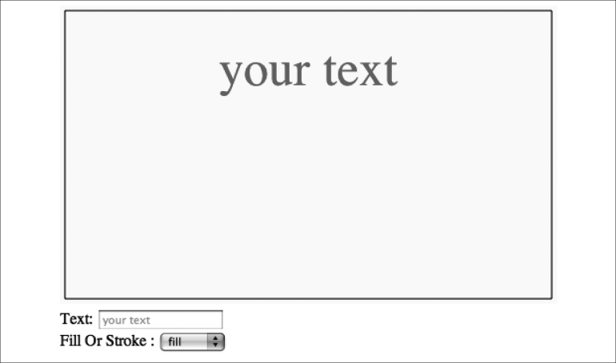
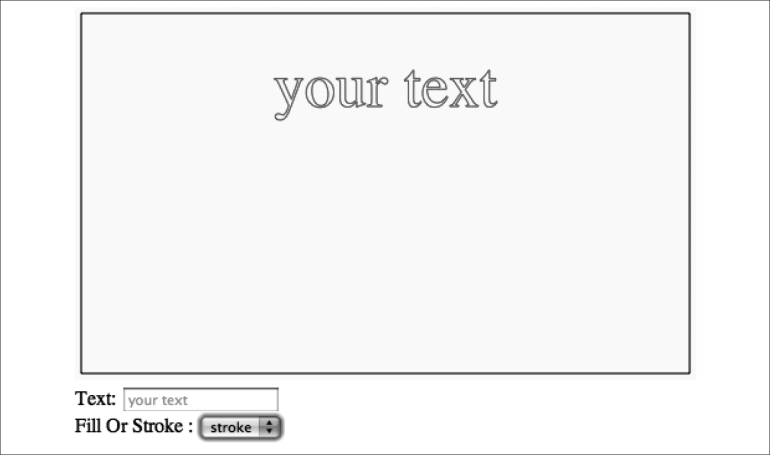

### 3.1.5　fillText和strokeText

> **eval()**
> 虽然本章为每个事件处理程序中类似的应用程序都创建了一个单独的函数，但实际上它们以相同的方式工作。然而，一些开发者会倾向于使用eval()函数，作为其对控制更改Text Arranger的HTML元素的事件处理程序，如下所示。
> 上面这段代码使用eval()创建并执行JavaScript代码。它动态地创建了HTML元素的名字，从而不必单独创建多个事件处理函数。然而，许多开发者慎重使用eval()，因为它开启了安全漏洞。不但使调试代码更难，还会在使用它时增加程序的风险。

context.fillText()函数（见图3-1）将在画布上渲染单色的文本。在context. fillColor属性中设置所用的颜色，在context.font属性中设置所用的字体。函数的调用如下：

```javascript
fillText([text],[x],[y],[maxWidth]);
```

```javascript
var formElement = document.getElementById("textBox"); 
　　formElement.addEventListener('keyup', function(e) { 
  　　  applyChange('message', e) }, false); 
formElement = document.getElementById("fillOrStroke"); 
formElement.addEventListener('change', function(e) {
　　applyChange('fillOrStroke', e) }, false); 
function applyChange (variable, e) {
　　eval(variable + ' = e.target.value'); 
　　drawScreen(); } 
```

其中，各参数的含义如下：

+ Text——在画布上渲染的文本；
+ x——文本在画布上的x坐标；
+ y——文本在画布上的y坐标。
+ maxWidth——在画布上渲染文本的最大宽度（在写这本书时，这个属性才刚刚添加到浏览器中）。


<center class="my_markdown"><b class="my_markdown">图3-1　程序运行时fillText的效果</b></center>

context.strokeText() 函数（见图3-2）与此类似，但是它指定了在画布上文本笔触的轮廓。在context.strokeColor属性中设置渲染笔触所用的颜色，在context.font属性中设置所用的字体。函数的调用如下：

```javascript
strokeText([text],[x],[y],[maxWidth])
```

其中，各参数的含义如下：

+ Text——在画布上渲染的文本；
+ x——文本在画布上的x坐标；
+ y——文本在画布上的y坐标；
+ maxWidth——在画布上渲染文本的最大宽度）在写本书时，还没有在任何浏览器中实现这个属性）。


<center class="my_markdown"><b class="my_markdown">图3-2　strokeText设置轮廓属性</b></center>

下一迭代的Text Arranger中，用户可以选择fillText或strokeText，或者两者都选。同时选择两者，会给fillText设置黑色的轮廓（strokeText）。在HTML<form>中添加<select>部分，id为fillOrStroke，这将使得用户能够进行选择。

Fill Or Stroke:

```javascript
<select id = "fillOrStroke">
　<option value = "fill">fill</option>
　<option value = "stroke">stroke</option>
　 <option value = "both">both</option>
</select>
```

在canvasApp()函数中定义变量fillOrStroke，用它保存用户在HTML<form>中选定的值。默认值是fill，这意味着Text Arranger首选显示为fillText。

```javascript
var fillOrStroke = "fill";
```

同时，也为fillOrStroke表单元素的变换创建事件监听器。

```javascript
formElement = document.getElementById("fillOrStroke");
formElement.addEventListener('change', fillOrStrokeChanged, false);
```

创建函数fillOrStrokeChanged()来处理事件。

```javascript
function fillOrStrokeChanged(e) {
　　　var target = e.target;
　　　fillOrStroke = target.value;
　　　drawScreen();
　 }
```

在drawScreen()函数中，测试fillOrStroke变量，以查看它是否包含fill值。一共有3个状态（fill、stroke和both），这里可以使用switch语句来处理选项。如果选择both则将strokeStyle设置为black(#000000)，作为突出显示彩色的fillText。

如果使用通过画布上宽和高计算的x坐标和y坐标的值，message变量包含默认或用户输入的文本，再由fillOrStroke变量判断如何渲染文本，最终会显示drawScreen()的用户配置出的文本。

```javascript
var metrics = context.measureText(message);
var textWidth = metrics.width;
var xPosition = (theCanvas.width/2) - (textWidth/2);
var yPosition = (theCanvas.height/2);
switch(fillOrStroke) {
　 case "fill":
　　　context.fillStyle = "#FF0000";
　　　context.fillText (message, xPosition,yPosition);
　　　break;
　 case "stroke":
　　　context.strokeStyle = "#FF0000";
　　　context.strokeText (message, xPosition,yPosition);
　　　break;
　 case "both":
　　　context.fillStyle = "#FF0000";
　　　context.fillText (message, xPosition,yPosition);
　　　context.strokeStyle = "#000000";
　　　　 context.strokeText (message, xPosition,yPosition);
　　　　 break;
　　　}
```

3.6节中的例3-1（参见本书示例代码中的CH3EX1.html文件）展示了Text Arranger的全部代码。测试一下，看看用户如何在HTML上进行控制，从而影响画布。没有过多的方式改变这里的文本，读者可以看到fillText和strokeText之间的不同。

