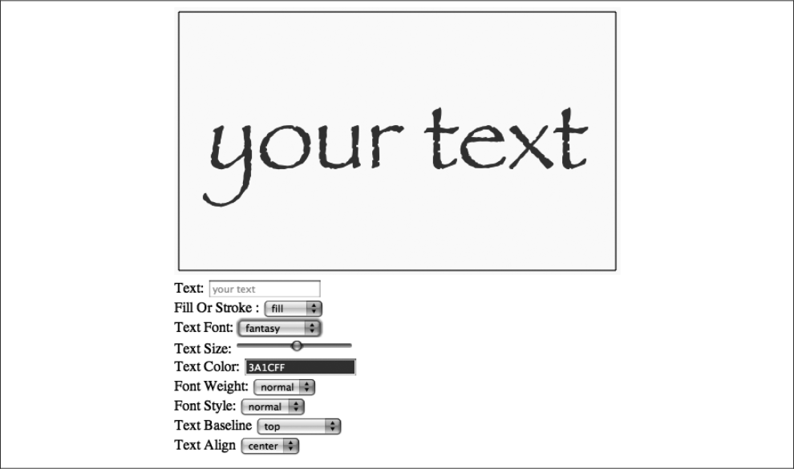
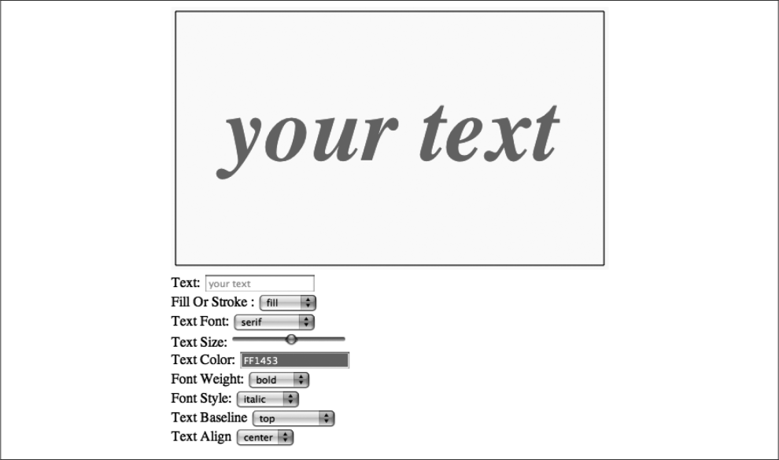

### 3.2.2　在文本编辑器中处理字体大小和外观

> **自定义备用字体**
> 所有的浏览器都支持前面提到的字体。另外，也可以指定任意用户可用的字体。对于多个后备字体，可以使用逗号隔开，如下所示：
> 同样的，一旦字体加载完成，Canvas就可以在CSS中调用@font-face来使用这些自定义的字体，代码如下所示：

Text Arranger程序已经为显示字体实现了一个可用字体选项的子集，这样可以使尽可能多的浏览器都能运行。下面是几种可以实现的字体选项。

#### 1．可用字体样式

```javascript
context.font = "normal lighter 50px arcade, monospace";
```

CSS定义了以下可用的字体样式。

```javascript
normal | italic | oblique | inherit
```

```javascript
@font-face {
　　 font-family: Arcade;
　　 src: url('arcade.otf'); 
}
```

在Text Arranger中，除了inherit都可以实现。

下面是创建字体样式<select> 复选框的代码。将表单控件id设为fontStyle属性的名称。由于监听了change事件，当用户选择了表单中的某个选项时，程序就能得到对应的控件id。这个版本Text Arranger中的表单控件都是如此。

```javascript
<select id="fontStyle">
 <option value="normal">normal</option>
 <option value="italic">italic</option>
 <option value="oblique">oblique</option>
</select>
```

#### 2．可用字体磅重

CSS定义了以下可用的字体磅重。

```javascript
normal | bold | bolder | lighter | 100 | 200 | 300 | 400 | 500 | 600 | 700 | 800 | 900 |inherit | auto
```

Text Arranger程序只用到了normal、bold、bolder和lighter。读者也可以添加自己想要的值。

下面是创建字体磅重<select>复选框的代码。

```javascript
<select id="fontWeight">
 <option value="normal">normal</option>
 <option value="bold">bold</option>
 <option value="bolder">bolder</option>
 <option value="lighter">lighter</option>
</select>
```

#### 3．通用字体外观

由于难以确保浏览器的字体在任何时候都可用，因此这里将Text Arranger的字体外观选择限制在CSS规范中定义的“通用”字体：serif、sans-serif、cursive、fantasy和monospace。

下面是创建字体外观<select> 复选框的代码。

```javascript
<select id="textFont">
 <option value="serif">serif</option>
 <option value="sans-serif">sans-serif</option>
 <option value="cursive">cursive</option>
 <option value="fantasy">fantasy</option>
 <option value="monospace">monospace</option>
</select>
```

#### 4．字体大小与HTML5范围控制

为指定字体的大小，这里已经实现了新的HTML5 range表单控件。range是一种<input> 类型，可以在HTML页面上创建一个滑块来限制数字输入的范围。range通过将表单输入控件类型设置为range来创建。range有以下4种属性：

+ min——范围最小值；
+ max——范围最大值；
+ step——范围滑块移动的步长单元数；
+ value——默认范围值。

下面是在Text Arranger中设置范围的代码。

```javascript
<input type="range" id="textSize"
 min="0"
 max="200"
 step="1"
 value="50"/>
```

如果浏览器不支持range控制，那么range将以文本框形式出现。

提示

> 写作本书时，Firefox尚不支持range。

#### 5．在canvasApp() 函数中创建必要的变量

接下来，需要在canvasApp() 容器函数中创建4个变量：fontSize、fontFace、fontWeight和fontStyle。它们用来为Text Arranger保存通过HTML表单控件设置的值。给每个变量设置一个默认值，一旦调用drawScreen()函数时，就在画布上显示文本。此后，只有在为每个表单控件创建的事件处理函数处理了change事件时，程序才调用drawScreen()函数。

下面为每个表单控件创建变量。

```javascript
var fontSize = "50";
var fontFace = "serif";
var fontWeight = "normal";
var fontStyle = "normal";
```

#### 6．在canvasApp()中设置事件处理器

正如在Text Arranger 1.0中那样，这里需要创建事件监听器以及关联的事件处理函数，以使HTML页面表单控制发生的变化可以与HTML5 Canvas进行交互。下面的事件监听器监听表单控件的change事件。

```javascript
formElement = document.getElementById("textSize");
formElement.addEventListener('change', textSizeChanged, false);
formElement = document.getElementById("textFont");
formElement.addEventListener('change', textFontChanged, false);
formElement = document.getElementById("fontWeight");
formElement.addEventListener('change', fontWeightChanged, false);
formElement = document.getElementById("fontStyle");
formElement.addEventListener('change', fontStyleChanged, false);
```

#### 7．在canvasApp()中定义事件处理器函数

下面必须为每个表单控件创建事件处理器。注意，每个处理器更新都关联着有效CSS字体字符串的变量，然后调用drawScreen()函数将新的文本绘制在画布上。

```javascript
function textSizeChanged(e) {
　 var target = e.target;
　 fontSize = target.value;
　 drawScreen();
}
function textFontChanged(e) {
　 var target = e.target;
　 fontFace = target.value;
　 drawScreen();
}
function fontWeightChanged(e) {
　 var target = e.target;
　 fontWeight = target.value;
　 drawScreen();
}
function fontStyleChanged(e) {
　 var target = e.target;
　 fontStyle = target.value;
　 drawScreen();
}
```

#### 8．在drawScreen()函数中设置字体

最终，在drawScreen() 函数里将这些设置合并在一起，创建了一个有效的CSS字体字符串并应用到context.font属性。

```javascript
context.font = fontWeight + " " + fontStyle + " " + fontSize + "px " + fontFace;
```

结果如图3-3和图3-4所示。


<center class="my_markdown"><b class="my_markdown">图3-3　设置字体的大小和外观</b></center>


<center class="my_markdown"><b class="my_markdown">图3-4　将字体设置为粗体和斜体</b></center>

