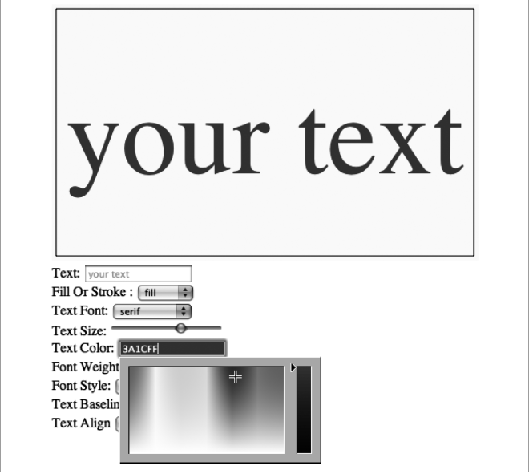

### 3.2.3　字体颜色

设置HTML5 Canvas的字体颜色非常简单，只需为context.fillStyle或context.strokeStyle属性设置一个有效的CSS RGB颜色，格式为 "#RRGGBB"。其中，RR、GG、BB分别是红色、绿色和蓝色的十六进制数值。例如：

```javascript
context.fillStyle = "#FF0000";
```

将文本填充色设为红色。

```javascript
context.strokeStyle = "#FF00FF";
```

将文本描边设置为紫色。

```javascript
context.fillStyle = "#FFFF00";
```

将文本填充色设为黄色。

Text Arranger程序将允许用户选择文本颜色。可以通过下拉菜单或者文本框来实现此功能，但是这里将用新的HTML5 <input> 颜色类型。这个方便的新表单控件在浏览器中直接工作，用户可以从设计美观的拾色器中可视化地选取颜色。在编写本书的时候，只有Chrome和Opera已经实现了HTML5的颜色 <input> 对象。

但是，由于本书要为Text Arranger使用一个很好的拾色器：JSColor。jsColor控件通过JavaScript（见图3-5）创建了一个漂亮的拾色器，类似于一个支持HTML5的优雅浏览器。

为实现jsColor和Text Arranger的拾色器，首先下载jscolor.js库并存入Text Arranger所在的文件夹中。然后把下面这行代码添加在<head>中，以在HTML页面中包含jsColor。

```javascript
<script type="text/javascript" src="jscolor/jscolor.js"></script>
```

再给HTML<form> 添加一个新的<input> 元素，并给出CSS类指定颜色。

```javascript
<input class="color" id="textFillColor" value="FF0000"/>
```

当用户使用jsColor选取了颜色，jsColor会生成类似于 "FF0000" 的文本值来代表所选的颜色值。同时，HTML5 Canvas需要在这个值的前面加上“#”。可以由textFillColorChanged事件处理器为来自textFillColor表单控件的值加上“#”，代码如下：

```javascript
function textFillColorChanged(e) {
　　　var target = e.target;
　　　textFillColor = "#" + target.value;
　　　drawScreen();
　 }
```

接下来，还要创建事件监听器，把来自textFillColor <input> 元素的事件改变到textFillColorChanged() 事件处理器中。

```javascript
formElement = document.getElementById("textFillColor");
formElement.addEventListener('change', textFillColorChanged, false);
```

最后，还需要在canvasApp() 函数中创建textFillColor变量。

```javascript
var textFillColor = "#ff0000";
```

这样可以使变量从前述的事件处理器获得更新，并且在这个事件处理器调用drawScreen() 函数的时候实现其功能。

```javascript
switch(fillOrStroke) {
　 case "fill":
　　　context.fillStyle = textFillColor;
　　　context.fillText (message, xPosition,yPosition);
　　　break;
　 case "stroke":
　　　context.strokeStyle = textFillColor;
　　　context.strokeText (message, xPosition,yPosition);
　　　break;
　 case "both":
　　　context.fillStyle = textFillColor;
　　　context.fillText (message, xPosition ,yPosition);
　　　context.strokeStyle = "#000000";
　　　context.strokeText (message, xPosition,yPosition);
　　　break;
}
```

请注意，这里需要更新Text Arranger 1.0创建的switch() 声明，以使其能够使用textFillColor变量，而不是硬代码值。但是，当描边和填充均被选择时，仍将描边设为黑色（“#000000”）。或者，也可以为strokeColor再添加一个附加拾色器，如果读者想扩展这个程序，可以自己试试。显示效果如图3-5所示。


<center class="my_markdown"><b class="my_markdown">图3-5　设置字体颜色</b></center>

