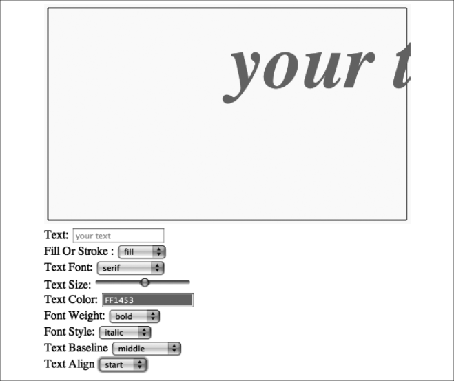

### 3.2.4　字体基线和对齐

在HTML5 Canvas中，对齐字体有两个选项：垂直和水平。这些对齐参照Canvas本身作用于文本，而且它围绕在文字最顶、最底、最右和最左四边的看不见的边框。这是一个重要的区别，也就是说，这些对齐作用于文本的方式不是读者所熟悉的方式。

#### 1．垂直对齐

字体基线是在em square（字体设计网格）中参照字体向下拉伸，基于预设水平位置的垂直对齐方式，小写p和y等低于基线的字体向下拉伸。基线告知画布如何显示这些字体，以及这些下伸字体如何与其他字体相关。HTML5 Canvas API在线有一张图是说明基线的，本应该放在本书中，但实际上，通过编写Text Arranger应用程序的方式更易于读者理解。context.textBaseline属性的选项如下。

+ top：文本em square的顶端，最高的字体顶端。选择这个基线将使文本下沉到画布的所有基线之下（y轴位置最高）。
+ hanging：比top基线稍低，就像挂在字体顶端附近的水平线上。
+ middle：绝对垂直居中基线。Text Arranger程序使用middle将字体垂直居中。
+ alphabetic：垂直书写字体的底部，例如阿拉伯文、拉丁文和希伯来文。
+ ideographic：水平书写字体的底部，例如汉字、片假名、平假名和韩文。
+ bottom：文本em square的底部。选择这个基线将使文本上浮到画布的所有基线之上（y轴位置最低）。

例如，如果想要按top基线放置文本，可以使用下面这段代码。

```javascript
context.textBaseline = "top";
```

之后，画布上所有显示的文本都将使用这个基线。要想改变这个基线，可以改变其属性。

```javascript
context.textBaseline = "middle";
```

实际上，一般在程序中都会使用唯一一种基线，除非要创建一个字处理或者设计那种需要精确文本处理的应用程序。

#### 2．水平对齐

context.textAlign属性的水平对齐是基于文本的x轴位置的。下面是可用的text Align值。

+ center：文本绝对水平居中。在Text Arranger程序中用来将字体居中。
+ start：紧跟在文本y轴位置显示。
+ end：所有文本都在文本y轴位置以前显示。
+ left：文本最左端从文本y轴位置开始（与start类似）。
+ right：文本最右端从文本y轴位置开始（与end类似）。

例如，设置文本居中对齐，可以使用下面这段代码。

```javascript
context.textAlign = "center";
```

设置这个属性后，所有文本都将使用文本y坐标位置作为中心点。但是，这并不意味着文本将被设置到画布中心。如果想要将文本设置到画布中心，则需要找到画布中心，并将这个中心点位置作为文本位置的y坐标值。在Text Arranger程序中就是如此。

也可以使用Canvas对象（源自DOM document对象）的dir属性来更改这些值。使用dir可以改变文字的显示方向。dir的有效值包括rtl（右至左）和ltr（左至右）。

#### 3．处理文本基线和对齐

在Text Arranger中处理文本基线和对齐与设置其他文本属性非常类似。首先，为canvasApp()函数添加一些变量，用来储存Text Arranger对齐参数。请注意，这里已将textAlign变量设为center，使文本在画布上居中了。

```javascript
var textBaseline = "middle";
var textAlign = "center";
```

接下来，在页面的HTML部分将每个新的属性添加至<select> 表单元素。

```javascript
Text Baseline <select id="textBaseline">
　<option value="middle">middle</option>
　<option value="top">top</option>
　<option value="hanging">hanging</option>
　<option value="alphabetic">alphabetic</option>
　<option value="ideographic">ideographic</option>
　<option value="bottom">bottom</option>
　</select>
　<br>
　Text Align <select id="textAlign">
　<option value="center">center</option>
　<option value="start">start</option>
　<option value="end">end</option>
　<option value="left">left</option>
　<option value="right">right</option>
　</select>
```

然后，添加事件监听器和事件处理器函数——用来连接用户交互和画布显示的HTML表单元素。为canvasApp() 函数注册事件监听器。

```javascript
formElement = document.getElementById("textBaseline");
formElement.addEventListener('change', textBaselineChanged, false);
formElement = document.getElementById("textAlign");
formElement.addEventListener('change', textAlignChanged, false);
```

接下来，需要在canvasApp()中创建事件处理器。

```javascript
function textBaselineChanged(e) {
　 var target = e.target;
　 textBaseline = target.value;
　 drawScreen();
}
function textAlignChanged(e) {
　 var target = e.target;
　 textAlign = target.value;
　 drawScreen();
}
```

然后，将新的数值应用到drawScreen() 函数中。

```javascript
context.textBaseline = textBaseline;
context.textAlign = textAlign;
```

最后，修改屏幕上水平居中的代码。由于在context.textAlign中使用了center对齐，因此这里不再需要像前面的Text Arranger 1.0那样减去各自context.measureText() 的宽度的一半。

```javascript
var metrics = context.measureText(message);
var textWidth = metrics.width;
var xPosition = (theCanvas.width/2) - (textWidth/2);
```

取而代之，可以简单地使用画布的中心点。

```javascript
var xPosition = (theCanvas.width/2);
```

请记住，center是文本的默认对齐方式。由于用户可以在Text Arranger中对此加以调整，因为在使用这个程序的时候，文本也可以按不同的方式对齐。

图3-6显示的是设置了start对齐和middle基线的文本显示效果。


<center class="my_markdown"><b class="my_markdown">图3-6　字体的start对齐和middle基线</b></center>

