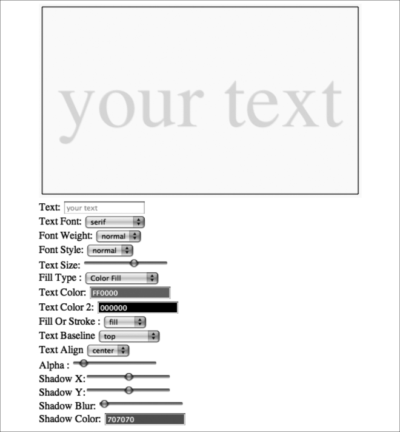

### 3.3.1　全局alpha和文本

利用alpha设置对象半透明或全透明是一个非常酷的方式。Canvas环境的globalAlpha属性可以用来实现此功能，当设置globalAlpha之后，会对画布上所有的绘制都起作用，因此设置的时候要多加小心。

context.globalAlpha的有效值范围为0.0（透明）～1.0（不透明）之间，alpha数值代表透明度的百分比。例如，设置50% alpha值的代码如下所示。

```javascript
context.globalAlpha = 0.5;
```

设置100% alpha值（不透明）的代码如下所示。

```javascript
context.globalAlpha = 1.0;
```

除了在其他设置选项中早已熟悉的Text Arranger中的元素外，读者还应多了解一些在使用globalAlpha属性的时候，该属性对画布其他部分有什么影响。

首先，在canvasApp() 函数中创建一个名为textAlpha的变量，初始设置为1，即文本初始显示不透明。

```javascript
var textAlpha = 1;
```

接下来，绘制背景前和绘制边框前，在drawImage() 函数中设置两次globalAlpha属性。

```javascript
function drawScreen() {
　　　//背景
　　　context.globalAlpha = 1;
```

然后，在显示文本前，将其设置为textAlpha中储存的值。

```javascript
context.globalAlpha = textAlpha;
```

这将重置globalAlpha。这样就可以对背景进行绘制，并且可以为显示文本使用可配置的alpha值。

下面将使用另一个HTML5 range表单控件，这次设置的数值范围：最小值为0.0，最大值为1.0，步长值为0.01。

```javascript
Alpha: <input type="range" id="textAlpha"
　　　 min="0.0"
　　　 max="1.0"
　　　 step="0.01"
　　　 value="1.0"/>
```

textAlphaChanged() 函数的工作方式和本章中创建的其他事件处理器基本相同。

```javascript
function textAlphaChanged(e) {
　　　var target = e.target;
　　　textAlpha = (target.value);
　　　drawScreen();
　 }
```

当然，别忘了添加textAlpha range控件的事件监听器。

```javascript
formElement = document.getElementById("textAlpha");
formElement.addEventListener('change', textAlphaChanged, false);
```

结果如图3-7所示。


<center class="my_markdown"><b class="my_markdown">图3-7　应用globalAlpha的文本</b></center>

