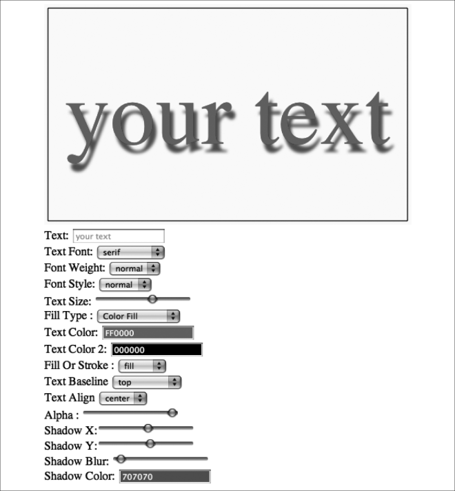

### 3.3.2　全局阴影和文本

HTML5 Canvas拥有一系列独特的创建阴影的属性。context.shadow函数并不仅针对文本，还能轻松地制作出非常棒的文本效果。

创建shadowEffect需要操作以下4个Canvas环境属性。

+ context.shadowColor：阴影颜色。同fillStyle和strokeStyle属性一样，使用 "#RRGG BB" 格式。
+ context.shadowOffsetX：阴影x轴位移。可以为正，也可以为负。
+ context.shadowOffsetY：阴影y轴位移。可以为正，也可以为负。
+ context.shadowBlur：阴影模糊滤镜。数值越大，扩散程度越大。

例如，创建一个向文本右下方位移各5个像素的红色阴影，模糊2个像素，可以这样设置属性：

```javascript
context.shadowColor = "#FF0000";
context.shadowOffsetX = 5;
context.shadowOffsetY = 5;
context.shadowBlur = 2;
```

与globalAlpha类似，为textArranger绘制背景之前必须重设阴影属性，否则阴影设置将应用到整个图像。首先，在canvasApp() 函数中创建一些储存阴影数值的的变量。

```javascript
var textAlpha = 1;
var shadowX = 1;
var shadowY = 1;
var shadowBlur = 1;
var shadowColor = "#707070";
```

然后，确认在drawScreen()函数中为textArranger绘制背景前取消了阴影设置。此时不必重设shadowColor，但是更新Canvas环境全局改变的属性也会是个不错的方法。

```javascript
context.shadowColor = "#707070";
context.shadowOffsetX = 0;
context.shadowOffsetY = 0;
context.shadowBlur = 0;
```

在drawScreen()函数中，使用之前创建的4个变量，生成阴影效果。

```javascript
context.shadowColor = shadowColor;
context.shadowOffsetX = shadowX;
context.shadowOffsetY = shadowY;
context.shadowBlur = shadowBlur;
```

现在，还需创建允许用户更新阴影设置的HTML。这里使用3个range控件，以及另一个使用jsColor的拾色器来完成此功能。

```javascript
Shadow X:<input type="range" id="shadowX"
　　　  min="-100"
　　　  max="100"
　　　  step="1"
　　　  value="1"/>
<br>
Shadow Y:<input type="range" id="shadowY"
　　　  min="-100"
　　　  max="100"
　　　  step="1"
　　　  value="1"/>
<br>
Shadow Blur: <input type="range" id="shadowBlur"
　　　  min="1"
　　　  max="100"
　　　  step="1"
　　　  value="1" />
<br>
Shadow Color: <input class="color" id="shadowColor" value="707070"/>
```

最后，添加事件监听器和事件处理器函数，使HTML表单元素可以与画布进行通信。结果如图3-8所示。

```javascript
formElement = document.getElementById("shadowX");
formElement.addEventListener('change', shadowXChanged, false);
formElement = document.getElementById("shadowY");
formElement.addEventListener('change', shadowYChanged, false);
formElement = document.getElementById("shadowBlur");
formElement.addEventListener('change', shadowBlurChanged, false);
formElement = document.getElementById("shadowColor");
formElement.addEventListener('change', shadowColorChanged, false);
function shadowXChanged(e) {
　　　var target = e.target;
　　　shadowX = target.value;
　　　drawScreen();
　 }
　 function shadowYChanged(e) {
　　　var target = e.target;
　　　shadowY = target.value;
　　　drawScreen();
　 }
　 function shadowBlurChanged(e) {
　　　var target = e.target;
　　　shadowBlur = target.value;
　　　drawScreen();
　 }
　function shadowColorChanged(e) {
　　　var target = e.target;
　　　shadowColor = target.value;
　　　drawScreen();
　 }
```


<center class="my_markdown"><b class="my_markdown">图3-8　应用全局阴影的文本</b></center>

