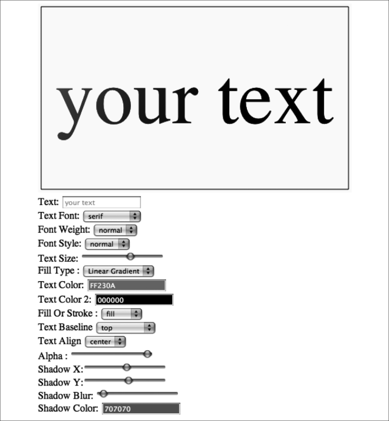

### 3.4.1　文本线性渐变

为创建线性渐变，调用环境createLinearGradient()的方法来创建Gradient对象。Create LinearGradient() 方法接受4种定义线性渐变参考线的参数：x0和y0参数是参考线的起点坐标，x1和y1是参考线的终点坐标。

```javascript
var gradient = context.createLinearGradient( [x0],[y0],[x1],[y1]);
```

例如，要创建一个线性渐变，起点位于文本开始处（100，100）并结束于文本的宽度，可以使用如下代码。

```javascript
var metrics = context.measureText(message);
var textWidth = metrics.width;
var gradient = context.createLinearGradient(100, 100, textWidth, 100);
```

创建了代表渐变的参考线后，还需要添加产生渐变层次的颜色。这需要通过addColorStop()方法来实现，它有两个参数：offset和color。

```javascript
gradient.addColorStop([offset],[color]);
```

+ offset：这是渐变参考线开始颜色层次的位移，整个渐变用0.0～1.0的十进制代表的百分数值来定义。
+ color："#RRGGBB"格式的有效CSS颜色。

如果想让渐变从黑色开始，在渐变一半的位置使用红色作为第二个颜色，那么可以创建两个调用来添加ColorStop()。

```javascript
gradient.addColorStop(0, "#000000");
gradient.addColorStop(.5, "#FF0000");
```

提示

> 如果通过addColorStop()添加颜色不成功，那么生成的文本将不可见。

结果如图3-9所示。


<center class="my_markdown"><b class="my_markdown">图3-9　线性、径向渐变填充的文本</b></center>

