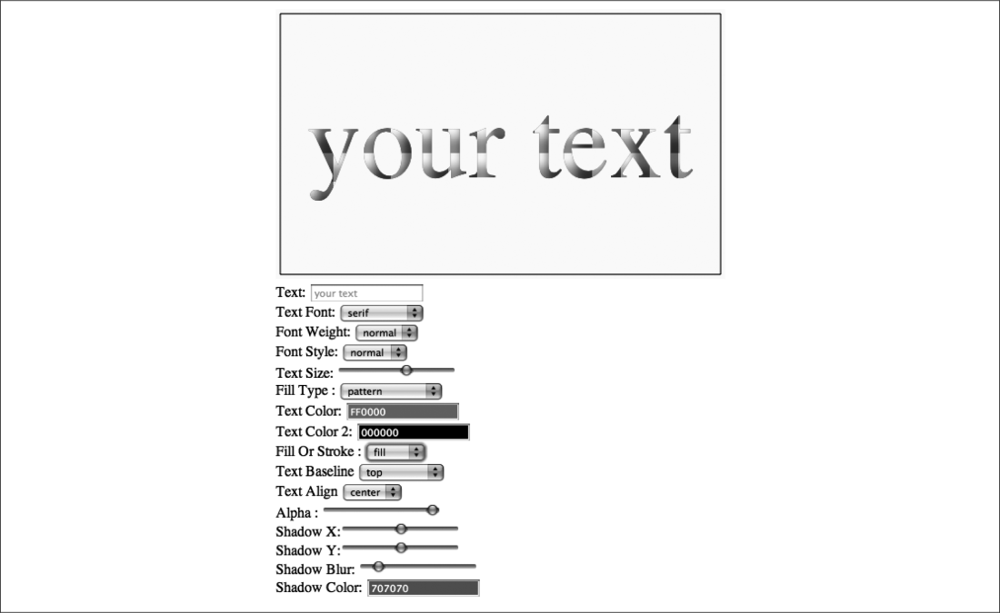

### 3.4.4　在Text Arranger中处理渐变和图案

在HTML5 Canvas中，Text Arranger 3.0中有很多变化用于实现文本对渐变和图案的支持。为使这些变化可以运行，首先要确认程序已经预加载了texture.jpg图像，它将用于context.createPattern()功能。为此，本节将创建一个名为eventAssets Loaded()的新函数，并将其设置为Image对象onload事件的事件处理器。当这个图片加载完毕，程序将调用canvasApp()方法，与调用eventWindowLoaded()的方式相同。

```javascript
function eventWindowLoaded() {
　 var patternImage= new Image();
　 patternImage.src = "texture.jpg";
　 patternImage.onload = eventAssetsLoaded;
}
function eventAssetsLoaded() {
　 canvasApp();
}
```

提示

> 这里不会使用函数中创建的图案变量，因为它不在canvasApp()函数的范围内，所以很少用来确认图像是否可用。

在canvasApp() 函数里创建3个变量来支持这个新功能。fillType描述了如何填充文本（常规颜色填充、线性渐变、径向渐变或是图案）。textColorFill2变量是渐变颜色断点的第二个颜色。最后，pattern变量储存预加载的Image对象，也就是即将在canvasApp()函数中创建的实例。

```javascript
var fillType = "colorFill";
var textFillColor2 = "#000000";
var pattern = new Image();
...
pattern.src = "texture.jpg";
```

现在跳转到HTML的 <form>部分。由于已经创建了填充文本的不同方式，因此还需要建立一个用于选择的选项。下面，使用fillType的变量id创建一个<select> 复选框。

```javascript
Fill Type: <select id="fillType">
　<option value="colorFill">Color Fill</option>
　<option value="linearGradient">Linear Gradient</option>
　<option value="radialGradient">Radial Gradient</option>
　<option value="pattern">pattern</option>
　</select>
```

添加第二颜色选择，用于渐变填充。这将用到jsColor拾色器和textColorFill2变量id。

```javascript
Text Color 2: <input class="color" id="textFillColor2" value ="000000"/>
　<br>
```

返回canvasApp()函数，为两个新的表单元素创建事件监听器。

```javascript
formElement = document.getElementById("textFillColor2");
formElement.addEventListener('change', textFillColor2Changed, false);
formElement = document.getElementById("fillType");
formElement.addEventListener('change', fillTypeChanged, false);
```

同时，还需要为新的表单元素创建关联的事件处理器函数。

```javascript
function textFillColor2Changed(e) {
　　　var target = e.target;
　　　textFillColor2 = "#" + target.value;
　　　drawScreen();
　 }
　 function fillTypeChanged(e) {
　　　var target = e.target;
　　　fillType = target.value;
　　　drawScreen();
　 }
```

接下来，为新功能添加drawScreen()支持。首先，使用环境下的measureText() 方法获得文本宽度，创建渐变。

```javascript
var metrics = context.measureText(message);
var textWidth = metrics.width;
```

然后，决定如何为环境中的fillStyle和strokeStyle格式化“颜色”。在这个实例中，它可以是CSS颜色、渐变或图像图案。

+ 颜色填充：如果实现一个简单的颜色填充，操作方法和低版本的Text Arranger一样。所做的只是将textFillColor的值赋给tempColor。
+ 线性渐变：线性渐变需要确定沿哪条线创建渐变。这条线将从文本起始位置（xPosition-textWidth/2，因为文本使用center对齐）水平渐变至文本结尾（textWidth）。同时，添加两个颜色断点（0和60%），颜色分别是textFillColor1和text FillColor2。
+ 径向渐变：从文本中心（xPosition,yPosition）开始，以字体大小为半径（fontSize）创建一个圆锥。这个圆锥将以半径为1水平扩展至文本宽度（textWidth）。
+ 图案：这个选项将创建一个使用image变量的图案，并设置其repeat的值，在水平和垂直方向铺设。

具体代码如下。

```javascript
var tempColor;
if (fillType == "colorFill") {
　 tempColor = textFillColor;
} else if (fillType == "linearGradient") {
　 var gradient = context.createLinearGradient(xPositiontextWidth/
　　　 2, yPosition, textWidth, yPosition);
　 gradient.addColorStop(0,textFillColor);
　 gradient.addColorStop(.6,textFillColor2);
　 tempColor = gradient;
} else if (fillType == "radialGradient") {
　 var gradient = context.createRadialGradient(xPosition, yPosition,
　　　 fontSize, xPosition+textWidth, yPosition, 1);
　 gradient.addColorStop(0,textFillColor);
　 gradient.addColorStop(.6,textFillColor2);
　 tempColor = gradient;
} else if (fillType == "pattern") {
　var tempColor = context.createPattern(pattern,"repeat");
} else {
　 tempColor = textFillColor;
}
```

最后，设置fillStyle或strokeStyle，用tempColor代替textFillColor。设置文本填充的选项将显示在画布上，如图3-10所示。

```javascript
context.fillStyle = tempColor;
```


<center class="my_markdown"><b class="my_markdown">图3-10　应用图像图案的文本</b></center>

