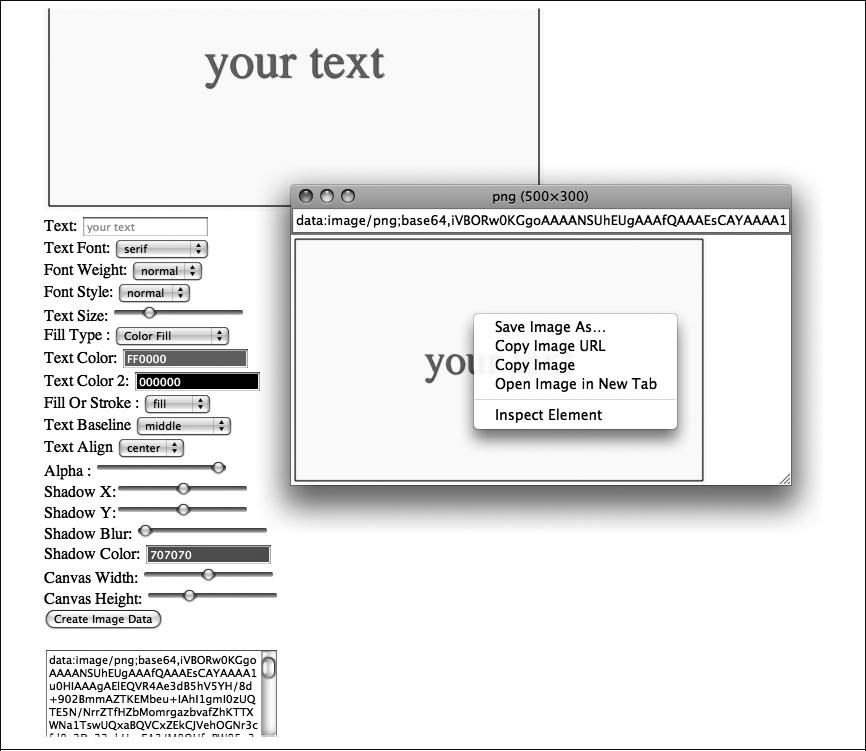

### 3.5.3　Canvas对象的toDataURL()方法

如同本书在第1章中简单说明的那样，Canvas对象也包含一个名为toDataURL()的方法——可以返回代表画布图像数据的字符串。若没有参数的调用，的可以返回一个图像MIME类型image/png的字符串。如果将image/jpg作为一个参数，也可以设置第二个参数，用来代表图片的“质量/压缩”级别，数值范围为0.0～1.0。这里将使用toDataURL()将画布的图像数据输出到表单的<textarea>元素，然后打开一个窗口显示动态的图像。这是一个显示功能是否有效的简单方法。

首先，要为Text Arranger创建HTML中最后的两个表单控件。创建一个id为createImage Data的按钮：当单击按钮时，它将产生一个名为imageDataDisplay的 <textarea>元素；当单击按钮后，它将保存图像的文本数据。

```javascript
<input type="button" id="createImageData" value="Create Image Data">
<br>
<br>
<textarea id="imageDataDisplay" rows=10 cols=30></textarea>
```

接下来，为createImageData按钮设置事件监听器。

```javascript
formElement = document.getElementById("createImageData");
formElement.addEventListener('click', createImageDataPressed, false);
```

然后，在createImageDataPressed() 事件处理器中，调用Canvas对象 （theCanvas）的toDataURL() 方法，将imageDataDisplay <textarea>的值设定为toDataURL()返回的数据。这时会弹出一个窗口，显示从画布创建的动态图像（见图3-11）。用户可以通过单击右键保存图像，就像保存其他HTML页面中的图像那样。是不是很酷？

```javascript
function createImageDataPressed(e) {
　　　var imageDataDisplay = document.getElementById('imageDataDisplay');
　　　imageDataDisplay.value = theCanvas.toDataURL();
　　　window.open(imageDataDisplay.value,"canvasImage","left=0,top=0,width=" +
　　　　　theCanvas.width + ",height=" + theCanvas.height +
　　　　　",toolbar=0,resizable=0");
　 }
```


<center class="my_markdown"><b class="my_markdown">图3-11　使用toDataURL()输出Canvas图像</b></center>

> **SECURITY_ERR: DOM Exception 18**
> 在一些Web浏览器中，例如Google Chrome，当显示图像（如例3-3中的图案填充类型）并尝试输出画布的时候，有可能会遇到错误（SECURITY_ERR: DOM Exception 18）。这通常，这是因为浏览器本地执行网页而造成的（加载自文件系统）。一般情况下，这些错误可以通过从服务器端加载HTML页面来清除——远程或在本地机器上均可。

