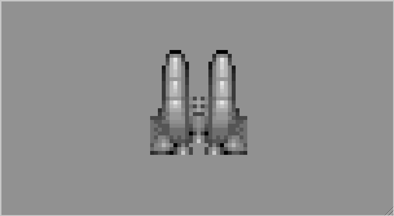
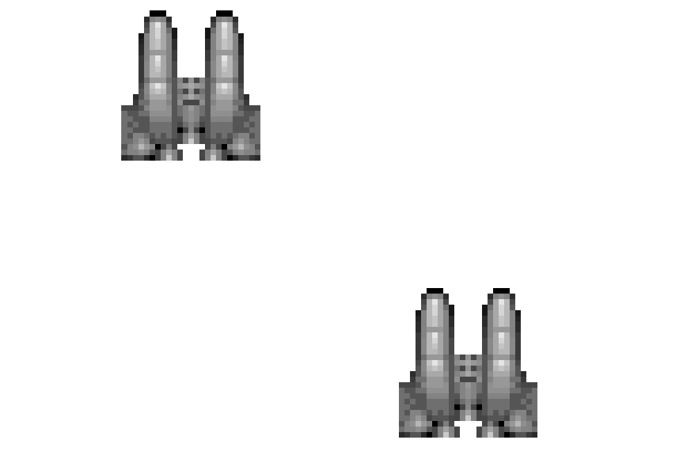

### 4.2.2　使用drawImage()函数在画布上显示图像

一旦图像加载完成，有多种方法可以将其显示在屏幕上。drawImage()Canvas方法用来将图像数据直接显示到画布上。drawImage()函数功能很多。它有3组不同的参数，每种都提供了不同的图像操作，包含图像源像素和画布上目标位置的像素。下面从最简单的开始。

```javascript
drawImage(Image, dx, dy)

```

这个函数有3个参数：Image对象以及定义画布上图像左上角起始点的值。下面这段代码将示例的飞船图像放置到了（0，0）位置（即左上角）。

```javascript
context.drawImage(spaceShip, 0, 0);
```

如果要在（50，50）处放置一个图像副本，只需改变调用代码的位置坐标即可。

```javascript
context.drawImage(spaceShip, 50, 50);
```

例4-1所示为到此为止的所有代码。

例4-1　加载和显示图像文件

```javascript
var spaceShip = new Image();
spaceShip.addEventListener('load', eventSheetLoaded , false);
spaceShip.src = "ship1.png";
function eventSheetLoaded(){
　 drawScreen();
}
function drawScreen(){
　 context.drawImage(spaceShip, 0, 0);
　 context.drawImage(spaceShip, 50, 50);
}
```

图4-1显示了尺寸为32 × 32的ship1.png文件。


<center class="my_markdown"><b class="my_markdown">图4-1　下载并显示图像文件</b></center>

在练习时，没必要将所有绘图代码都直接放到某个函数当中，例如drawScreen()。相比之下，创建一个单独的函数显得更有意义，如下面的函数placeShip()。

```javascript
function drawScreen(){
　 placeShip(spaceShip, 0, 0);
　 placeShip(spaceShip, 50, 50);
}
function placeShip(obj, posX, posY, width, height){
　 if (width && height){
　　 context.drawImage(obj, posX, posY, width, height);
　 } else {
　　 context.drawImage(obj, posX, posY);
　 }
}
```

placeShip()函数接受环境、图像对象、x坐标和y坐标以及高度和宽度。如果输入了高度和宽度，就调用第一个版本的drawScreen()函数，否则就调用第二个版本的该函数。下节将讲解如何调整图像大小。

ship1.png文件是32 × 32的位图，已经用Ari Feldman著名的SpriteLib修改过。SpriteLib是一个免费的类库，储存Ari为游戏和书籍制作的基于像素的游戏素材。

提示

> 为本书专门设置的网站只有完成示例的一部分必要的文件。为适应本书的需求Ari的文件已经被调整。

图4-2显示了画布上绘制的两个图像副本，一个位于左上角（0，0），另一个位于（50，50）。


<center class="my_markdown"><b class="my_markdown">图4-2　使用同一源文件绘制多个对象</b></center>

