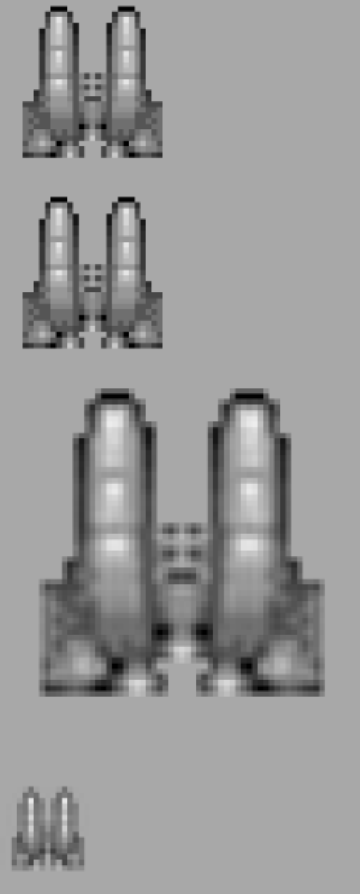

### 4.2.3　调整画布上图像的大小

为绘制和缩放图像，还可以将参数传送到drawImage()函数中。例如，第二版的drawImage()函数获得了两个新的参数。

```javascript
drawImage(Image, dx, dy, dw, dh)
```

dw和dh代表在画布上绘制图像的矩形部分的宽度和高度。如果想把图像缩放到64 × 64或16 × 16，那么可以使用下列代码。

```javascript
context.drawImage(spaceShip, 0, 0,64,64);
context.drawImage(spaceShip, 0, 0,16,16);
```

例4-2在画布上绘制了多个不同尺寸的图像。

例4-2　绘图时调整图像大小

```javascript
function eventSheetLoaded(){
　 drawScreen();
}
function drawScreen(){
　 context.drawImage(spaceShip, 0, 0);
　 context.drawImage(spaceShip, 0, 34,32,32);
　 context.drawImage(spaceShip, 0, 68,64,64);
　 context.drawImage(spaceShip, 0, 140,16,16);
}
```

本例的输出效果如图4-3所示。


<center class="my_markdown"><b class="my_markdown">图4-3　绘图时调整图像大小</b></center>

例4-2添加了一个灰色边框，这样就能更方便地查看图像在画布上的放置情况。用户可以在绘制时缩放屏幕上的图像，节省计算以及对对象使用矩阵转换所必需的步骤。需要提醒的是，缩放参考原点是图像的左上角。如果使用矩阵操作，那么缩放前须将原点平移至对象中心。

然后，在画布上放置两个32 × 32的对象，以显示这两个函数调用的区别。

```javascript
context.drawImage(spaceShip, 0, 0);
context.drawImage(spaceShip, 0, 34,32,32);
```

第二个图像放在了第一个图像以下34像素的位置。第二个图像调用中的后两个参数“32，32”实际上没有必要，因为这就是对象的原始尺寸。这说明缩放操作不会在任何轴向平移（或移动）对象，每个左上角都是（0，0）。

