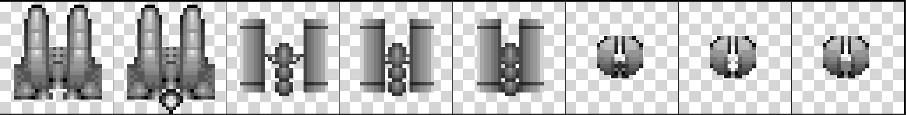

### 4.2.4　将部分图像复制到画布

第三组可以传送到drawImage()函数的参数允许读者复制源图像上任意的矩形部分，并将其放置到画布上。放置图像的同时也可以调整大小。

在这组操作中使用第二个源图像：飞船停靠的拼图（或者叫素材拼图、纹理拼图等）。这种类型的文件布局指的是物理打散成矩形数据的图像文件。通常，这些矩形是正方形，这种“拼板”或“素材”的宽为32像素，高也是32像素，通常就是指32 × 32拼板。

图4-4显示了一个绘图应用程序打开的有网格线的拼图，网格线分割了拼图上的每一个拼板。


<center class="my_markdown"><b class="my_markdown">图4-4　绘图程序中的拼图</b></center>

图4-5是一个实际的拼图——没有网格线——将用在后面的示例当中。


<center class="my_markdown"><b class="my_markdown">图4-5　应用程序中输出的拼图</b></center>

第三版drawImage()函数的参数如下所示。

```javascript
drawImage(Image, sx, sy, sw, sh, dx, dy, dw, dh)

```

sx和sy代表在画布上开始复制源图像的“源位置”，sw和sh代表从（sx，sy）处开始的矩形宽度和高度。这个矩形将被复制到画布上的“目标位置”（dx，dy）。如同前面的drawImage()函数，dw和dh代表图像缩放的新的宽度和高度。

例4-3将第二版的飞船（拼板2）复制到画布的（50，50）处，同时将图像缩放至64 × 64，结果如图4-6所示。

例4-3　使用drawImage()函数的所有参数

```javascript
var tileSheet = new Image();
tileSheet.addEventListener('load', eventSheetLoaded , false);
tileSheet.src = "ships.png";
function eventSheetLoaded(){
　 drawScreen();
}
function drawScreen(){
　 //绘制背景以显示出画布边缘
　 context.fillStyle = "#aaaaaa";
　 context.fillRect(0,0,500,500);
　 context.drawImage(tileSheet, 32, 0,32,32,50,50,64,64);
}
```


<center class="my_markdown"><b class="my_markdown">图4-6　使用drawImage()函数的所有参数</b></center>

如例4-3所示，Image示例的名称改为了tileSheet变量，这是因为它代表的是很多单个飞船图像。

现在，使用相同的方法，通过拼图上的拼板来模拟动画。

