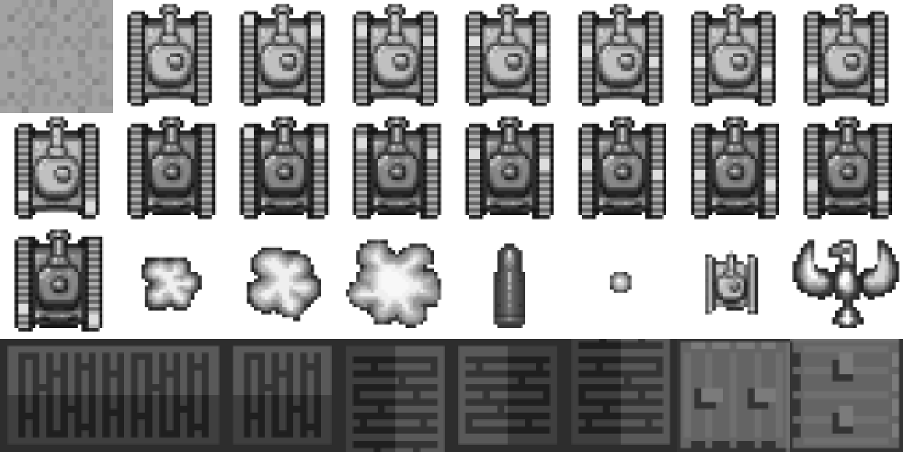

### 4.4　高级帧式动画

在4.3节的例子中，在拼图上进行简单的前后翻动。接下来，将创建一个新方法，以使用拼图来播放一系列图像。首先，来看新的拼图，创建自SpriteLibd。图4-7显示了示例的素材拼图tanks_sheet.png，本节都要用到这张图。

<b class="my_markdown">图4-7　拼图示例</b>

如图4-7所示，这里面包含了多个用在游戏中的32 × 32的拼板。本章不会创建整个游戏，但是会检验一下如何使用这些拼板创建一个游戏屏幕。第9章将使用这些拼板创建一个简单的迷宫追逐游戏。

