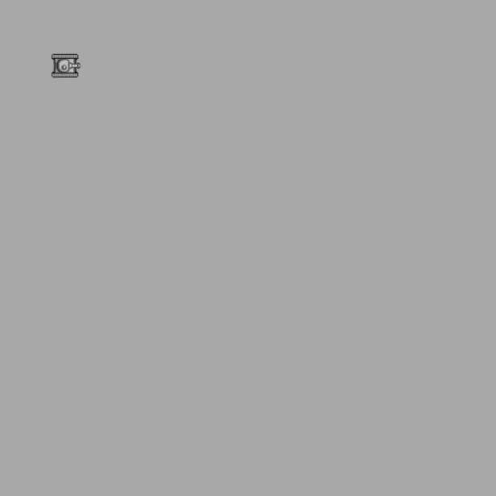

### 4.5.1　画布变换基础

尽管第2章已经详细介绍了基本的Canvas变换，这里还是先复习一下对画布上单个对象进行变换的要点。请记住，画布是一个单一即时模式绘图界面，因此，任何变换都会应用到整个画布。在本节的示例中，将绘制两个对象。首先绘制一个灰色背景矩形，然后将拼图中的当前拼板复制到想要的位置上。这是两个分离的对象。但是，当它们出现在画布上时，它们都是绘制在界面上简单的像素集合。与Flash或者其他平台允许多个素材或者电影剪辑占用物理空间不同，Canvas上只有一种对象：环境。

为弥补这一点，此处将创建逻辑显示对象。背景和坦克都将被当作分开的逻辑显示对象。如果想绘制坦克并通过变换矩阵旋转它，这里必须通过使用save()和restore()Canvas函数来区分逻辑绘图操作。

下面来看一个示例：将坦克顺时针旋转90°。

#### 步骤一：保存当前环境到堆栈。

save()环境函数将会把当前画布（本例中的灰色矩形背景）上的内容储存起来，称为“保管”。

```javascript
context.save();
```

当坦克变化完毕后，使用restore()函数调用替换回来。

#### 步骤二：将变换矩阵重置为初始化矩阵。

变换对象的下一步是通过传输值来重设清除变换矩阵，使其重置为识别值。

```javascript
context.setTransform(1,0,0,1,0,0)
```

#### 步骤三：编码变换算法。

每个变换都会略有区别，但是通常在旋转一个对象的时候，都想要将矩阵平移至对象中点。示例中的坦克在画布上的位置是（50，50），把它平移到（66，66）。由于坦克是32 × 32的方块拼板，这里可以简单地在x坐标和y坐标上各增加32的一半——16即可。

```javascript
context.translate(x+16, y+16);
```

下面，找出坦克旋转的弧度。这个示例中，选择90°。

```javascript
var rotation = 90;
var angleInRadians = rotation * Math.PI / 180;
context.rotate(angleInRadians);
```

#### 步骤四：绘制图像。

在绘制图像时，必须记住绘图原点已经不再是上一个例子中的（50，50）。一旦变换矩阵平移到一个新的点，那个点就是绘图的原点（0，0）。

起初，这可能有点令人糊涂，需要多练习。以左上角坐标（50，50）绘制图像，必须在当前位置的x坐标和y坐标上都减去16。

```javascript
context.drawImage(tileSheet, sourceX, sourceY,32,32,-16,-16,32,32);
```

例4-7为例4-4增加了旋转部分的代码，当读者再运行这个示例的时候，坦克已经向右转了。

提示

> 注意，例4-7已经删除了前面的例子当对drawScreen()的调用，取而代之的是一个新的事件监听器函数，并在tileSheet变量加载后调用。新的函数被命名为eventShipLoaded()。

例4-7　旋转变换

```javascript
var tileSheet = new Image();
tileSheet.addEventListener('load', eventSheetLoaded , false);
tileSheet.src = "tanks_sheet.png";
var animationFrames = [1,2,3,4,5,6,7,8];
var frameIndex = 0;
var rotation = 90;
var x = 50;
var y = 50;
function eventSheetLoaded(){
　 drawScreen();
}
function drawScreen(){
　 //绘制背景以显示出画布边缘
　 context.fillStyle = "#aaaaaa";
　 context.fillRect(0,0,500,500);
　 context.save();
　 context.setTransform(1,0,0,1,0,0)
　 context.translate(x+16, y+16);
　 var angleInRadians = rotation * Math.PI / 180;
　 context.rotate(angleInRadians);
　 var sourceX = Math.floor(animationFrames[frameIndex] % 8)*32;
　 var sourceY = Math.floor(animationFrames[frameIndex] / 8)*32;
　 context.drawImage(tileSheet, sourceX, sourceY,32,32,-16,-16,32,32);
　 context.restore();
}
function eventShipLoaded(){
　　drawScreen();
}
```

图4-8显示了这个示例的输出结果。


<center class="my_markdown"><b class="my_markdown">图4-8　应用旋转变换</b></center>

更进一步，可以通过应用例4-5中的动画技术使向右转的坦克在8块拼板中循环移动。

