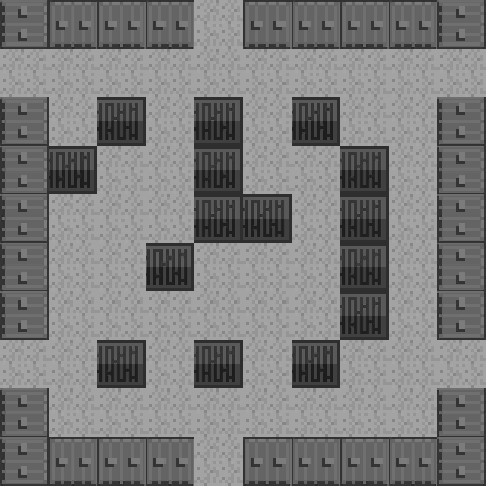

### 4.6.3　在画布上显示地图

首先要记住，Tiled数据从1开始，而不是从0开始。这意味着拼板编号为1～32，而不再是0～31。可以在将这些数值抄写到数组当中时将每个值减去1，或者可以在拼图绘制操作中采用程序编程也行。这里采用程序编程的方式，通过绘图操作创建一个偏移量。

```javascript
var mapIndexOffset = -1;
```

提示

> 不仅可以使用mapIndexOffset变量，还可以遍历数组中的每个数据将每个数值都减去1。这将在游戏开始前进行，在每块拼板显示时运行这个数学运算，从而节省了额外的处理器负载。

#### 1．地图的高度和宽度

现在创建两个变量，为拼板地图显示代码，增加灵活性。这看起来很简单，似乎没必要，但是如果读者习惯了使用变量控制拼板地图的高度和宽度，将来调整尺寸会容易得多。

基于地图的行列编号来跟踪它的宽度和高度，代码如下所示。

```javascript
var mapRows = 10;
var mapCols = 10;
```

#### 2．存储地图数据

从Tild中输出的数据是一系列自左上角开始，从左到右的行编号，每行到最右一列完成时换下一行。如同输出时那样使用这些数据，只需将它们放在一个二维数组中。

```javascript
var tileMap = [
　　　 [32,31,31,31,1,31,31,31,31,32]
　 , [1,1,1,1,1,1,1,1,1,1]
　 , [32,1,26,1,26,1,26,1,1,32]
　 , [32,26,1,1,26,1,1,26,1,32]
　 , [32,1,1,1,26,26,1,26,1,32]
　 , [32,1,1,26,1,1,1,26,1,32]
　 , [32,1,1,1,1,1,1,26,1,32]
　 , [1,1,26,1,26,1,26,1,1,1]
　 , [32,1,1,1,1,1,1,1,1,32]
　 , [32,31,31,31,1,31,31,31,31,32]
　 ];
```

#### 3．在画布上显示地图

在显示地图时，只需遍历tileMap数组的每一行，并且遍历每一行中的每一列。在[row][column]位置的tileID数字就是将要从拼图复制到画布上的拼板。row *32是在画布上放置拼板的y坐标，col *32是x坐标。

```javascript
for (var rowCtr=0;rowCtr<mapRows;rowCtr++) {
　 for (var colCtr=0;colCtr<mapCols;colCtr++){
　　　var tileId = tileMap[rowCtr][colCtr]+mapIndexOffset;
　　　var sourceX = Math.floor(tileId % 8) *32;
　　　var sourceY = Math.floor(tileId / 8) *32;
　　　context.drawImage(tileSheet, sourceX,
　　　 sourceY,32,32,colCtr*32,rowCtr*32,32,32);
　 }
}
```

提示

> 行和列的引用看起来有点不太好理解，因为行是y轴方向而列是x轴方向。这样做是因为拼板被组织成二维数组的形式，访问二维数组时，行值总是第一个标记。

使用mapRows和mapCols变量来遍历数据并将它们绘制到画布上。这使得更改拼板地图的高度和宽度相对简单，而不必在代码中找到具体的代码值。当然，还可以使用其他值，例如拼板的宽度和高度，如同在拼图中每行的拼板数（8）。

复制拼板的sourceX和sourceY值。在以前的示例中可以找到相同的方式。这次，使用[rowCtr][colCtr]二维查找找到tileId变量，然后添加mapIndexOffset。位移是负值（−1），这样可以高效地在每个拼板地图数值中减去1，得到从0开始的便于操作的地图数值。例4-10显示了其实现方法，结果如图4-10所示。

例4-10　在画布上显示地图

```javascript
var tileSheet = new Image();
tileSheet.addEventListener('load', eventSheetLoaded , false);
tileSheet.src = "tanks_sheet.png";
var mapIndexOffset = -1;
var mapRows = 10;
var mapCols = 10;
var tileMap = [
　　 [32,31,31,31,1,31,31,31,31,32]
　 , [1,1,1,1,1,1,1,1,1,1]
　 , [32,1,26,1,26,1,26,1,1,32]
　 , [32,26,1,1,26,1,1,26,1,32]
　 , [32,1,1,1,26,26,1,26,1,32]
　 , [32,1,1,26,1,1,1,26,1,32]
　 , [32,1,1,1,1,1,1,26,1,32]
　 , [1,1,26,1,26,1,26,1,1,1]
　 , [32,1,1,1,1,1,1,1,1,32]
　 , [32,31,31,31,1,31,31,31,31,32]
　 ];
function eventSheetLoaded(){
　 drawScreen()
}
function drawScreen(){
　 for (var rowCtr=0;rowCtr<mapRows;rowCtr++){
　　　for (var colCtr=0;colCtr<mapCols;colCtr++){
　　　　 var tileId = tileMap[rowCtr][colCtr]+mapIndexOffset;
　　　　 var sourceX = Math.floor(tileId % 8)*32;
　　　　 var sourceY = Math.floor(tileId / 8)*32;
　　　　 context.drawImage(tileSheet, sourceX,
　　　　 sourceY,32,32,colCtr*32,rowCtr*32,32,32);
　　　}
　 }
}
```


<center class="my_markdown"><b class="my_markdown">图4-10　画布上绘制的拼板地图</b></center>

接下来，本章将结束基于拼板的Canvas开发（使用这些原则的小游戏示例参见第9章）。本章的最后一节将讨论建立简单的拼板地图编辑器。在开始之前，先来看看平移和缩放图像。

