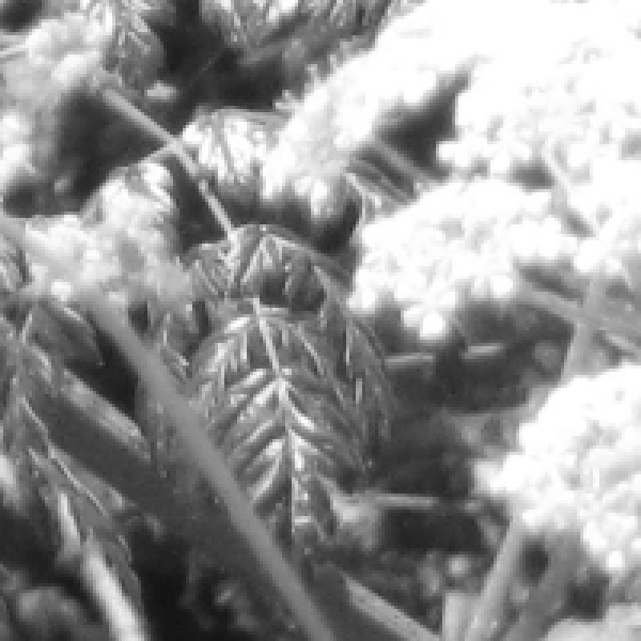

### 4.7.3　修改图片容器的属性

用户可以通过修改变量viewPortWidth和viewPortHeight的值来改变所绘图片的ViewPort属性。例4-12显示了如何在200 × 200的窗口里绘制400 × 400大小的图片。本质上，就是将相同大小的图片缩放至一个较小的容器中。

```javascript
var viewPortWidth=200;
var viewPortHeight=200;
```

例4-12对例4-11进行了简单的修改。

例4-12　通过ViewPort属性修改缩放比例

```javascript
var photo=new Image();
photo.addEventListener('load', eventPhotoLoaded , false);
photo.src="butterfly.jpg";
var windowWidth=500;
var windowHeight=500;
var viewPortWidth=200;
var viewPortHeight=200;
var windowX=0;
var windowY=0;
function eventPhotoLoaded() {
　　drawScreen()
}
function drawScreen(){
　　　　context.drawImage(photo, windowX, windowY,windowWidth,windowHeight, 
　　　　　　　　　　　　　0,0,viewPortWidth,viewPortHeight);
}
```

当运行例4-12时，读者会发现，相同大小的图片被放到了Canvas的较小区域中。图 4-13是该例子的运行截图。


<center class="my_markdown"><b class="my_markdown">图4-13　在小逻辑窗口中显示图像</b></center>

