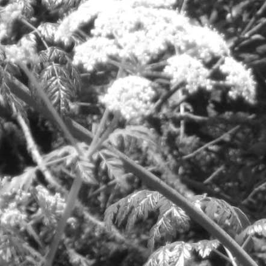

### 4.7.4　缩放图像

在画布上绘制图片时，除了通过设置ViewPort属性来缩放图片，也可以通过直接修改源图片的高度和宽度来达到缩放显示图片的目的。下面，保持图片容器的大小不变，对窗口的大小进行修改。当窗口的大小调整至比实际的显示窗口还大时，可以在 500 × 500的画布上看到图片的更多内容，且图片的细节也将更加清晰。要放大或缩小一个图像，需要改变drawImage()函数中最终的width值和height值。下面来试试如何在平移进行的同时，将图像的显示比例设置为2倍大小。drawImage()函数如下：

```javascript
context.drawImage(photo, windowX, windowY, windowWidth*2, windowHeight*2,
　　　　　　　　　0, 0, viewPortWidth, viewPortHeight);
```

例4-13对例4-12进行了修改，将窗口的长和宽都增加了一倍，以便对原图片进行缩放。

例4-13　通过修改图片源的属性对图片进行缩放

```javascript
var photo=new Image();
photo.addEventListener('load', eventPhotoLoaded , false);
photo.src="butterfly.jpg";
var windowWidth=500;
var windowHeight=500;
var viewPortWidth=500;
var viewPortHeight=500;
var windowX=0;
var windowY=0;
function eventPhotoLoaded() {
　　drawScreen()
}
function drawScreen(){
　　　　context.drawImage(photo, windowX, windowY,windowWidth*2,windowHeight*2,
　　　　　　　　　　　　　0,0,viewPortWidth,viewPortHeight);
}
```

比较例4-12和例4-13的输出可以发现，图片放大至两倍大小，尤其是在观察图片中的蝴蝶时，更能发现这一点。读者可以将图片移动到蝴蝶所在的位置，跟正常状态下的蝴蝶进行比较。

图4-14所示为该例子的运行截图。


<center class="my_markdown"><b class="my_markdown">图4-14　放大后的图片</b></center>

