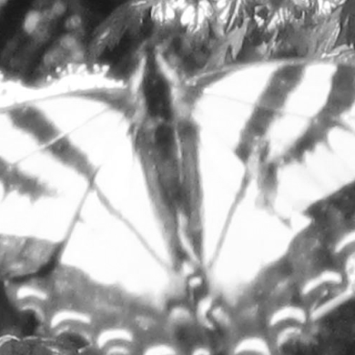

### 4.7.5　平移图片

例4-14将通过修改窗口的X和Y的位置来显示蝴蝶。另外，在绘制图片时，将不对图片进行缩放。

```javascript
var windowX=1580;
var windowY=1190;
```

运行例4-14，读者将看到蝴蝶基本占满整个画布。

例4-14　修改窗口属性，平移图片

```javascript
var photo=new Image();
　　photo.addEventListener('load', eventPhotoLoaded , false);
　　photo.src="butterfly.jpg";
　　var windowWidth=500;
　　var windowHeight=500;
　　var viewPortWidth=500;
　　var viewPortHeight=500;
　　var windowX=1580;
　　var windowY=1190;
　　function eventPhotoLoaded() {
　　　　drawScreen()
　　}
　　function drawScreen(){
　　　　context.drawImage
　　　　(photo, windowX,windowY,windowWidth,windowHeight,0,0,viewPortWidth,
　　　　viewPortHeight);
　　}
　　function gameLoop() {
　　　　window.setTimeout(gameLoop, 100);
　　　　drawScreen();
　　}
```

如图4-15所示，画布中没有进行缩放的蝴蝶。


<center class="my_markdown"><b class="my_markdown">图4-15　在正常尺寸下的蝴蝶</b></center>

