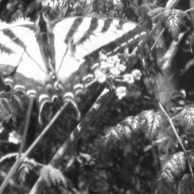

### 4.7.6　同时对图片进行移动和缩放

同时移动和缩放图片，只需和例4-14一样修改窗口的属性，和例4-15一样修改图片源的大小。

```javascript
var windowX=1580;
var windowY=1190;
```

在drawScreen()函数中，通过以下代码绘制图片。

```javascript
context.drawImage(photo, windowX, windowY, windowWidth*2, windowHeight*2,
　　　　　　　　　0, 0, viewPortWidth, viewPortHeight);
```

例4-15展示了缩放与移动的组合应用。

例4-15　同时对图片进行移动和缩放

```javascript
var photo=new Image();
photo.addEventListener('load', eventPhotoLoaded , false);
photo.src="butterfly.jpg";
var windowWidth=500;
var windowHeight=500;
var viewPortWidth=500;
var viewPortHeight=500;
var windowX=1580;
var windowY=1190;
function eventPhotoLoaded() {
　　drawScreen();
}
function drawScreen(){
　　　　context.drawImage(photo, windowX,
　　　　windowY,windowWidth*2,windowHeight*2,0,0,viewPortWidth,viewPortHeight);
}
```

运行例4-15可以发现，将绘制的区域已经移动到了大图片上一个新的地方，且原图片被放大至两倍。实际上，这是一个拉伸的效果，因此，蝴蝶比例4-14更加清楚。图4-16所示为例4-16的运行截图。


<center class="my_markdown"><b class="my_markdown">图4-16　同时对图片进行移动和缩放</b></center>

接下来，看看如何操控画布上的像素。

