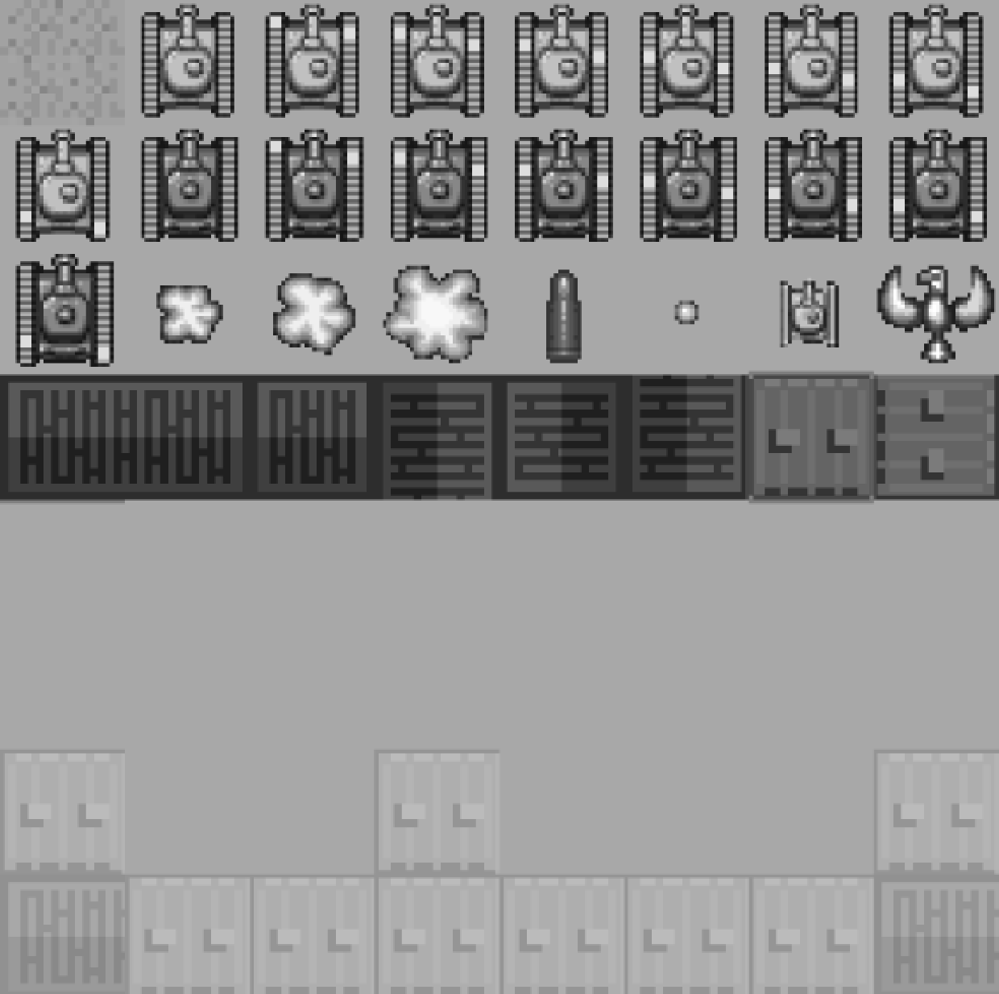

### 4.8.2　应用程序拼板印章

此处将创建一个简单的应用程序，该程序可以使用户高亮选择一个图像，将其复制后用作一个印章绘制到画布上。怎么看这也不能是一个惊爆的编辑应用——它只是使用ImageData对象的一个说明而已。

提示

> 这个应用程序需要运行在一个本地或者远程的Web服务器上。如果应用程序试图对一个文件调用getImageData()函数——即使是在一台本地机器上的同一个文件夹里，那么所有浏览器都会弹出一个错误。当前版本的Safari（6.02）不会弹出这个错误。

为了创建这个简单的应用程序，将使用到本章前面用到的拼图。单击拼图上的一点，会高亮显示一个32 × 32的方块拼板。将此拼板绘制到画布的底部。为说明像素操作，在将其绘制到屏幕之前，把像素颜色值设为一个新的透明度值。这将是制作原创的拼板地图编辑器的开始。那么，这里还将用到图4-7中的文件tanks_sheet.png。

#### 1．如何组织ImageData.data

ImageData.data属性是一个一维数组，为ImageData对象中的每个像素保存4个字节的数据。本节的示例应用程序将使用32 × 32个拼板。一个32 × 32的拼板包含1024个像素（或1K数据）。一个ImageData实例的ImageData.data属性控制32 × 32个图像，它将是4096字节（或者4K）每一个单独的字节用来为每个像素储存红、绿、蓝和alpha值。在这个应用程序中，遍历每个像素并将其alpha值设为128，代码如下。

```javascript
for (j=3; j< imageData.data.length; j+=4){
　 imageData.data[j] = 128;
}
```

首先从3开始循环，这是数组里的第四个属性。一维数组为每个像素保存一组连续数值，那么，索引3即代表第一个像素的alpha值（由于数组从0开始）。循环按每4个数值遍历数组，并将其设置为128。循环遍历完成，每个像素的alpha值都为128。

提示

> 与其他Canvas alpha操作中alpha值的范围为0～1不同，这里通过像素颜色值来操作alpha值，范围为0～255。

#### 2．基本应用程序

图4-17是简单拼板图章应用程序的截屏。

提示

> 图4-17显示的是本地运行Safari 5.1的示例。写作本书时，这是唯一一个可以在不弹出任何错误的前提下操作本地加载文件的像素数据，而非在Web服务器上运行时加载的浏览器。


<center class="my_markdown"><b class="my_markdown">图4-17　拼板图章应用程序</b></center>

屏幕被分为上下两部分，上面一部分是256 × 128拼图，下面是相同尺寸的拼板地图。用户将从上面选择一个拼板，这个拼板将红色高亮显示。然后，用户可以将选择的拼板印到下面的拼板地图绘制区域里。将拼板绘制在下面这部分后，alpha值被设为128。

#### 3．为画布添加鼠标事件

这里需要在应用程序中编写代码来响应鼠标单击，并且跟踪鼠标指针当前的x坐标和y坐标。现在，设立两个应用程序范围的全局变量来储存鼠标指针的当前位置。

```javascript
var mouseX;
var mouseY;
```

同时设立两个时间监听器函数，并将它们关联到theCanvas对象。

```javascript
theCanvas.addEventListener("mousemove", onMouseMove, false);
theCanvas.addEventListener("click", onMouseClick, false);
```

在HTML中设立一个单一的Canvas对象。

```javascript
<canvas id="canvas" width="256" height="256" style="position: absolute;
　　top: 50px; left: 50px;">
 Your browser does not support HTML5 Canvas.
</canvas>
```

在代码的JavaScrpit部分，按以下方式定义画布。

```javascript
theCanvas = document.getElementById("canvas");
```

注意，设置<canvas>的位置为“top: 50px”和“left: 50px”。这将会使应用程序保持被放置在浏览器的左上角。不过，即使<canvas>标签没在页面的左上角，下面也有机会说明如何找到鼠标的x坐标和y坐标的准确值。onMouseMove函数将使用这些信息，基于<canvas>标签的位置来平移mouseX和mouseY数值。

```javascript
function onMouseMove(e){
　 mouseX = e.clientX-theCanvas.offsetLeft;
　 mouseY = e.clientY-theCanvas.offsetTop;
}
```

实际上，onMouseClick函数在应用程序中发挥了很大作用。当单击鼠标按钮的时候，这个函数会判断用户单击的是拼图，还是下面的拼版地图绘图区域。如果用户单击的是拼图，这个函数会判断具体哪个拼板被单击了。然后它将调用highlightTile()函数，同时传输被单击的拼板id（0～31），以及拼板左上角的x坐标和y坐标。

如果用户单击的是下半部分的拼版地图绘图区域，这个函数将再次判断用户单击了哪块拼板，并将当前选择的拼板在拼板地图上的相应位置输出。代码如下：

```javascript
function onMouseClick(e){
　 if (mouseY < 128){
　　　//寻找拼板高亮显示
　　　var col = Math.floor(mouseX / 32);
　　　var row = Math.floor(mouseY / 32);
　　　var tileId = (row*7)+(col+row);
　　　highlightTile(tileId,col*32,row*32)
　 }else{
　　　var col = Math.floor(mouseX / 32);
　　　var row = Math.floor(mouseY / 32);
　　　context.putImageData(imageData,col*32,row*32);
　　　}
　 }
```

接下来，重点介绍单击拼图的情况（mouseY < 128）。

若要判断单击拼图时的拼板tileId，则将鼠标单击的x坐标转换为0～7的数字，将y坐标转换为0～3的数字。为此，通过调用Math.floor函数来得到当前的mouseX或mouseY位置，然后除以拼版的宽或者高（都是32）。这样就可以找到被单击拼板的row值和col值。

```javascript
var col = Math.floor(mouseX / 32);
var row = Math.floor(mouseY / 32)
```

为找到行和列关联的tileId（拼图的0～31拼板编号），需要使用以下计算公式。

```javascript
TileId = (row*totalRows-1)+ (col+row);
```

实际使用应用程序数值计算。

```javascript
var tileId = (row*7)+(col+row);
```

例如，如果用户单击mouseX = 50以及mouseY = 15这个点，运算情况如下。

```javascript
col = Math.floor(50/32); // col = 1
row = Math.floor(15/32); // row = 0
tileId = (0*7)+(1+0);　　 // tileId = 1
```

这个位置是拼图上的第二块拼板。onMouseClick()函数随即将tileId和col的值乘以32，row值也乘以32，然后一同传输到highlightTile()函数中，告诉highlightTile()函数用户单击的准确的tileId、row和col值。

如果用户单击屏幕下方的拼板地图绘图区域，代码进行相同的行列计算。然后，调用putImageData()函数，并传输到控制着待印拼板及其左上角放置位置的ImageData实例中。

```javascript
var col = Math.floor(mouseX / 32);
var row = Math.floor(mouseY / 32);
context.putImageData(imageData,col*32,row*32);
```

#### 4．highlightTile()函数

highlightTile()函数接受以下3个参数。

+ 拼图上拼板的编号0～31。
+ tileId代表的拼板左上角的x坐标。
+ tileId代表的拼板左上角的y坐标。

提示

> x坐标和y坐标可以通过传输tileId数值来找到，但是它们需要在onMouse Down函数中。因此，可以在调用highlightTile()时把它们传输过去。这样就不用进行两次运算了。

highlightTile()解决的第一项任务是在屏幕上方重绘拼图。

```javascript
context.fillStyle = "#aaaaaa";
context.fillRect(0,0,256,128);
drawTileSheet();
```

这样做是为了删除围绕当前拼板的红色边框，同时准备在输入的tileId值所代表的拼板周围绘制一个新的红色边框。

然后，drawTileSheet()函数将tanks_sheet.png文件从（0，0）开始绘制在画布上。

```javascript
function drawTileSheet(){
　 context.drawImage(tileSheet, 0, 0);
}
```

接下来，highlightTile()函数将新的像素数据（已经没有红框包围）从画布复制到ImageData实例中。

```javascript
ImageData = context.getImageData(x,y,32,32);
```

现在，ImageData变量保存有画布上的拼板像素数据的一个副本。然后遍历ImageData.data中的像素，并将每个alpha值设为128。

既然ImageData变量保存着变更了alpha值后的正确像素，这里就可以围绕这个拼板绘制红框，以示这个拼板已经被选中，并将其印在拼板地图上。

```javascript
var startX = Math.floor(tileId % 8)*32;
var startY = Math.floor(tileId / 8)*32;
context.strokeStyle = "red";
context.strokeRect(startX,startY,32,32)
```

例4-16是这个应用程序的所有代码。

例4-16　拼板印章应用程序

```javascript
<!doctype html>
<html lang="en">
<head>
<meta charset="UTF-8">
<title>CH4EX16: Tile Stamper Application</title>
<script src="modernizr.js"></script>
<script type="text/javascript">
window.addEventListener('load', eventWindowLoaded, false);
function eventWindowLoaded(){
　 canvasApp();
}
function canvasSupport (){
　return Modernizr.canvas;
}
function canvasApp(){
　 if (!canvasSupport()){
　　　　　return;
　 }else{
　　　var theCanvas = document.getElementById("canvas");
　　　var context = theCanvas.getContext("2d");
　 }
　 var mouseX;
　 var mouseY;
　 var tileSheet = new Image();
　 tileSheet.addEventListener('load', eventSheetLoaded , false);
　 tileSheet.src = "tanks_sheet.png";
　 var imageData = context.createImageData(32,32);
　 function eventSheetLoaded(){
　　　startUp();
　 }
　 function startUp(){
　　　context.fillStyle = "#aaaaaa";
　　　context.fillRect(0,0,256,256);
　　　drawTileSheet();
　 }
　 function drawTileSheet(){
　　　context.drawImage(tileSheet, 0, 0);
}
function highlightTile(tileId,x,y){
　 context.fillStyle = "#aaaaaa";
　 context.fillRect(0,0,256,128);
　 drawTileSheet();
　 imageData = context.getImageData(x,y,32,32);
　 //遍历imageData.data，将每组的第4个值设为新值
　 for (j=3; j< imageData.data.length; j+=4){
　　　imageData.data[j]=128;
　 }
　 var startX = Math.floor(tileId % 8)*32;
　 var startY = Math.floor(tileId / 8)*32;
　 context.strokeStyle = "red";
　 context.strokeRect(startX,startY,32,32)
}
function onMouseMove(e){
　 mouseX = e.clientX-theCanvas.offsetLeft;
　 mouseY = e.clientY-theCanvas.offsetTop;
}
function onMouseClick(e){
　 console.log("click: " + mouseX + "," + mouseY);
　 if (mouseY < 128){
　　　//找到的拼板高亮显示
　　　var col = Math.floor(mouseX / 32);
　　　var row = Math.floor(mouseY / 32)
　　　var tileId = (row*7)+(col+row);
　　　highlightTile(tileId,col*32,row*32)
　 }else{
　　　var col = Math.floor(mouseX / 32);
　　　var row = Math.floor(mouseY / 32);
　　　context.putImageData(imageData,col*32,row*32);
　　　}
　 }
　 theCanvas.addEventListener("mousemove", onMouseMove, false);
　 theCanvas.addEventListener("click", onMouseClick, false);
}
</script>
</head>
<body>
<div>
<canvas id="canvas" width="256" height="256" style="position: absolute;
　　top: 50px; left: 50px;">
Your browser does not support HTML5 Canvas.
</canvas>
</div>
</body>
</html>
```

提示

> 在写作本书时，作者必须通过Web服务器来运行这个应用程序，以在画布上操作本地tanks_sheet.png文件。如果读者使用的是Safari浏览器（本书使用5.1版）或者火狐浏览器（19.02版），那么可以在本地硬盘上成功测试这个应用程序。

