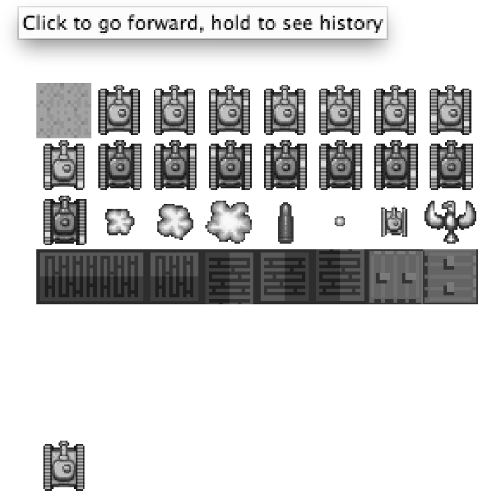

### 4.9　画布间的复制

Canvas可以将其他画布作为位图绘图操作源。接下来，快速看一下如何使用这项功能。

需要更改本章的基础文件。在HTML中创建一个新的<canvas>标签，并将其命名为canvas2（可将其命名为除第一个<canvas>名字外的任何名字），HTML<body>将如下所示。

```javascript
<body>
<div>
<canvas id="canvas" width="256" height="256" style="position: absolute;
　　top: 50px; left: 50px;">Your browser does not support HTML5 Canvas.</canvas>
<canvas id="canvas2" width="32" height="32" style="position: absolute;
　　top: 256px; left: 50px;">Your browser does not support HTML5 Canvas.</canvas>
</div>
</body>
```

将第二个<canvas>放在第一个下面，将其width和height都设置为32。然后，为canvas2创建一个新的环境和内部引用变量。用来为两个<canvas>元素提供引用支持的代码如下。

```javascript
if (!canvasSupport()){
　　 return;
　}else{
　 var theCanvas = document.getElementById("canvas");
　 var context = theCanvas.getContext("2d");
　 var theCanvas2 = document.getElementById("canvas2");
　 var context2 = theCanvas2.getContext("2d");
}
```

例4-17将使用前面示例中的拼图图像，并将其绘制到第一个画布上。然后，从这个画布中复制一个32 × 32的方块到第二个画布上。

例4-17　在画布间复制

```javascript
<!doctype html>
<html lang="en">
<head>
<meta charset="UTF-8">
<title>CH4EX17: Canvas Copy</title>
<script src="modernizr.js"></script>
<script type="text/javascript">
window.addEventListener('load', eventWindowLoaded, false);
function eventWindowLoaded(){
　 canvasApp();
}
function canvasSupport (){
　　 return Modernizr.canvas;
}
function canvasApp(){
　 if (!canvasSupport()){
　　　return;
　 }else{
　　　var theCanvas = document.getElementById("canvas");
　　　var context = theCanvas.getContext("2d");
　　　var theCanvas2 = document.getElementById("canvas2");
　　　var context2 = theCanvas2.getContext("2d");
　 }
　 var tileSheet = new Image();
　 tileSheet.addEventListener('load', eventSheetLoaded , false);
　 tileSheet.src="tanks_sheet.png";
　 function eventSheetLoaded(){
　　　startUp();
　 }
　 function startUp(){
　　　context.drawImage(tileSheet, 0, 0);
　　　context2.drawImage(theCanvas, 32, 0,32,32,0,0,32,32);
　 }
}
</script>
</head>
<body>
<div>
<canvas id="canvas" width="256" height="256" style="position: absolute;
　　top: 50px; left: 50px;"> Your browser does not support HTML5 Canvas.</canvas>
<canvas id="canvas2" width="32" height="32" style="position: absolute;
　　top: 256px; left: 50px;">Your browser does not support HTML5 Canvas.</canvas>
</div>
</body>
</html>
```

图4-18显示了操作中的画布复制函数的执行效果。


<center class="my_markdown"><b class="my_markdown">图4-18　画布复制操作示例</b></center>

当在包含Canvas对象的Web页面上创建需要跨多个<div>实例共享和复制图像数据的应用程序时，画布复制操作非常有用。例如，多个Canvas元素可以遍布整个Web页面，当用户更改了其中一个，其他的也可以同步更新。这可以用在有趣的应用程序中，例如一款游戏中的“小图”；或者，可以用在大型的应用程序中，例如股票的投资组合图和个性化功能。

