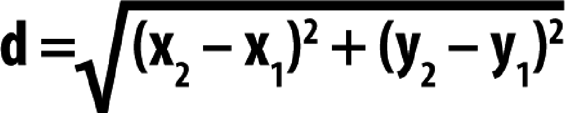
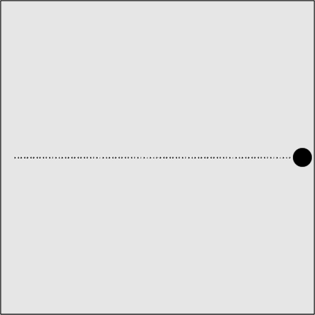

### 5.1.1　两点间移动：线段距离

通过常量改变对象x坐标和y坐标的方式移动，在很多应用程序里都运行得不错。但是，有些情况要求更精确。例如，将一个对象从A点匀速移动到B点。在数学上，得出未知线段长度的办法通常采用勾股定理：

A<sup class="my_markdown">2</sup>+ B<sup class="my_markdown">2</sup> = C<sup class="my_markdown">2</sup>。

这个等式中，A、B是已知的两个直角边，C是直角三角形未知的斜边。当然，需要将这个方程转换成画布上的点和像素可用的方式。

这是在应用程序中使用数学方程的一个很好的例子。在这个例子中，需要求出给定两点间线段的距离。用文字表述这个方程的含义如下：

所求距离等于两点x坐标之差与y坐标之差的平方和的平方根。

距离方程如图5-1所示。


<center class="my_markdown"><b class="my_markdown">图5-1　距离方程</b></center>

在第二个示例中，将在canvasApp()函数中创建一些新的变量。speed变量保留，就像在第一个示例中那样，但这次将其设置为5，目的在于调用drawScreen()函数的时候移动5个像素。

```javascript
var speed = 5;
```

然后，创建两个动态对象——每个都有x和y属性——代表移动的两个端点。本例中，将让这个圆从（20，250）移动到（480，250）。

```javascript
var p1 = {x:20,y:250};
var p2 = {x:480,y:250};
```

现在，重建图5-1中的距离方程。第一步是计算两点间的x坐标及y坐标之差。

```javascript
var dx = p2.x - p1.x;
var dy = p2.y - p1.y;
```

接下来，求distance的值。将刚刚创建的两个变量分别平方后相加，然后使用Math.sqrt()函数求出平方根。

```javascript
var distance = Math.sqrt(dx*dx + dy*dy);
```

接下来，将使用算出来的distance的值计算出从p1点到p2点匀速移动对象的像素值。第一步，要计算出在给定的speed值下对象将要移动多少次（即调用几次drawScreen()）。通过用distance除以speed求得。

```javascript
var moves = distance/speed;
```

然后求出每次调用drawScreen()时，x和y各需要移动多长距离。这两个变量名为xunits和yunits。

```javascript
var xunits = (p2.x - p1.x)/moves;
var yunits = (p2.y - p1.y)/moves;
```

最后，创建一个名为ball的动态对象，用来控制p1点的x和y。

```javascript
var ball = {x:p1.x, y:p1.y};
```

将调用drawScreen()函数的间隔设置为20s。

```javascript
function gameLoop() {
　 window.setTimeout(gameLoop, 20);
　 drawScreen()
}
gameLoop();
```

#### 1．绘制球

现在，将这个球绘制到屏幕上。在drawScreen()函数中，首先来判断moves变量是否大于0。如果是，将继续保持这个球运动到p2点。通过减少移动次数（moves--），然后将x加xunits，将y加上yunits来更新这个球的x和y的属性：

```javascript
if (moves > 0 ){
　 moves--;
　 ball.x += xunits;
　 ball.y += yunits;
}
```

更新values值后，只需将这个球的x坐标和y坐标绘制在指定的x和y属性上即可。这一步完成后，按每33ms调用drawScreen()即可。

```javascript
context.fillStyle = "#000000";
context.beginPath();
context.arc(ball.x,ball.y,15,0,Math.PI*2,true);
context.closePath();
context.fill();
```

在浏览器中运行这个示例。读者可以在代码文件CH5EX2.html中找到它。球从一点移动到了另一点。尝试改变一下每一点的坐标x和坐标y的值，或者改变移动速度，看看会有什么结果。通过这个简单的示例就可以学到很多。

#### 2．追踪移动：点路径

本章中的很多示例，都会创建方法来追踪画布上对象的运动，并通过绘制点来显示追踪的路径。这样可以表明对象是如何移动的。不过在现实世界中，需要去除这个功能，以使应用程序可以表现得更真实。现在仅在此处讨论这段代码，如果本章随后的其他示例中再有这段代码，读者回过头来重温一下这节所讲的内容即可。首先，在canvasApp()函数中创建一个数组，用来保存将要绘制在画布上的这些点。

```javascript
var points = new Array();
```

接下来，加载一个4像素×4像素的黑色图像point.png，用来在画布上显示点。

```javascript
var pointImage = new Image();
pointImage.src = "point.png";
```

只要为将要移动的对象计算出一个点，就可以将这个点放到points数组中。

```javascript
points.push({x:ball.x,y:ball.y});
```

在每次调用drawScreen()时，将放到points数组中的那些点绘制出来。记住，必须每次重绘所有点。这是因为，画布是一个即时模式显示界面，并不保存所绘图像的任何信息。

```javascript
for (var i = 0; i< points.length; i++){
　 context.drawImage(pointImage, points[i].x, points[i].y,1,1);
}
```

图5-2中，可以看到这个球从一点到另一点的移动的过程，以及points路径绘制后是什么样的。

提示

> 本章中，只在本节深入探讨points路径。如果看到了这些点是如何绘制的，就会明白为什么添加这些功能，以及如何添加这些功能。必要的时候，可能还会有足够的信息来删除这些代码。


<center class="my_markdown"><b class="my_markdown">图5-2　一个球从一点沿路径向另一个点移动（为说明清楚，将点绘制出来）</b></center>

例5-2是CH5EX2.html全部代码的列表。

例5-2　简单直线移动

```javascript
<!doctype html>
<html lang="en">
<head>
<meta charset="UTF-8">
<title>CH5EX2: Moving On A Simple Line</title>
<script src="modernizr.js"></script>
<script type="text/javascript">
window.addEventListener('load', eventWindowLoaded, false);
function eventWindowLoaded(){
　 canvasApp();
}
function canvasSupport (){
　　 return Modernizr.canvas;
}
function canvasApp(){
　if (!canvasSupport()){
　　　　　return;
　　　　}
　var pointImage = new Image();
　pointImage.src = "point.png";
　function drawScreen (){
　　　context.fillStyle = '#EEEEEE';
　　　context.fillRect(0, 0, theCanvas.width, theCanvas.height);
　　　//边框
　　　context.strokeStyle = '#000000';
　　　context.strokeRect(1, 1, theCanvas.width-2, theCanvas.height-2);
　　　//创建球
　　　if (moves > 0 ){
　　　　 moves--;
　　　　 ball.x += xunits;
　　　　 ball.y += yunits;
　　　}
　　　//绘制点来说明路径
　　　points.push({x:ball.x,y:ball.y});
　　　for (var i = 0; i< points.length; i++){
　　　　　context.drawImage(pointImage, points[i].x, points[i].y,1,1);
　　　}
　　　context.fillStyle = "#000000";
　　　context.beginPath();
　　　context.arc(ball.x,ball.y,15,0,Math.PI*2,true);
　　　context.closePath();
　　　context.fill();
　 }
　 var speed = 5;
　 var p1 = {x:20,y:250};
　 var p2 = {x:480,y:250};
　 var dx = p2.x - p1.x;
　 var dy = p2.y - p1.y;
　 var distance = Math.sqrt(dx*dx + dy*dy);
　 var moves = distance/speed;
　 var xunits = (p2.x - p1.x)/moves;
　 var yunits = (p2.y - p1.y)/moves;
　 var ball = {x:p1.x, y:p1.y};
　 var points = new Array();
　 theCanvas = document.getElementById("canvasOne");
　 context = theCanvas.getContext("2d");
　 function gameLoop() {
　　　window.setTimeout(gameLoop, 20);
　　　drawScreen()
　 }
　 gameLoop();
}
</script>
</head>
<body>
<div style="position: absolute; top: 50px; left: 50px;">
<canvas id="canvasOne" width="500" height="500">
 Your browser does not support HTML5 Canvas.
</canvas>
</div>
</body>
</html>
```

