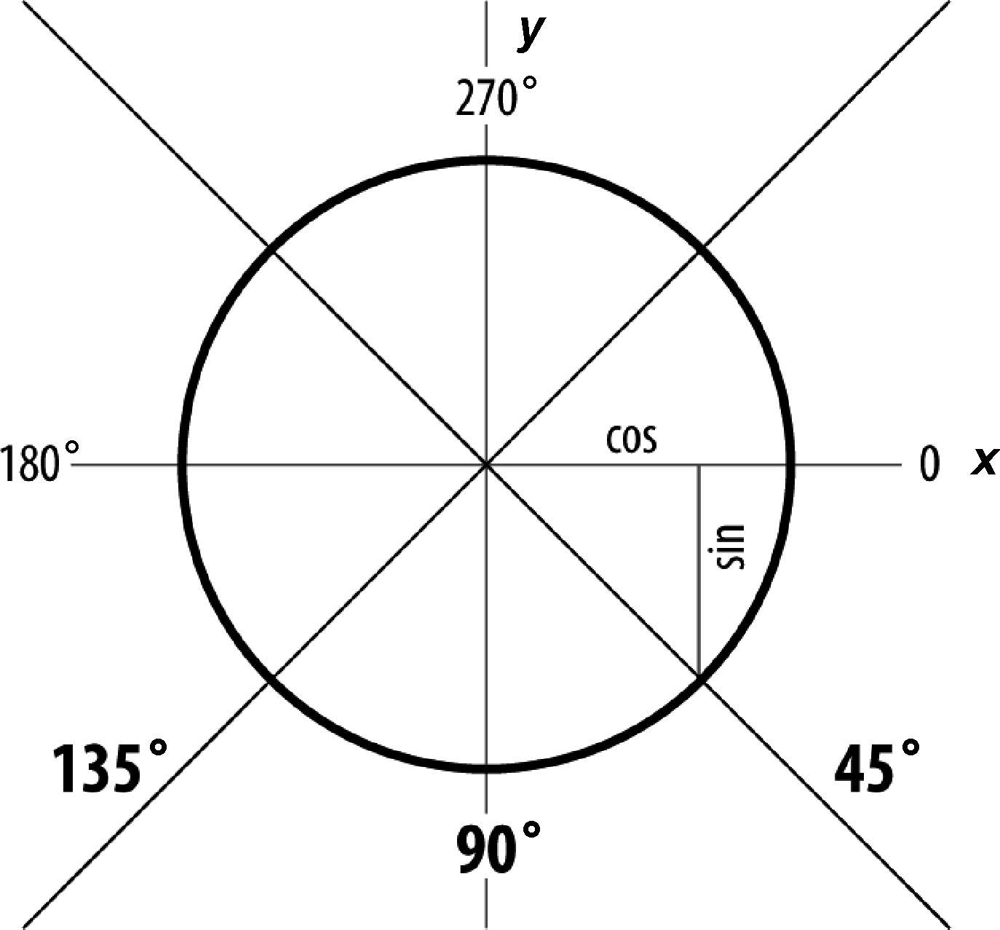
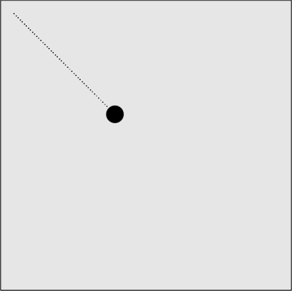

### 5.1.2　按照矢量移动

在两点之间移动很方便，但是很多时候并没有一个要移到哪里去的目标点，只有从哪里开始的起始点。这种情况下，创建一个vector作为移动对象就非常有用了。

矢量是一个具有数量和方向的物理量。在示例中，数量就是对象移动的速度speed的值，方向就是对象移动的角度angle的值。

在矢量上移动和在两点之间移动非常类似。在canvasApp()函数中，首先设置speed的值（数量），这是每次调用drawScreen()函数移动对象的像素数。将其设为5，并将对象起始点（p1）设为（20，20）。

```javascript
var speed = 5;
var p1 = {x:20,y:20};
```

现在，将对象移动的角度angle的值（方向）设为45°。在数学上，平滑直线通常代表角度为0，45°的矢量就意味着向右下方移动。

需要将角度转换为弧度。弧度是度量角度的标准单位，大部分数学计算都需要将角度转换为弧度才能使用。

那么，为什么不干脆使用角度而只使用弧度呢？原因就在于，如果在2D界面上移动对象，矢量的移动角度还是比较容易理解的。一个圆为360°，大约有6个弧度，按逆时针方向计算。数学家可能对此非常有感觉。不过，就在计算机屏幕上移动对象来说，还是角度更容易些。因此，还是使用角度。但是，在运算的时候，仍需将45°的角度转换成弧度。使用标准方程式radians = angle * Math.PI/ 180即可，代码如下。

```javascript
var angle = 45;
var radians = angle * Math.PI/ 180;
```

开始讨论如何计算对象沿矢量移动之前，还得复习两个三角函数概念：cos和sin。如果是从圆心向外绘制，两者都与通过angle（以转化为radians）创建的弧形有关。

+ cos：从x轴（x）逆时针测量的角度。
+ sin：弧形终点垂直坐标（y）。

图5-3所示为这些值与45°角的关系。


<center class="my_markdown"><b class="my_markdown">图5-3　画布上的角度</b></center>

虽然看起来有点复杂，但是有一种简便的理解方法：余弦通常与x值有关，正弦通常与y值有关。可以利用sin和cos来计算对象沿矢量的移动。

为计算每次调用drawScreen()函数时对象移动的像素数值（xunits和yunits），可使用计算得出的radians（方向）和speed（数量），以及JavaScript的Math对象的Math.cos()函数（余弦）和Math.sin()函数（正弦）。

```javascript
var xunits = Math.cos(radians) * speed;
var yunits = Math.sin(radians) * speed;
```

在drawScreen()函数中，将ball.x和ball.y分别加上xunits和yunits。

```javascript
ball.x += xunits;
ball.y += yunits;
```

无须检查moves是否已经为0，因为像素并不是要移动到某一点，而只是沿着矢量移动，可以永远移动。在下节中，本书将探讨如何使对象在撞上其他对象时改变方向，例如撞上一堵墙。

图5-4显示了例5-3在浏览器中的运行结果。记住，绘制出点只是为了演示清楚。


<center class="my_markdown"><b class="my_markdown">图5-4　让对象沿着矢量移动</b></center>

例5-3给出了完整代码。

例5-3　沿矢量移动

```javascript
<!doctype html>
<html lang="en">
<head>
<meta charset="UTF-8">
<title>CH5EX3: Moving On A Vector</title>
<script src="modernizr.js"></script> 
<script type="text/javascript">
window.addEventListener('load', eventWindowLoaded, false);
function eventWindowLoaded(){
　 canvasApp();
}
function canvasSupport (){
　　 return Modernizr.canvas;
}
function canvasApp(){
　if (!canvasSupport()){
　　　　　return;
　　　　}
　 var pointImage = new Image();
　 pointImage.src = "point.png";
　 function drawScreen (){
　　　 context.fillStyle = '#EEEEEE';
　　　 context.fillRect(0, 0, theCanvas.width, theCanvas.height);
　　　 //边框
　　　 context.strokeStyle = '#000000';
　　　 context.strokeRect(1, 1, theCanvas.width-2, theCanvas.height-2);
　　　 ball.x += xunits;
　　　 ball.y += yunits;
　　　 //绘制点来指示路径
　　　 points.push({x:ball.x,y:ball.y});
　　　 for (var i = 0; i< points.length; i++){
　　　　　context.drawImage(pointImage, points[i].x, points[i].y,1,1);
　　　 }
　　　 context.fillStyle = "#000000";
　　　 context.beginPath();
　　　 context.arc(ball.x,ball.y,15,0,Math.PI*2,true);
　　　 context.closePath();
　　　 context.fill();
　 }　var speed = 5;
　 var p1 = {x:20,y:20};
　 var angle = 45;
　 var radians = angle * Math.PI/ 180;
　 var xunits = Math.cos(radians) * speed;
　 var yunits = Math.sin(radians) * speed;
　 var ball = {x:p1.x, y:p1.y};
　 var points = new Array();
　 theCanvas = document.getElementById("canvasOne");
　 context = theCanvas.getContext("2d");
　 function gameLoop() {
　　　window.setTimeout(gameLoop, 20);
　　　drawScreen()
　 }
　 gameLoop();　 
}
</script>
</head>
<body>
<div style="position: absolute; top: 50px; left: 50px;">
<canvas id="canvasOne" width="500" height="500">
 Your browser does not support HTML5 Canvas.
</canvas>
</div>
</body>
</html>
```

