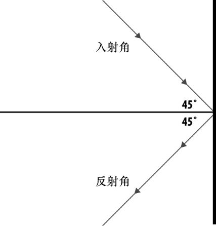

### 5.2　撞墙反弹

尽管创建一个有数量、有方向的矢量并让对象沿着它精确移动看起来很有动画感，但是现实中却很少出现类似的运动。大部分时候，人们会希望这个对象能对周围的世界有反应，例如撞上水平或者垂直的墙后能弹回来。

为了帮读者理解怎样实现反弹动画，先来看一个简单的物理原理。尽管这条原理经常用在光线上，但是对于动画2D形状却是非常有用的，特别是对象撞上水平或者垂直的墙后反弹的情况。这个原理就是反射角原理，即入射角等于反射角。

入射角是对象撞向墙壁时的角度，反射角是对象从墙面反弹回来的角度。

图5-5说明了对象以直线撞击墙壁时，行进线路在碰撞点与法线形成了45°夹角，弹回（反射）线路也是同样的45°夹角。

<b class="my_markdown">图5-5　入射角与反射角相等</b>

在下节中，本书将创建一系列使用这个原则设置对象动画的示例。本节的例5-4是一个球碰撞画布边缘反弹回来的例子。

