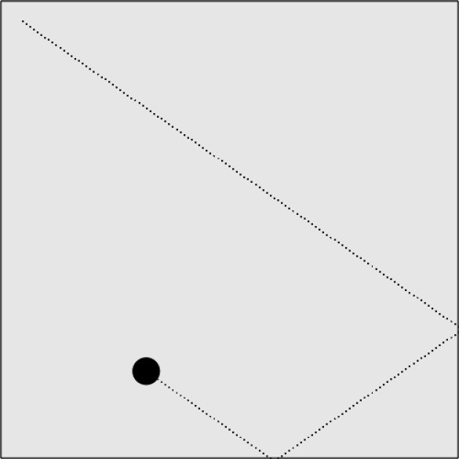

### 5.2.1　单个球反弹

在第一个示例中，创建一个沿矢量行进的球。将speed（数量）设置为5，将angle（方向）设置为35。其他变量与例5-3中的相同。还是让这个球沿着矢量运动，但是这次将测试这个球如何碰撞“墙壁”（也就是画布边缘），然后按照反射角原理反弹回来。与前面的矢量示例相比，一大变化就是初始化radians、xunits和yunits的位置，没有在canvasApp()中初始化应用程序时对它们进行设置，而是调用了一个名为updateBall()的新函数进行设置。

```javascript
var speed = 5;
var p1 = {x:20,y:20};
var angle = 35;
var radians = 0;
var xunits = 0;
var yunits = 0;
var ball = {x:p1.x, y:p1.y};
updateBall();
```

在每次为球设置新的angle时调用updateBall()函数，因为需要重新计算radians，并且找到新的xunits值和yunits值。当程序启动以及这个球每次从墙面反弹回来的时候，就生成了一个新的angle值。

```javascript
function updateBall(){
　 radians = angle * Math.PI/ 180;
　 xunits = Math.cos(radians) * speed;
　 yunits = Math.sin(radians) * speed;
}
```

在drawScreen()函数中更新这个球的位置，然后将其绘制到画布上。

```javascript
ball.x += xunits;
ball.y += yunits;
context.fillStyle = "#000000";
context.beginPath();
context.arc(ball.x,ball.y,15,0,Math.PI*2,true);
context.closePath();
context.fill();
```

在绘制到画布之前，先来测试球是否已经碰撞到了墙壁。如果这个球碰到了画布的右边（ball.x > theCanvas.width）或者左侧边缘（ball.x < 0），将角度值设为180°减去这个球沿矢量来的时候的角度，得出入射角度。另外，如果这个球碰到了画布的顶部（ball.y < 0）或者底部（ball.y > theCanvas.height），将用360°减去这个球沿矢量来的时候的角度。

```javascript
if (ball.x > theCanvas.width || ball.x < 0 ){
　　　 angle = 180 - angle;
　　　 updateBall();
　　} else if (ball.y > theCanvas.height || ball.y < 0){
　　　 angle = 360 - angle;
　　　 updateBall();
　　}
```

例5-4演示了一个球如何按照物理原理从墙面反弹回来。结果如图5-6所示。

例5-4　反弹球

```javascript
<!doctype html>
<html lang="en">
<head>
<meta charset="UTF-8">
<title>CH5EX4: Ball Bounce</title>
<script src="modernizr.js"></script>
<script type="text/javascript">
window.addEventListener('load', eventWindowLoaded, false);
function eventWindowLoaded(){
　 canvasApp();
} function canvasSupport (){
　　 return Modernizr.canvas;
}
function canvasApp(){
　if (!canvasSupport()){
　　　　　return;
　　　　}
　function drawScreen (){
　　　context.fillStyle = '#EEEEEE';
　　　context.fillRect(0, 0, theCanvas.width, theCanvas.height);
　　　//边框
　　　context.strokeStyle = '#000000';
　　　context.strokeRect(1, 1, theCanvas.width-2, theCanvas.height-2);
　　　ball.x += xunits;
　　　ball.y += yunits;
　　　context.fillStyle = "#000000";
　　　context.beginPath();
　　　context.arc(ball.x,ball.y,15,0,Math.PI*2,true);
　　　context.closePath();
　　　context.fill();
　　　if (ball.x > theCanvas.width || ball.x < 0 ){
　　　　 angle = 180 - angle;
　　　　 updateBall();
　　　} else if (ball.y > theCanvas.height || ball.y < 0){
　　　　 angle = 360 - angle;
　　　　 updateBall();
　　　}
　 }
　 function updateBall(){
　　　radians = angle * Math.PI/ 180;
　　　xunits = Math.cos(radians) * speed;
　　　yunits = Math.sin(radians) * speed;
　 }
　 var speed = 5;
　 var p1 = {x:20,y:20};
　 var angle = 35;
　 var radians = 0;
　 var xunits = 0;
　 var yunits = 0;
　 var ball = {x:p1.x, y:p1.y};
　 updateBall();
　 theCanvas = document.getElementById("canvasOne");
　 context = theCanvas.getContext("2d");
　 function gameLoop() {
　　　window.setTimeout(gameLoop, 20);
　　　drawScreen()
　 }
　 gameLoop();
}
</script>
</head>
<body>
<div style="position: absolute; top: 50px; left: 50px;">
<canvas id="canvasOne" width="500" height="500">
Your browser does not support HTML5 Canvas.
</canvas>
</div>
</body>
</html>
```


<center class="my_markdown"><b class="my_markdown">图5-6　单个球撞墙反弹回来</b></center>

提示

> 当在浏览器上运行的时候，不会绘制线上的点，因为它们比起这个球来说要慢很多。图5-6说明了它们的入射角度和反射角度。

