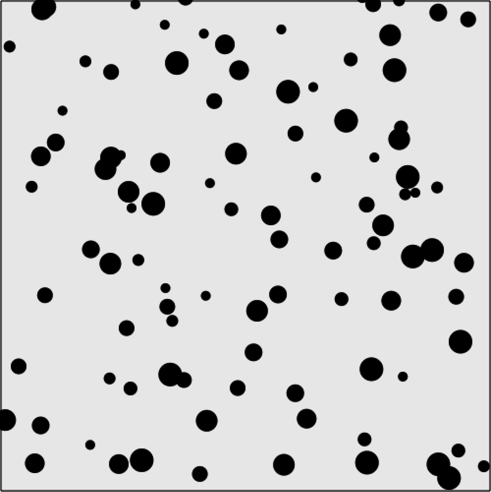

### 5.2.2　多球撞墙反弹

一个球的例子已经很酷了，要是100个呢？编码100遍是不是更复杂？完全不是。实际上，代码只是复杂了一点点，而且更加精妙。大部分的编程任务只是针对单个对象类型，这往往会让读者觉得有点偷懒。然而，当需要创建一个支持n个对象的应用程序时，必须确保代码在多种不同的情况下都能正常运转。在画布上反弹100的球的情况中，需要创建一个球对象，它将有更多的属性。回想一下前面创建过的球对象，它只包含x和y两个属性，如下所示。

```javascript
var ball = {x:p1.x, y:p1.y};
```

canvasApp()函数中其他代表球（speed, angle, xunits, yunits）的变量都是全局变量。使用全局变量的原因在于读者可以不用再去管它。然而，由于需要确保应用中的每个球都以相同的方式运行，因此需要为每个球对象设置这些属性数值。

为实现这个多球反弹应用程序，将创建一个新的对象来控制关于每个反弹球的所有相关信息：x、y、speed、angle、xunits和yunits。由于将要创建100个大小不同的球，还将添加一个名为radius的属性来代表球的大小（准确的说是大小的一半，即是球的半径）。

```javascript
tempBall = {x:tempX,y:tempY,radius:tempRadius, speed:tempSpeed,
　　　　　　 angle:tempAngle, xunits:tempXunits, yunits:tempYunits}
```

在canvasApp()函数中，这里定义了几个新的变量来控制在画布上到处反弹的这些球。

+ numBalls：随机创建球的个数。
+ maxSize：这些球的最大半径。
+ minSize：这些球的最小半径。
+ maxSpeed：这些球的最大速度。
+ balls：控制所有创建的球的数组。

新定义的变量如以下代码所示。

```javascript
var numBalls = 100 ;
var maxSize = 8;
var minSize = 5;
var maxSpeed = maxSize+5;
var balls = new Array();
```

创建一组临时变量来控制将球放到balls数组之前的属性数值。

```javascript
var tempBall;
var tempX;
var tempY;
var tempSpeed;
var tempAngle;
var tempRadius;
var tempRadians;
var tempXunits;
var tempYunits;
```

接下来，在canvasApp()函数中，通过循环来重复创建这些球对象。请注意，下面的tempX和tempY变量是如何创建的。这些数值代表了球在画布上的起始位置，每个位置值都是随机产生的，而且按球的大小（tempRadius*2）进行了平移。如果不这样做，应用程序启动时有些球就会卡在墙里面，因为它们的x坐标或y坐标有可能在墙里面。但是，由于它们的speed又不够大，因此这些球将会“弹”到画面以外去，并且卡在那里永远也弹不会来（想想看，这多么令人难过）。

提示

> 当读者尝试这个应用程序的时候，可能仍然偶尔会有球卡在墙里。为避免这样的情况发生，接下来将进一步进行优化。但是，想必这个小问题仍将是一个大工程。这将在第5章的5.2.4节中讲到。

tempSpeed变量是由之前创建的maxSpeed值减去tempRadius的值得来的。speed变量并不是随机的，但是它将与求得的大小（半径）成反比。由于大球的半径会更大，因此从tempSpeed减得的数值也将会更大，也就是这个球移动得更慢。

提示

> 当在Web浏览器中运行CH5EX5.html的时候，读者会注意到，这个小伎俩使这些球看起来更真实了，因为人的意识里就是大的物体会移动得慢些。

```javascript
for (var i = 0; i < numBalls; i++){
　　tempRadius = Math.floor(Math.random()*maxSize)+minSize;
　　tempX = tempRadius*2 + (Math.floor(Math.random()*theCanvas.width)-tempRadius*2);
　　tempY = tempRadius*2 + (Math.floor(Math.random()*theCanvas.height)-tempRadius*2);
　　tempSpeed = maxSpeed-tempRadius;
　　tempAngle = Math.floor(Math.random()*360);
　　tempRadians = tempAngle * Math.PI/ 180;
　　tempXunits = Math.cos(tempRadians) * tempSpeed;
　　tempYunits = Math.sin(tempRadians) * tempSpeed;
　　tempBall = {x:tempX,y:tempY,radius:tempRadius, speed:tempSpeed, angle:tempAngle,
　　　　xunits:tempXunits, yunits:tempYunits}
　　balls.push(tempBall);
}
```

现在，需要将这些球绘制到画布上。在drawScreen()函数中，绘制这些球的代码看起来会很眼熟，因为这和例5-4中绘制一个球的代码是相同的。只需要遍历balls数组来产生每个球对象即可。

```javascript
for (var i = 0; i <balls.length; i++){
　　　　　 ball = balls[i];
　　　　　 ball.x += ball.xunits;
　　　　　 ball.y += ball.yunits;
　　　　　 context.beginPath();
　　　　　 context.arc(ball.x,ball.y,ball.radius,0,Math.PI*2,true);
　　　　　 context.closePath();
　　　　　 context.fill();
　　　　 if (ball.x > theCanvas.width || ball.x < 0 ){
　　　　　　　ball.angle = 180 - ball.angle;
　　　　　　　updateBall(ball);
　　　　 } else if (ball.y > theCanvas.height || ball.y < 0){
　　　　　　　ball.angle = 360 - ball.angle;
　　　　　　　updateBall(ball);
　　　　 }
　　　}
```

当在Web浏览器中加载例5-5的时候，将看到一堆球各自朝向屏幕移动，如图5-7所示。如果有兴趣的话，可以将numBalls变量的值改为500或者1000，观察画布上的图案。


<center class="my_markdown"><b class="my_markdown">图5-7　多个大小不同的球撞墙后反弹</b></center>

例5-5　多球反弹

```javascript
<!doctype html>
<html lang="en">
<head>
<meta charset="UTF-8">
<title>CH5EX5: Multiple Ball Bounce</title>
<script src="modernizr.js"></script>
<script type="text/javascript">
window.addEventListener('load', eventWindowLoaded, false);
function eventWindowLoaded(){
　 canvasApp();
}
function canvasSupport (){
　　 return Modernizr.canvas;
}
function canvasApp(){
if (!canvasSupport()){
　　　 return;
　　　}
function drawScreen (){
　　context.fillStyle = '#EEEEEE';
　　context.fillRect(0, 0, theCanvas.width, theCanvas.height);
　　//边框
　　context.strokeStyle = '#000000';
　　context.strokeRect(1, 1, theCanvas.width-2, theCanvas.height-2);
　　//放置球
　　context.fillStyle = "#000000";
　　var ball;
　　for (var i = 0; i <balls.length; i++){
　　　 ball = balls[i];
　　　 ball.x += ball.xunits;
　　　 ball.y += ball.yunits;
　　　 context.beginPath();
　　　 context.arc(ball.x,ball.y,ball.radius,0,Math.PI*2,true);
　　　 context.closePath();
　　　 context.fill();
　　　 if (ball.x > theCanvas.width || ball.x < 0 ){
　　　　　ball.angle = 180 - ball.angle;
　　　　　updateBall(ball);
　　　 } else if (ball.y > theCanvas.height || ball.y < 0){
　　　　　ball.angle = 360 - ball.angle;
　　　　　updateBall(ball);
　　　 }
　　}
}
function updateBall(ball){
　 ball.radians = ball.angle * Math.PI/ 180;
　 ball.xunits = Math.cos(ball.radians) * ball.speed;
　 ball.yunits = Math.sin(ball.radians) * ball.speed;
}
var numBalls = 100 ;
var maxSize = 8;
var minSize = 5;
var maxSpeed = maxSize+5;
var balls = new Array();
var tempBall;
var tempX;
var tempY;
var tempSpeed;
var tempAngle;
var tempRadius;
var tempRadians;
var tempXunits;
var tempYunits;
theCanvas = document.getElementById("canvasOne");
context = theCanvas.getContext("2d");
for (var i = 0; i < numBalls; i++){
　 tempRadius = Math.floor(Math.random()*maxSize)+minSize;
　 tempX = tempRadius*2 + (Math.floor(Math.random()*theCanvas.width)-tempRadius*2);
　 tempY = tempRadius*2 + (Math.floor(Math.random()*theCanvas.height)-tempRadius*2);
　 tempSpeed = maxSpeed-tempRadius;
　 tempAngle = Math.floor(Math.random()*360);
　 tempRadians = tempAngle * Math.PI/ 180;
　 tempXunits = Math.cos(tempRadians) * tempSpeed;
　 tempYunits = Math.sin(tempRadians) * tempSpeed;
　 tempBall = {x:tempX,y:tempY,radius:tempRadius, speed:tempSpeed, angle:tempAngle,
　　　 xunits:tempXunits, yunits:tempYunits}
　 balls.push(tempBall);
}
function gameLoop() {
　window.setTimeout(gameLoop, 20);
　drawScreen()
}
gameLoop();
}
</script>
</head>
<body>
<div style="position: absolute; top: 50px; left: 50px;">
<canvas id="canvasOne" width="500" height="500">
 Your browser does not support HTML5 Canvas.
</canvas>
</div>
</body>
</html>
```

