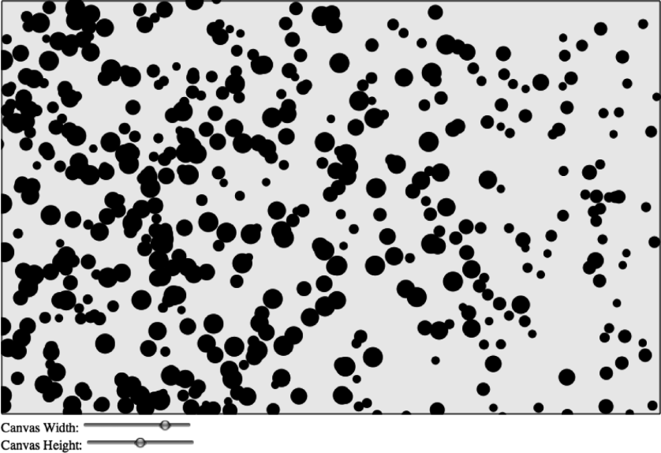

### 5.2.3　可动态调整画布大小的多球碰撞反弹

在进入更复杂的球与球互动之前，还是先来尝试更多的变化。在第3章中，本书曾经使用HTML5表单控件来调整了画布的大小，并且可以在画布中央显示文本。那么，以现在球的例子再试一次。这将会给读者更好的启发，看看对象与动态调整大小的画布如何进行互动。

首先，在HTML中创建两个HTML5 range控件，一个是width，另一个是height，并将它们的最大值设为1000。下面将使用这些控件来实时调整画布的宽度和高度。

```javascript
<form>
 Canvas Width: <input type="range" id="canvasWidth"
　　　 min="0"
　　　 max="1000"
　　　 step="1"
　　　 value="500"/>
 <br>
 Canvas Height: <input type="range" id="canvasHeight"
　　　 min="0"
　　　 max="1000"
　　　 step="1"
　　　 value="500"/>
 <br>
</form>
```

在canvasApp()当中，为这两个HTML5表单控件创建事件监听器——监听change事件。也就是说，随时移动range控件，随时调用时间处理器。

```javascript
formElement = document.getElementById("canvasWidth")
formElement.addEventListener('change', canvasWidthChanged, false);
formElement = document.getElementById("canvasHeight")
formElement.addEventListener('change', canvasHeightChanged, false);
```

事件处理器函数捕捉range控件的变化。设置theCanvas.width或theCanvas.height，然后调用drawScreen()函数来显示新尺寸的画布。这里无须再调用drawScreen()函数，当新的尺寸被应用到下个间隔的drawScreen()中时，画布会闪耀。

```javascript
function canvasWidthChanged(e){
　　　var target = e.target;
　　　theCanvas.width = target.value;
　　　drawScreen();
　 }
function canvasHeightChanged(e){
　　　var target = e.target;
　　　theCanvas.height = target.value;
　　　drawScreen();
}
```

提示

> 这些内容已经在第3章中进行了详细的解释。

最后，将球的数量从canvasApp()函数中增加到500。

```javascript
var numBalls = 500 ;
```

现在，测试例5-6（代码目录的CH5EX6.html）。当在Web浏览器中运行这段代码的时候，读者将看到500个球围着画布碰撞反弹，如图5-8所示。当使用range控件增加画布的宽度和高度时，它们将在碰到新的画布边缘之前一直运动。如果将画布缩小，就会发现这些球挤在一个更加狭小的空间里。如果快速地调整画布尺寸，有些球会被留在画布外面，但是很快又会重新出现在调整完尺寸的画布中了。


<center class="my_markdown"><b class="my_markdown">图5-8　快速调整画布大小中的多球碰撞反弹</b></center>

例5-6　动态调整画布大小时的多球碰撞反弹

```javascript
<!doctype html>
<html lang="en">
<head>
<meta charset="UTF-8">
<title>CH5EX6: Multiple Ball Bounce With Resize</title>
<script src="modernizr.js"></script>
<script type="text/javascript">
window.addEventListener('load', eventWindowLoaded, false);
function eventWindowLoaded(){
　 canvasApp();
}
function canvasSupport (){
　　 return Modernizr.canvas;
}
function canvasApp(){
　 if (!canvasSupport()){
　　　　　 return;
　　　　 }
　　formElement = document.getElementById("canvasWidth")
　　formElement.addEventListener('change', canvasWidthChanged, false);
　　formElement = document.getElementById("canvasHeight")
　　formElement.addEventListener('change', canvasHeightChanged, false);
　 function drawScreen (){
　　　 context.fillStyle = '#EEEEEE';
　　　 context.fillRect(0, 0, theCanvas.width, theCanvas.height);
　　　 //边框
　　　 context.strokeStyle = '#000000';
　　　 context.strokeRect(1, 1, theCanvas.width-2, theCanvas.height-2);
　　　 //放置球
　　　 context.fillStyle = "#000000";
　　　 var ball;
　　　 for (var i = 0; i <balls.length; i++){
　　　　　ball = balls[i];
　　　　　ball.x += ball.xunits;
　　　　　ball.y += ball.yunits;
　　　　　context.beginPath();
　　　　　context.arc(ball.x,ball.y,ball.radius,0,Math.PI*2,true);
　　　　　context.closePath();
　　　　　context.fill();
　　　　　if (ball.x > theCanvas.width || ball.x < 0 ){
　　　　　　 ball.angle = 180 - ball.angle;
　　　　　　 updateBall(ball);
　　　　　} else if (ball.y > theCanvas.height || ball.y < 0){
　　　　　　 ball.angle = 360 - ball.angle;
　　　　　　 updateBall(ball);
　　　　　}
　　　}
　 }
　 function updateBall(ball){
　　　ball.radians = ball.angle * Math.PI/ 180;
　　　ball.xunits = Math.cos(ball.radians) * ball.speed;
　　　ball.yunits = Math.sin(ball.radians) * ball.speed;
　 }
　 var numBalls = 500 ;
　 var maxSize = 8;
　 var minSize = 5;
　 var maxSpeed = maxSize+5;
　 var balls = new Array();
　 var tempBall;
　 var tempX;
　 var tempY;
　 var tempSpeed;
　 var tempAngle;
　 var tempRadius;
　 var tempRadians;
　 var tempXunits;
　 var tempYunits;
　 theCanvas = document.getElementById("canvasOne");
　 context = theCanvas.getContext("2d");
　 for (var i = 0; i < numBalls; i++){
　　　tempRadius = Math.floor(Math.random()*maxSize)+minSize;
　　　tempX = tempRadius*2 + (Math.floor(Math.random()*theCanvas.width)-tempRadius*2);
　　　tempY = tempRadius*2 + (Math.floor(Math.random()*theCanvas.height)-tempRadius*2);
　　　tempSpeed = maxSpeed-tempRadius;
　　　tempAngle = Math.floor(Math.random()*360);
　　　tempRadians = tempAngle * Math.PI/ 180;
　　　tempXunits = Math.cos(tempRadians)* tempSpeed;
　　　tempYunits = Math.sin(tempRadians)* tempSpeed;
　　　tempBall = {x:tempX,y:tempY,radius:tempRadius, speed:tempSpeed, angle:tempAngle,
　　　　　xunits:tempXunits, yunits:tempYunits}
　　　balls.push(tempBall);
　 }
　 function gameLoop() {
　　　window.setTimeout(gameLoop, 20);
　　　drawScreen()
　 }
　 gameLoop();
　 function canvasWidthChanged(e){
　　　var target = e.target;
　　　theCanvas.width = target.value;
　　　drawScreen();
　 }
　 function canvasHeightChanged(e){
　　　var target = e.target;
　　　theCanvas.height = target.value;
　　　drawScreen();
　 }
}
</script>
</head>
<body>
<div style="position: absolute; top: 50px; left: 50px;">
<canvas id="canvasOne" width="500" height="500">
Your browser does not support HTML5 Canvas.
</canvas>
<form>
Canvas Width: <input type="range" id="canvasWidth"
　　　min="0"
　　　max="1000"
　　　step="1"
　　　value="500"/>
<br>
Canvas Height: <input type="range" id="canvasHeight"
　　　min="0"
　　　max="1000"
　　　step="1"
　　　value="500"/>
<br>
</form>
</div>
</body>
</html>
```

