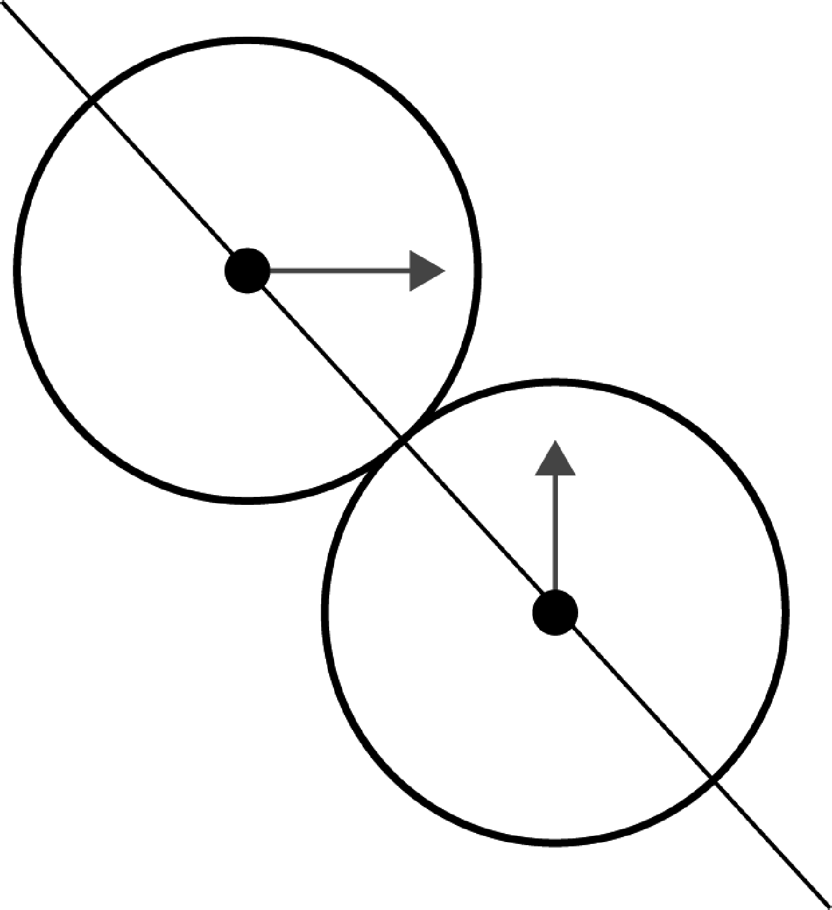
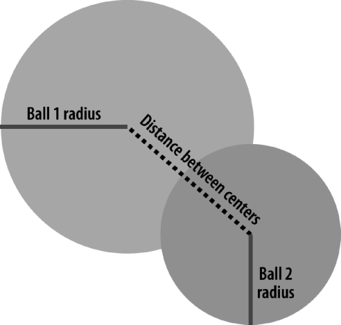
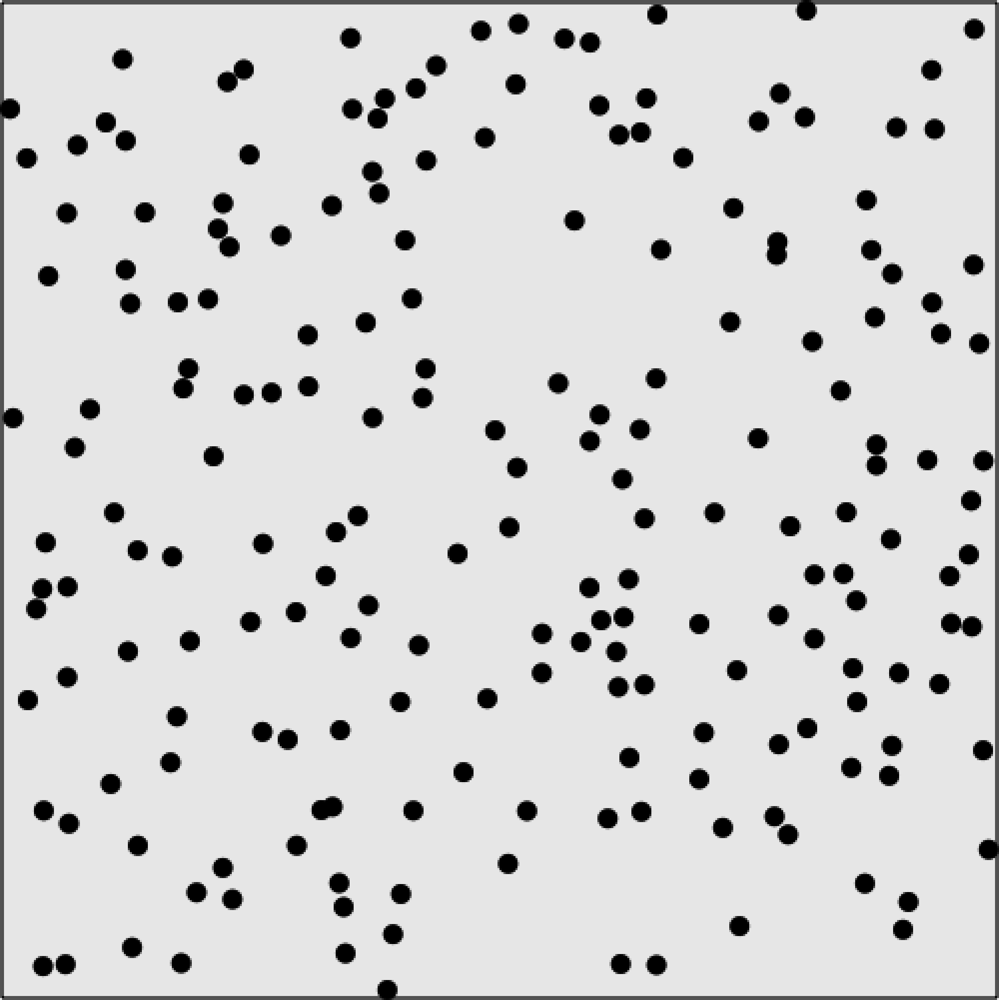

### 5.2.4　多球反弹和碰撞

现在，是时候前进一步了。除了测试球从墙面的反弹之外，如何实现球和球之间的相互碰撞？需要增加很多非常复杂的代码来处理这种类型的互动。

#### 1．球的物理互动

这个示例当中，将创建一种弹性碰撞。也就是说，碰撞前后所有对象的总动能不发生变化，这就是动量守恒定律（牛顿第三定律）。为此，本文将使用两个碰撞球的x轴和y轴速度，并且沿两个球的球心绘制一条“作用线”。如图5-9所示，这是改编自Jobe Makar与Ben Winiarczyk合著的Macromedia’s Flash MX 2004 Game Design Demystified （Macromedia出版）。然后，将按照这个角度以及动量守恒定律为每个球创建新的x轴和y轴速度。


<center class="my_markdown"><b class="my_markdown">图5-9　两个球从不同角度碰撞时连接球心的作用线</b></center>

为准确计算这些球在画布上碰撞的动量守恒，再添加一个新的属性：mass。mass用于测量一个球（或者任何对象）抵制速度的变化的强度。因为碰撞将要改变对象的速度，这是针对画布上的这些球对象增加的重要内容。

#### 2．确保这些球的开始位置不会在其他球的上面

这里将从例5-6（CH5EX6.html）创建的代码开始。这段代码的第一个重大改变在于确保这些球的开始位置不会随机地在其他球上面。如果让它们在相同的位置开始，它们将一直纠缠在一起而不会分开。老实讲，这种情况发生时看起来很酷，但那并不是本书想要得到的结果。

在canvasApp()函数中，将变量tempRadius的值设为5，用作每个球的半径。接下来，创建另一个新的变量，名为placeOK，并将其设为false。当这个变量为true的时候，就会得知得到了一个空地来放置小球（小球没有在其他球之上）。

下面，输入一个while()循环重复操作，直到placeOK变成false为止。然后，为每个新的球对象设置值。

```javascript
tempRadius = 5;
var placeOK = false;
while (!placeOK){
tempX = tempRadius*3 + (Math.floor(Math.random()*theCanvas.width)-tempRadius*3);
tempY = tempRadius*3 + (Math.floor(Math.random()*theCanvas.height)-tempRadius*3);
tempSpeed = 4;
tempAngle = Math.floor(Math.random()*360);
tempRadians = tempAngle * Math.PI/ 180;
tempvelocityx = Math.cos(tempRadians)* tempSpeed;
tempvelocityy = Math.sin(tempRadians)* tempSpeed;
```

现在，需要将一个动态对象设置于刚创建的那些数值之外，并将这个对象置于tempBall变量之中。在这里为每个球创建一个mass属性。同样，它用于计算这些球互相碰撞时候的效果。对于本示例中的所有球，mass属性都将是tempRadius变量的数值。这是因为在2D环境中，通过每个球的相对尺寸可以简便地生成mass值。由于每个球的mass和speed都是相同的，因此它们互相影响的方式也都是近似的。稍后，本书将展示创建不同mass数值的球时的运行效果。

最后，将nextX和nextY的属性设置成与x值和y值相等的数值。使用这些数值作为“预测”属性，辅助减轻迭代之间发生的碰撞——那将会导致球的重叠或者其他奇怪现象。

```javascript
tempBall = {x:tempX,y:tempY, nextX: tempX, nextY: tempY, radius:tempRadius,
　　speed:tempSpeed, angle:tempAngle, velocityx:tempvelocityx,
　　velocityy:tempvelocityy, mass:tempRadius};
```

用tempBall变量来代表新的动态球对象，然后测试它是否能被放置到随机生成的tempX和tempY位置上。通过调用一个新的函数canStartHere()来实现。如果canStartHere()返回值为true，就停止while()循环；反之，再次启动循环。

```javascript
　 placeOK = canStartHere(tempBall);
}
```

canStartHere()函数非常简单。它遍历ball数组，将新的tempBall与已有的球逐一测试，看他们是否重叠。如果检测到重叠，就返回false；反之，则返回true。为测试重叠，需要创建另一个新的函数hitTestCircle()。

```javascript
function canStartHere(ball){
　　　var retval = true;
　　　for (var i = 0; i <balls.length; i++){
　　　　 if (hitTestCircle(ball, balls[i])){
　　　　　　retval = false;
　　　　 }
　　　}
　　　return retval;
　 }
```

#### 3．检测圆圈碰撞

hitTestCircle()函数执行发现圆圈和圆圈碰撞的检测，来判断作为参数传送给函数的两个圆（各代表一个球）是否接触。因为已经通过球的圆心点坐标（x，y）来跟踪它，所以这项计算非常容易。为此，使用勾股定理（A<sup class="my_markdown">2</sup>+B<sup class="my_markdown">2</sup>=C<sup class="my_markdown">2</sup>）。为在碰撞前就检测到它，可使用球的nextx和nexty属性（重复一下，如果使用当前的x坐标和y坐标，这些球又会卡在一起而失去控制）。然后，将distance数值与两个球的半径之和对比，如果结果是小于，就会发生碰撞。这是测试碰撞的一个简单而有效的方法，在2D环境下检测小球碰撞非常有效。

```javascript
function hitTestCircle(ball1,ball2){
　 var retval = false;
　 var dx = ball1.nextx - ball2.nextx;
　 var dy = ball1.nexty - ball2.nexty;
　 var distance = (dx * dx + dy * dy);
　 if (distance <= (ball1.radius + ball2.radius)* (ball1.radius + ball2.radius)){
　　　retval = true;
　　}
　 return retval;
}
```

图5-10说明了这段代码的原理。


<center class="my_markdown"><b class="my_markdown">图5-10　球的碰撞</b></center>

#### 4．分离drawScreen()函数中的代码

接下来要做的事是，通过将代码分离为可控的函数来简化drawScreen()函数。这样做是要准确地检测碰撞，需要确保计算已经按特定顺序完成。在此称之为更新碰撞渲染循环。

+ update()：在balls数组中设置nextx和nexty的属性。
+ testWalls()：测试是否已经有球撞到墙上。
+ collide()：测试球之间的碰撞。如果发生碰撞，就更新nextx和nexty的值。
+ render()：令每个球的x属性和y属性分别等于nextx和nexty，并将他们绘制到画布上，代码如下。

```javascript
function drawScreen (){
　 update();
　 testWalls();
　 collide();
　 render();
　 }
```

#### 5．更新对象的位置

update()函数遍历balls数组的球，用x轴和y轴的速度为每个球更新nextx属性和nexty属性。此处不直接更新x和y，因为想要在球撞到墙和别的球之前就要检测到它。为此，按如下方式使用nextx和nexty属性。

```javascript
function update(){
　　　for (var i = 0; i <balls.length; i++){
　　　　 ball = balls[i];
　　　　 ball.nextx = (ball.x += ball.velocityx);
　　　　 ball.nexty = (ball.y += ball.velocityy);
　　　}
}
```

#### 6．更好地与墙互动

在上一个例子中，本书讨论了球和墙之间的互动，不过这里仍然有一个问题。由于通过圆心的x坐标和y坐标来移动这些球，在反弹发生前它们可能在半路就移出了画布。为了修正这个错误，需要加上或者减去ball对象的半径（主要取决于所检测的是哪一面墙）在画布的右侧和底部检测墙的时候要加上球的半径。类似地，测试在画布的左侧和顶部的时候，要减去球的半径。这样，这些球就不会在被墙面反弹回来之前就移出边缘了。

```javascript
function testWalls(){
　　　var ball;
　　　var testBall;
　　　for (var i = 0; i <balls.length; i++){
　　　　 ball = balls[i];
　　　　 if (ball.nextx+ball.radius > theCanvas.width){
　　　　　　ball.velocityx = ball.velocityx*−1;
　　　　　　ball.nextx = theCanvas.width - ball.radius;
　　　　 } else if (ball.nextx-ball.radius < 0 ){
　　　　　　ball.velocityx = ball.velocityx*−1;
　　　　　　ball.nextx = ball.radius;
　　　　 } else if (ball.nexty+ball.radius > theCanvas.height ){
　　　　　　ball.velocityy = ball.velocityy*−1;
　　　　　　ball.nexty = theCanvas.height - ball.radius;
　　　　 } else if(ball.nexty-ball.radius < 0){
　　　　　　ball.velocityy = ball.velocityy*−1;
　　　　　　ball.nexty = ball.radius;
　　　　 }
　　　}
　 }
```

#### 7．球的碰撞

collide()函数测试是否有球互相碰撞了。这个函数使用两个嵌套的循环，它们都将遍历balls数组来确保每个球两两之间都测试过。在第一个循环中，从balls数组中取出球，并将其放入ball变量。再次遍历balls数组，将每个球放入testBall变量。二者同时进行。当同时得到ball和testBall之后，确保它俩不是同一个球——每个球都不会和自己发生碰撞。当确认此事之后，调用hitTestCircle()函数来测试碰撞。如果发现碰撞，就调用collideBalls()函数。当球碰撞时，程序执行了一些很有意思的代码，如下所示。

```javascript
function collide(){
　　　 var ball;
　　　 var testBall;
　　　 for (var i = 0; i <balls.length; i++){
　　　　　 ball = balls[i];
　　　　　 for (var j = i+1; j < balls.length; j++){
　　　　　　　　 testBall = balls[j];
　　　　　　　　if (hitTestCircle(ball,testBall)){
　　　　　　　　　　collideBalls(ball,testBall);
　　　　　　　　 }
　　　　　　　}
　　　　}
　　 }
```

#### 8．球的碰撞进阶

现在，来到了这个例子中最有意思的代码部分。这里将为每个球更新属性，使它们互相反弹开。想想，之所以使用nextx属性和nexty属性，是因为要确认绘制完这个球后，它们将在什么位置（不是现在的位置）。这将避免两个球因重叠而粘在一起。

提示

> 有时，球还是会粘在一起。这在处理球碰撞时是一个很常见的问题。通常，在碰撞测试前两个球就已经重叠时会出现，并且反弹不足以将它们彻底分开。这里已经采取多种方式来优化这个函数，但是确实还需要进一步优化。

collideBalls()函数有两个参数：ball1和ball2。两个参数都是将要碰撞的ball对象。

```javascript
function collideBalls(ball1,ball2){
```

首先，需要计算每个球的中心点间的距离，并将其存储为dx和dy（距离x和距离y）。这和测试球的碰撞时所做的事情是很相似的。区别在于，现在不仅要知道它们已经碰上了，还要知道是怎么碰的。

```javascript
var dx = ball1.nextx - ball2.nextx;
var dy = ball1.nexty - ball2.nexty;
```

为此，需要使用Math.atan2()函数来找到碰撞的角度。这个函数给出了两个球碰撞角度的弧度值——这是碰撞发生的作用线。需要使用这个数值来判断两个球在碰撞后将如何反应。

```javascript
var collisionAngle = Math.atan2(dy, dx);
```

接下来，以每个球在碰撞前给定的x轴和y轴的速度来计算速度矢量。

```javascript
var speed1 = Math.sqrt(ball1.velocityx * ball1.velocityx +
　　ball1.velocityy * ball1.velocityy);
var speed2 = Math.sqrt(ball2.velocityx * ball2.velocityx +
　　ball2.velocityy * ball2.velocityy);
```

然后，以当前的速度来计算每个球的角度（以弧度为单位）。

```javascript
var direction1 = Math.atan2(ball1.velocityy, ball1.velocityx);
var direction2 = Math.atan2(ball2.velocityy, ball2.velocityx);
```

接下来，把矢量沿逆时针方向旋转，这样就可以把这些数值代入动量守恒方程中。基本上，只有使用碰撞角度并使其平滑，才能使球反弹。这与从墙面反弹球是类似的。

```javascript
var velocityx_1 = speed1 * Math.cos(direction1 - collisionAngle);
var velocityy_1 = speed1 * Math.sin(direction1 - collisionAngle);
var velocityx_2 = speed2 * Math.cos(direction2 - collisionAngle);
var velocityy_2 = speed2 * Math.sin(direction2 - collisionAngle);
```

取得每个球的mass值，并基于动量守恒定律更新它们的x轴和y轴的速度。为得出两个球的最终速度，可使用下列公式。

```javascript
velocity1 = ((mass1 - mass2)* velocity1 + 2*mass2 * velocity2)/ mass1 + mass2
velocity2 = ((mass2 - mass1)* velocity2 + 2*mass1 * velocity1)/ mass1+ mass2
```

实际上，只有x轴速度需要更新，y轴速度保持常量不变。

```javascript
var final_velocityx_1 = ((ball1.mass - ball2.mass)* velocityx_1 +
　　(ball2.mass + ball2.mass)* velocityx_2)/(ball1.mass + ball2.mass);
var final_velocityx_2 = ((ball1.mass + ball1.mass)* velocityx_1 +
　　(ball2.mass - ball1.mass)* velocityx_2)/(ball1.mass + ball2.mass);
var final_velocityy_1 = velocityy_1;
var final_velocityy_2 = velocityy_2
```

得出最终速度之后，再次将角度旋转回来，预留碰撞角度。

```javascript
ball1.velocityx = Math.cos(collisionAngle)* final_velocityx_1 +
　　Math.cos(collisionAngle + Math.PI/2)* final_velocityy_1;
ball1.velocityy = Math.sin(collisionAngle)* final_velocityx_1 +
　　Math.sin(collisionAngle + Math.PI/2)* final_velocityy_1;
ball2.velocityx = Math.cos(collisionAngle)* final_velocityx_2 +
　　Math.cos(collisionAngle + Math.PI/2)* final_velocityy_2;
ball2.velocityy = Math.sin(collisionAngle)* final_velocityx_2 +
　　Math.sin(collisionAngle + Math.PI/2)* final_velocityy_2;
```

现在，为两个球更新nextx和nexty的值，以便在render()函数中使用或者为其他的碰撞做准备。

```javascript
　 ball1.nextx = (ball1.nextx += ball1.velocityx);
　 ball1.nexty = (ball1.nexty += ball1.velocityy);
　 ball2.nextx = (ball2.nextx += ball2.velocityx);
　 ball2.nexty = (ball2.nexty += ball2.velocityy);
}
```

提示

> 如果这让读者感到迷惑，没关系，大家都会这样。本书花费了很大力气才将这段代码从其他资源翻译成一个可运行的HTML5 Canvas示例。这里的代码基于Felipe Sampaio所著的Flash Lite Effort - Embedded Systems and Pervasive Computing Lab。同时，部分基于Jobe Makar和Ben Winiarczyk合著的Macromedia Flash MX 2004 Game Design Demystified，以及Keith Peters关于ActionScript动画的有关书籍。

下面所列就是例5-7的完整代码。

例5-7　球的简单互动

```javascript
<!doctype html>
<html lang="en">
<head>
<meta charset="UTF-8">
<title>CH5EX7: Balls With Simple Interactions</title>
<script src="modernizr.js"></script>
<script type="text/javascript">
window.addEventListener('load', eventWindowLoaded, false);
function eventWindowLoaded(){
　 canvasApp();
}
function canvasSupport (){
　　 return Modernizr.canvas;
}
function canvasApp(){
　if (!canvasSupport()){
　　　　　return;
　　　　}
　function drawScreen (){
　　　context.fillStyle = '#EEEEEE';
　　　context.fillRect(0, 0, theCanvas.width, theCanvas.height);
　　　//边框
　　　context.strokeStyle = '#000000';
　　　context.strokeRect(1, 1, theCanvas.width-2, theCanvas.height-2);
　　　update();
　　　testWalls();
　　　collide();
　　　render();
　}
　function update(){
　　 for (var i = 0; i <balls.length; i++){
　　　　ball = balls[i];
　　　　ball.nextx = (ball.x += ball.velocityx);
　　　　ball.nexty = (ball.y += ball.velocityy);
　　 }
　}
　function testWalls(){
　　 var ball;
　　 var testBall;
　　 for (var i = 0; i <balls.length; i++){
　　　　ball = balls[i];
　　　　if (ball.nextx+ball.radius > theCanvas.width){
　　　　　 ball.velocityx = ball.velocityx*−1;
　　　　　 ball.nextx = theCanvas.width - ball.radius;
　　　　} else if (ball.nextx-ball.radius < 0 ){
　　　　　 ball.velocityx = ball.velocityx*−1;
　　　　　 ball.nextx =ball.radius;
　　　　} else if (ball.nexty+ball.radius > theCanvas.height ){
　　　　　 ball.velocityy = ball.velocityy*−1;
　　　　　 ball.nexty = theCanvas.height−ball.radius;
　　　　} else if(ball.nexty-ball.radius < 0){
　　　　　 ball.velocityy = ball.velocityy*−1;
　　　　　 ball.nexty = ball.radius;
　　　　}
　　 }
　}
　function render(){
　　 var ball;
　　 context.fillStyle = "#000000";
　　 for (var i = 0; i <balls.length; i++){
　　　　ball = balls[i];
　　　　ball.x = ball.nextx;
　　　　ball.y = ball.nexty;
　　　　context.beginPath();
　　　　context.arc(ball.x,ball.y,ball.radius,0,Math.PI*2,true);
　　　　context.closePath();
　　　　context.fill();
　　 }
　}
　function collide(){
　　　var ball;
　　　var testBall;
　　　for (var i = 0; i <balls.length; i++){
　　　　　ball = balls[i];
　　　　　for (var j = i+1; j < balls.length; j++){
　　　　　　　　testBall = balls[j];
　　　　　　　 if (hitTestCircle(ball,testBall)){
　　　　　　　　　 collideBalls(ball,testBall);
　　　　　　　　}
　　　　　　 }
　　　 }
　　}
　function hitTestCircle(ball1,ball2){
　　　var retval = false;
　　　var dx = ball1.nextx - ball2.nextx;
　　　var dy = ball1.nexty - ball2.nexty;
　　　var distance = (dx * dx + dy * dy);
　　　if (distance <= (ball1.radius + ball2.radius)* (ball1.radius + ball2.radius))
　　　{
　　　　　　 retval = true;
　　　}
　　　return retval;
　　}
　function collideBalls(ball1,ball2){
　　 var dx = ball1.nextx - ball2.nextx;
　　 var dy = ball1.nexty - ball2.nexty;
　　 var collisionAngle = Math.atan2(dy, dx);
　　 var speed1 = Math.sqrt(ball1.velocityx * ball1.velocityx +
　　　 　 ball1.velocityy * ball1.velocityy);
　　 var speed2 = Math.sqrt(ball2.velocityx * ball2.velocityx +
　　　 　 ball2.velocityy * ball2.velocityy);
　　 var direction1 = Math.atan2(ball1.velocityy, ball1.velocityx);
　　 var direction2 = Math.atan2(ball2.velocityy, ball2.velocityx);
　　 var velocityx_1 = speed1 * Math.cos(direction1 - collisionAngle);
　　 var velocityy_1 = speed1 * Math.sin(direction1 - collisionAngle);
　　 var velocityx_2 = speed2 * Math.cos(direction2 - collisionAngle);
　　 var velocityy_2 = speed2 * Math.sin(direction2 - collisionAngle);
　　 var final_velocityx_1 = ((ball1.mass - ball2.mass)* velocityx_1 +
　　　　(ball2.mass + ball2.mass)* velocityx_2)/(ball1.mass + ball2.mass);
　　 var final_velocityx_2 = ((ball1.mass + ball1.mass)* velocityx_1 +
　　　　(ball2.mass - ball1.mass)* velocityx_2)/(ball1.mass + ball2.mass);
　　 var final_velocityy_1 = velocityy_1;
　　 var final_velocityy_2 = velocityy_2;
　　 ball1.velocityx = Math.cos(collisionAngle)* final_velocityx_1 +
　　　　 Math.cos(collisionAngle + Math.PI/2)* final_velocityy_1;
　　 ball1.velocityy = Math.sin(collisionAngle)* final_velocityx_1 +
　　　　 Math.sin(collisionAngle + Math.PI/2)* final_velocityy_1;
　　 ball2.velocityx = Math.cos(collisionAngle)* final_velocityx_2 +
　　　　 Math.cos(collisionAngle + Math.PI/2)* final_velocityy_2;
　　 ball2.velocityy = Math.sin(collisionAngle)* final_velocityx_2 +
　　　　 Math.sin(collisionAngle + Math.PI/2)* final_velocityy_2;
　　 ball1.nextx = (ball1.nextx += ball1.velocityx);
　　 ball1.nexty = (ball1.nexty += ball1.velocityy);
　　 ball2.nextx = (ball2.nextx += ball2.velocityx);
　　 ball2.nexty = (ball2.nexty += ball2.velocityy);
　 }
　 var numBalls = 200 ;
　 var maxSize = 15;
　 var minSize = 5;
　 var maxSpeed = maxSize+5;
　 var balls = new Array();
　 var tempBall;
　 var tempX;
　 var tempY;
　 var tempSpeed;
　 var tempAngle;
　 var tempRadius;
　 var tempRadians;
　 var tempvelocityx;
　 var tempvelocityy;
　 theCanvas = document.getElementById("canvasOne");
　 context = theCanvas.getContext("2d");
　 for (var i = 0; i < numBalls; i++){
　　　tempRadius = 5;
　　　var placeOK = false;
　　　while (!placeOK){
　　　　 tempX = tempRadius*3 + (Math.floor(Math.random()*theCanvas.width)-tempRadius*3);
　　　　 tempY = tempRadius*3 + (Math.floor(Math.random()*theCanvas.height)-tempRadius*3);
　　　　 tempSpeed = 4;
　　　　 tempAngle = Math.floor(Math.random()*360);
　　　　 tempRadians = tempAngle * Math.PI/ 180;
　　　　 tempvelocityx = Math.cos(tempRadians)* tempSpeed;
　　　　 tempvelocityy = Math.sin(tempRadians)* tempSpeed;
　　　　 tempBall = {x:tempX,y:tempY, nextX: tempX, nextY: tempY, radius:tempRadius,
　　　　　　 speed:tempSpeed, angle:tempAngle, velocityx:tempvelocityx,
　　　　　　 velocityy:tempvelocityy, mass:tempRadius};
　　　　 placeOK = canStartHere(tempBall);
　　　}
　　　balls.push(tempBall);
　}
　function canStartHere(ball){
　　 var retval = true;
　　 for (var i = 0; i <balls.length; i++){
　　　　if (hitTestCircle(ball, balls[i])){
　　　　　 retval = false;
　　　　}
　　 }
　　 return retval;
　}
　function gameLoop() {
　　 window.setTimeout(gameLoop, 20);
　　 drawScreen()
　}
　gameLoop();
}
</script>
</head>
<body>
<div style="position: absolute; top: 50px; left: 50px;">
<canvas id="canvasOne" width="500" height="500">
 Your browser does not support HTML5 Canvas.
</canvas>
</div>
</body>
</html>
```

现在，当运行例5-7（CH5EX7.html）时，会看到一堆大小和重量相同的球互相碰撞，同时和画布边缘进行类似撞墙的碰撞，如图5-11所示。当看这个演示的时候，想象所有可能进行的更改以产生不同效果的方式。例如，创建不同质量不同速度的球，甚至是创建一个不动的球（只是改变撞到它的球的方向）。在例5-8中，会从一个略有不同的角度来看这段代码，并增加一些新的属性使它更有意思。


<center class="my_markdown"><b class="my_markdown">图5-11　相同大小的球互相碰撞反弹</b></center>

