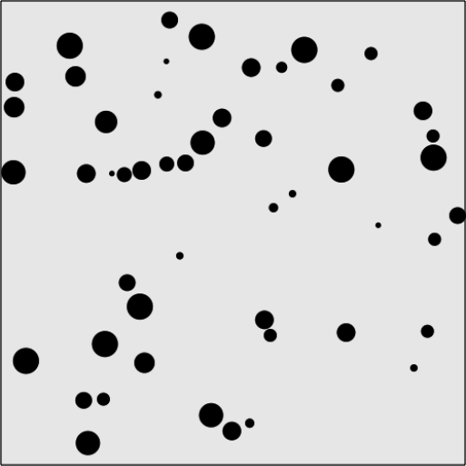

### 5.2.5　有摩擦力的多球碰撞反弹

如果希望这些球能够慢下来并最终停止，需要为例5-7增加摩擦力的影响。简单的摩擦力只是一个在每次将对象绘制到画布上时，用来改变速度的数值。

在canvasApp()函数中创建不同大小的球。在前面的例子中，这些球都是相同大小的。虽然效果不错，但是大小不同、重量不等的球会产生更多有意思的效果。为此，将minSize变量设为3，将maxSize变量设为12，表示这些球的半径将在3～12像素之间。增加一个名为friction的属性。这是一个全局属性，它不会应用到任何一个单独的球上。将其设为.01，表示这些球将以0.01像素每帧的加速度降低x和y轴的速度（在每次drawScreen()函数调用时）。

```javascript
var numBalls = 50 ;
var maxSize = 12;
var minSize = 3;
var maxSpeed = maxSize+5;
var friction = .01;
```

由于这些球大小不同、重量不等，因此它们互相的碰撞的效果将完全不同。例5-7中讲到过，需要通过一个mass属性来计算球在碰撞时的动量守恒。只不过，重量会根据大小不同而有所不同。

```javascript
for (var i = 0; i < numBalls; i++){
　 tempRadius = Math.floor(Math.random()*maxSize)+minSize;
```

在update()函数中，应用friction数值来计算当前速度与摩擦系数相乘得到的乘积，并从当前的速度中减去这个值。x轴和y轴速度都要这样操作，为什么不用x轴和y轴速度直接减去摩擦系数的数值呢？因为x轴和y轴速度并不总是成比例的。如果直接减去摩擦系数的数值，将不经意地改变速度。因此，需要针对每个速度成比例地减去一个摩擦力的数值，这个值就是速度和friction数值的乘积。应用friction数值的这个方法，可以使速度均匀地降下来。

```javascript
function update(){
　　　for (var i = 0; i <balls.length; i++){
　　　　 ball = balls[i];
　　　　 //摩擦力
　　　　 ball.velocityx = ball.velocityx - ( ball.velocityx*friction);
　　　　 ball.velocityy = ball.velocityy - ( ball.velocityy*friction);
　　　　 ball.nextx = (ball.x += ball.velocityx);
　　　　 ball.nexty = (ball.y += ball.velocityy);
　　　}
　 }
```

代码的完整版见CH5EX8.html文件，或者输入例5-8的代码也行。注意碰撞时，小球撞上大球时的效果不明显，反之亦然。同时，由于应用了摩擦力，这些球将逐渐慢下来。

例5-8　增加摩擦力因素的球的碰撞

```javascript
<!doctype html>
<html lang="en">
<head>
<meta charset="UTF-8">
<title>CH5EX8: Balls With Friction</title>
<script src="modernizr.js"></script>
<script type="text/javascript">
window.addEventListener('load', eventWindowLoaded, false);
function eventWindowLoaded(){
　 canvasApp();
}
function canvasSupport (){
　　 return Modernizr.canvas;
}
function canvasApp(){
　　if (!canvasSupport()){
　　　　return;
　　　　}
　function drawScreen (){
　　　context.fillStyle = '#EEEEEE';
　　　context.fillRect(0, 0, theCanvas.width, theCanvas.height);
　　　//边框
　　　context.strokeStyle = '#000000';
　　　context.strokeRect(1, 1, theCanvas.width-2, theCanvas.height-2);
　　　update();
　　　testWalls();
　　　collide();
　　　render();
　}
　function update(){
　　 for (var i = 0; i <balls.length; i++){
　　　　ball = balls[i];
　　　　//摩擦力
　　　　ball.velocityx = ball.velocityx - ( ball.velocityx*friction);
　　　　ball.velocityy = ball.velocityy - ( ball.velocityy*friction);
　　　　ball.nextx = (ball.x += ball.velocityx);
　　　　ball.nexty = (ball.y += ball.velocityy);
　　 }
　}
　function testWalls(){
　　 var ball;
　　 var testBall;
　for (var i = 0; i <balls.length; i++){
　　 ball = balls[i];
　　　if (ball.nextx+ball.radius > theCanvas.width){
　　　　 ball.velocityx = ball.velocityx*−1;
　　　　 ball.nextx = theCanvas.width - ball.radius;
　　　} else if (ball.nextx-ball.radius < 0 ){
　　　　 ball.velocityx = ball.velocityx*−1;
　　　　 ball.nextx = ball.radius;
　　　} else if (ball.nexty+ball.radius > theCanvas.height ){
　　　　 ball.velocityy = ball.velocityy*−1;
　　　　 ball.nexty = theCanvas.height−ball.radius;
　　　} else if(ball.nexty-ball.radius < 0){
　　　　 ball.velocityy = ball.velocityy*−1;
　　　　 ball.nexty = ball.radius;
　　　}
　　}
　}
　function render(){
　　 var ball;
　　 context.fillStyle = "#000000";
　　 for (var i = 0; i <balls.length; i++){
　　　　ball = balls[i];
　　　　ball.x = ball.nextx;
　　　　ball.y = ball.nexty;
　　　　context.beginPath();
　　　　context.arc(ball.x,ball.y,ball.radius,0,Math.PI*2,true);
　　　　context.closePath();
　　　　context.fill();
　　 }
　}
　function collide(){
　　　var ball;
　　　var testBall;
　　　for (var i = 0; i <balls.length; i++){
　　　　　ball = balls[i];
　　　　　for (var j = i+1; j < balls.length; j++){
　　　　　　　　testBall = balls[j];
　　　　　　　 if (hitTestCircle(ball,testBall)){
　　　　　　　　　 collideBalls(ball,testBall);
　　　　　　　　}
　　　　　　 }
　　　 }
　 }
　function hitTestCircle(ball1,ball2){
　　　var retval = false;
　　　var dx = ball1.nextx - ball2.nextx;
　　　var dy = ball1.nexty - ball2.nexty;
　　　var distance = (dx * dx + dy * dy);
　　　if (distance <= (ball1.radius + ball2.radius)* (ball1.radius + ball2.radius)){
　　　　　　 retval = true;
　　　 }
　　　 return retval;
　　}
　function collideBalls(ball1,ball2){
　　 var dx = ball1.nextx - ball2.nextx;
　　 var dy = ball1.nexty - ball2.nexty;
　　 var collisionAngle = Math.atan2(dy, dx);
　　 var speed1 = Math.sqrt(ball1.velocityx * ball1.velocityx +
　　　　 ball1.velocityy * ball1.velocityy);
　　 var speed2 = Math.sqrt(ball2.velocityx * ball2.velocityx +
　　　　 ball2.velocityy * ball2.velocityy);
　　 var direction1 = Math.atan2(ball1.velocityy, ball1.velocityx);
　　 var direction2 = Math.atan2(ball2.velocityy, ball2.velocityx);
　　 var velocityx_1 = speed1 * Math.cos(direction1 - collisionAngle);
　　 var velocityy_1 = speed1 * Math.sin(direction1 - collisionAngle);
　　 var velocityx_2 = speed2 * Math.cos(direction2 - collisionAngle);
　　 var velocityy_2 = speed2 * Math.sin(direction2 - collisionAngle);
　　 var final_velocityx_1 = ((ball1.mass - ball2.mass)* velocityx_1 +
　　　　 (ball2.mass + ball2.mass)* velocityx_2)/(ball1.mass + ball2.mass);
　　 var final_velocityx_2 = ((ball1.mass + ball1.mass)* velocityx_1 +
　　　　 (ball2.mass - ball1.mass)* velocityx_2)/(ball1.mass + ball2.mass);
　　 var final_velocityy_1 = velocityy_1;
　　 var final_velocityy_2 = velocityy_2;
　　 ball1.velocityx = Math.cos(collisionAngle)* final_velocityx_1 +
　　　　 Math.cos(collisionAngle + Math.PI/2)* final_velocityy_1;
　　 ball1.velocityy = Math.sin(collisionAngle)* final_velocityx_1 +
　　　　 Math.sin(collisionAngle + Math.PI/2)* final_velocityy_1;
　　 ball2.velocityx = Math.cos(collisionAngle)* final_velocityx_2 +
　　　　 Math.cos(collisionAngle + Math.PI/2)* final_velocityy_2;
　　 ball2.velocityy = Math.sin(collisionAngle)* final_velocityx_2 +
　　　　 Math.sin(collisionAngle + Math.PI/2)* final_velocityy_2;
　　 ball1.nextx = (ball1.nextx += ball1.velocityx);
　　 ball1.nexty = (ball1.nexty += ball1.velocityy);
　　 ball2.nextx = (ball2.nextx += ball2.velocityx);
　　 ball2.nexty = (ball2.nexty += ball2.velocityy);
　}
　var numBalls = 50 ;
　var maxSize = 12;
　var minSize = 3;
　var maxSpeed = maxSize+5;
　var balls = new Array();
　var tempBall;
　var tempX;
　var tempY;
　var tempSpeed;
　var tempAngle;
　var tempRadius;
　var tempRadians;
　var tempvelocityx;
　var tempvelocityy;
　var friction = .01;
　theCanvas = document.getElementById("canvasOne");
　context = theCanvas.getContext("2d");
　for (var i = 0; i < numBalls; i++){
　　 tempRadius = Math.floor(Math.random()*maxSize)+minSize;
　　 var placeOK = false;
　　 while (!placeOK){
　　　　tempX = tempRadius*3 + (Math.floor(Math.random()*theCanvas.width)-tempRadius*3);
　　　　tempY = tempRadius*3 + (Math.floor(Math.random()*theCanvas.height)-tempRadius*3);
　　　　tempSpeed = maxSpeed-tempRadius;
　　　　tempAngle = Math.floor(Math.random()*360);
　　　　tempRadians = tempAngle * Math.PI/ 180;
　　　　tempvelocityx = Math.cos(tempRadians)* tempSpeed;
　　　　tempvelocityy = Math.sin(tempRadians)* tempSpeed;
　　　　tempBall = {x:tempX,y:tempY,radius:tempRadius, speed:tempSpeed, angle:tempAngle,
　　　　　　velocityx:tempvelocityx, velocityy:tempvelocityy, mass:tempRadius*8,
　　　　　　nextx: tempX, nexty:tempY};
　　　　placeOK = canStartHere(tempBall);
　　 }
　　 balls.push(tempBall);
　}
　function canStartHere(ball){
　　 var retval = true;
　　 for (var i = 0; i <balls.length; i++){
　　　　if (hitTestCircle(ball, balls[i])){
　　　　　 retval = false;
　　　　}
　　 }
　　 return retval;
　}
　function gameLoop() {
　　 window.setTimeout(gameLoop, 20);
　　 drawScreen()
　}
　gameLoop();;
}
</script>
</head>
<body>
<div style="position: absolute; top: 50px; left: 50px;">
<canvas id="canvasOne" width="500" height="500">
Your browser does not support HTML5 Canvas.
</canvas>
</div>
</body>
</html>
```

图5-12所示为代码在浏览器中的运行效果。


<center class="my_markdown"><b class="my_markdown">图5-12　应用不同大小摩擦力的多球相互碰撞反弹</b></center>

