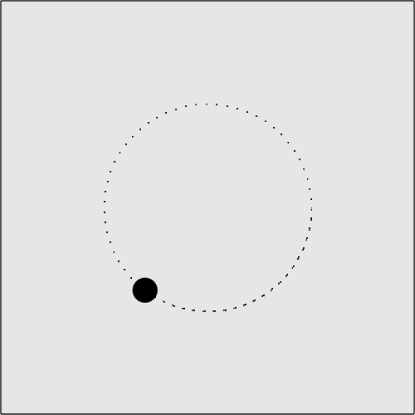

### 5.3.1　匀速圆周运动

匀速圆周运动是指对象沿着不同半径的给定圆匀速移动。只要半径已知，即可使用前面学过的cos和sin来定位移动对象的x轴和y轴的坐标。定位一个沿给定圆周匀速运动的对象坐标的方程如下。

```javascript
x = radius * cosine(angle)
y = radius * sine(angle)
```

本节将创建一个匀速圆周运动的示例，圆的半径为125，圆心在画布上的坐标为（250，250）。然后，将一个球从angle为0处开始沿着圆周进行移动。

在canvasApp()中，将这个圆周路径定义为存储在circle变量中的动态对象。尽管这个对象定义了圆周的属性，但这个圆弧不会在画布上显示出来，它只是定义了ball对象移动的路径。

```javascript
var circle = {centerX:250, centerY:250, radius:125, angle:0}
var ball = {x:0, y:0,speed:.1};
```

在drawScreen ()中，将这个方程与匀速圆周运动结合起来。为此，将ball对象的x属性和y属性设为方程的乘积加上画布上的圆心位置(circle.centerX, circle.centerY)。

```javascript
ball.x = circle.centerX + Math.cos(circle.angle)* circle.radius;
ball.y = circle.centerY + Math.sin(circle.angle)* circle.radius;
```

然后，增加球圆周运动的角速度。这将有效地使这个球在下次调用drawScreen()函数的时候移动到一个新的位置上。

```javascript
circle.angle += ball.speed;
```

最后，在画布上绘制球。

```javascript
context.fillStyle = "#000000";
context.beginPath();
context.arc(ball.x,ball.y,15,0,Math.PI*2,true);
context.closePath();
context.fill();
```

圆周路径由画布上的点来指示，如图5-13所示。


<center class="my_markdown"><b class="my_markdown">图5-13　沿圆周移动对象</b></center>

改变圆周路径对象的radius、centerX和centerY的属性可以轻松地改变其位置和大小。

例5-9展示了CH5EX9.html文件的代码。

例5-9　圆周运动

```javascript
<!doctype html>
<html lang="en">
<head>
<meta charset="UTF-8">
<title>CH5EX9: Moving In A Circle</title>
<script src="modernizr.js"></script>
<script type="text/javascript">
window.addEventListener('load', eventWindowLoaded, false);
function eventWindowLoaded(){
　 canvasApp();
}
function canvasSupport (){
　　 return Modernizr.canvas;
}
function canvasApp(){
　if (!canvasSupport()){
　　　　　return;
　　　　}
　function drawScreen (){
　　　context.fillStyle = '#EEEEEE';
　　　context.fillRect(0, 0, theCanvas.width, theCanvas.height);
　　　//边框
　　　context.strokeStyle = '#000000';
　　　context.strokeRect(1, 1, theCanvas.width-2, theCanvas.height-2);
　　　ball.x = circle.centerX + Math.cos(circle.angle)* circle.radius;
　　　ball.y = circle.centerY + Math.sin(circle.angle)* circle.radius;
　　　circle.angle += ball.speed;
　　　context.fillStyle = "#000000";
　　　context.beginPath();
　　　context.arc(ball.x,ball.y,15,0,Math.PI*2,true);
　　　context.closePath();
　　　context.fill();
　}
　　　var radius = 100;
　　　var circle = {centerX:250, centerY:250, radius:125, angle:0}
　　　var ball = {x:0, y:0,speed:.1};
　　　theCanvas = document.getElementById("canvasOne");
　　　context = theCanvas.getContext("2d");
function gameLoop() {
　　 window.setTimeout(gameLoop, 20);
　　 drawScreen()
　}
　gameLoop();
}
</script>
</head>
<body>
<div style="position: absolute; top: 50px; left: 50px;">
<canvas id="canvasOne" width="500" height="500">
 Your browser does not support HTML5 Canvas.
</canvas>
</div>
</body>
</html>
```

