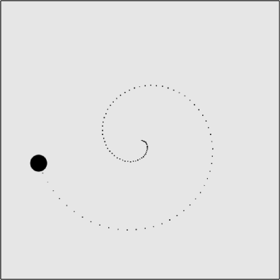

### 5.3.2　简单螺旋运动

有很多复杂的方法可以使对象螺旋运动。其中之一就是使用斐波那契数列，它可以完美地描述出自然界中的螺旋形状。斐波那契数列从0开始，每个后续数字都是前两个数字之和，即（1, 2, 3, 5, 8, 13, 21, 34, 55, 89...）。当然，创建数列的数学方法比较复杂，同时也比较难于编译到移动对象中去。

为达到这个目的，本节通过在每次调用drawScreen()函数时增加圆周半径的方法来创建一个简单的螺旋。如果以例5-9中的代码为基础，需要为其加上一个radiusInc变量，用作增加圆周的半径改变数值。在canvasApp()函数中创建这个新的变量。

```javascript
var radiusInc = 2;
```

然后，在drawScreen()中加上下面这段代码来实现每次移动对象时增加圆的半径。

```javascript
circle.radius += radiusInc;
```

由画布上的点来指示螺旋路径，如图5-14所示。


<center class="my_markdown"><b class="my_markdown">图5-14　简单地采用螺旋方式移动对象</b></center>

减少radiusInc变量的数值可以产生更小的螺旋；反之，将radiusInc变量的数值增大可以产生更大的螺旋。

例5-10所示为CH5EX10.html文件中的代码。

例5-10　简单的螺旋式移动

```javascript
<!doctype html>
<html lang="en">
<head>
<meta charset="UTF-8">
<title>CH5EX10: Moving In A Simple Geometric Spiral </title>
<script src="modernizr.js"></script>
<script type="text/javascript">
window.addEventListener('load', eventWindowLoaded, false);
function eventWindowLoaded(){
　 canvasApp();
}
function canvasSupport (){
　　 return Modernizr.canvas;
}
function canvasApp(){
　if (!canvasSupport()){
　　　　　return;
　　　　}
　var pointImage = new Image();
　pointImage.src = "point.png";
　function drawScreen (){
　　　context.fillStyle = '#EEEEEE';
　　　context.fillRect(0, 0, theCanvas.width, theCanvas.height);
　　　//边框
　　　context.strokeStyle = '#000000';
　　　context.strokeRect(1, 1, theCanvas.width-2, theCanvas.height-2);
　　　ball.x = circle.centerX + Math.cos(circle.angle)* circle.radius;
　　　ball.y = circle.centerY + Math.sin(circle.angle)* circle.radius;
　　　circle.angle += ball.speed;
　　　circle.radius += radiusInc;
　　　//绘制点以说明路径
　　　points.push({x:ball.x,y:ball.y});
　　　for (var i = 0; i< points.length; i++){
　　　　 context.drawImage(pointImage, points[i].x, points[i].y,1,1);
　　　}
　　　context.fillStyle = "#000000";
　　　context.beginPath();
　　　context.arc(ball.x,ball.y,15,0,Math.PI*2,true);
　　　context.closePath();
　　　context.fill();
　　}
　　var radiusInc = 2;
　　var circle = {centerX:250, centerY:250, radius:2, angle:0, radiusInc:2}
　　var ball = {x:0, y:0,speed:.1};
　　var points = new Array();
　　theCanvas = document.getElementById("canvasOne");
　　context = theCanvas.getContext("2d");
　　function gameLoop() {
　　　window.setTimeout(gameLoop, 20);
　　　drawScreen()
　　}
　　gameLoop();
}
</script>
</head>
<body>
<div style="position: absolute; top: 50px; left: 50px;">
<canvas id="canvasOne" width="500" height="500">
 Your browser does not support HTML5 Canvas.
</canvas>
</div>
</body>
</html>
```

