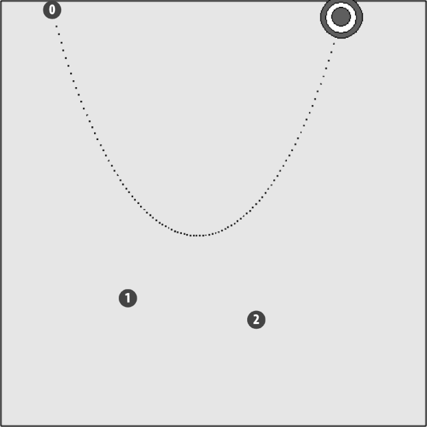

### 5.3.4　移动图像

在立方贝塞尔曲线上移动图像和移动圆形绘制对象一样容易，如接下来的两个示例所示。如果制作一个游戏——靶心在画布上移动而玩家必须射中它，就可以使用立方贝赛尔曲线路径来创建一个新奇有趣的样式，让靶心可以沿路径移动。

在这个示例中，先创建一个全局变量bullseye，用来控制将要加载显示到画布上的bullseye.png图像。

```javascript
var bullseye;
function eventWindowLoaded(){
　 bullseye = new Image();
　 bullseye.src = "bullseye.png"
　 bullseye.onload = eventAssetsLoaded;
}
```

在canvasApp()函数中，创建一个与之前的示例中不同的曲线，方法就是通过设置新的p0, p1, p2, p3的数值。使用这些数值，靶心将沿着一个抛物线路径来移动，曲线路径如图5-16所示。

```javascript
var p0 = {x:60, y:10};
var p1 = {x:150, y:350};
var p2 = {x:300, y:375};
var p3 = {x:400, y:20};
```

再创建一个player对象，代表画布上的靶心。

```javascript
var player = {x:0, y:0, speed:.01, t:0};
```

在drawImage()函数中，计算完t、xt和yt之后，将图像绘制在画布上。

```javascript
player.x = xt-bullseye.width/2;
　　　player.y = yt-bullseye.height/2;
　　　context.drawImage(bullseye,player.x,player.y);
```


<center class="my_markdown"><b class="my_markdown">图5-16　在立方贝塞尔曲线路径上移动图像</b></center>

例5-12的其余部分和例5-11非常类似。

例5-12　移动图像

```javascript
<!doctype html>
<html lang="en">
<head>
<meta charset="UTF-8">
<title>CH5EX12: Moving An Image </title>
<script src="modernizr.js"></script>
<script type="text/javascript">
window.addEventListener('load', eventWindowLoaded, false);
var bullseye;
function eventWindowLoaded(){
　 bullseye = new Image();
　 bullseye.src = "bullseye.png"
　 bullseye.onload = eventAssetsLoaded;
}
function eventAssetsLoaded(){
　 canvasApp();
}
function canvasSupport (){
　　 return Modernizr.canvas;
}
function canvasApp(){
　if (!canvasSupport()){
　　　　　return;
　　　　}
　var pointImage = new Image();
　pointImage.src = "point.png";
　function drawScreen (){
　　　context.fillStyle = '#EEEEEE';
　　　context.fillRect(0, 0, theCanvas.width, theCanvas.height);
　　　//边框
　　　context.strokeStyle = '#000000';
　　　context.strokeRect(1, 1, theCanvas.width-2, theCanvas.height-2);
　　　var t = player.t;
　　　var cx = 3 * (p1.x - p0.x)
　　　var bx = 3 * (p2.x - p1.x)- cx;
　　　var ax = p3.x - p0.x - cx - bx;
　　　var cy = 3 * (p1.y - p0.y);
　　　var by = 3 * (p2.y - p1.y)- cy;
　　　var ay = p3.y - p0.y - cy - by;
　　　var xt = ax*(t*t*t)+ bx*(t*t)+ cx*t + p0.x;
　　　var yt = ay*(t*t*t)+ by*(t*t)+ cy*t + p0.y;
　　　player.t += player.speed;
　　　if (player.t > 1){
　　　　player.t = 1;
　　　}
　　　//绘制点
　　　context.font = "10px sans";
　　　context.fillStyle = "#FF0000";
　　　context.beginPath();
　　　context.arc(p0.x,p0.y,8,0,Math.PI*2,true);
　　　context.closePath();
　　　context.fill();
　　　context.fillStyle = "#FFFFFF";
　　　context.fillText("0",p0.x-2,p0.y+2);
　　　context.fillStyle = "#FF0000";
　　　context.beginPath();
　　　context.arc(p1.x,p1.y,8,0,Math.PI*2,true);
　　　context.closePath();
　　　context.fill();
　　　context.fillStyle = "#FFFFFF";
　　　context.fillText("1",p1.x-2,p1.y+2);
　　　context.fillStyle = "#FF0000";
　　　context.beginPath();
　　　context.arc(p2.x,p2.y,8,0,Math.PI*2,true);
　　　context.closePath();
　　　context.fill();
　　　context.fillStyle = "#FFFFFF";
　　　context.fillText("2",p2.x-2, p2.y+2);
　　　context.fillStyle = "#FF0000";
　　　context.beginPath();
　　　context.arc(p3.x,p3.y,8,0,Math.PI*2,true);
　　　context.closePath();
　　　context.fill();
　　　context.fillStyle = "#FFFFFF";
　　　context.fillText("3",p3.x-2, p3.y+2);
　　　//绘制点来显示路径
　　　points.push({x:xt,y:yt});
　　　for (var i = 0; i< points.length; i++){
　　　　 context.drawImage(pointImage, points[i].x, points[i].y,1,1);
　　　}
　　　context.closePath();
　　　player.x = xt-bullseye.width/2;
　　　player.y = yt-bullseye.height/2;
　　　context.drawImage(bullseye,player.x,player.y);
　 }
　 var p0 = {x:60, y:10};
　 var p1 = {x:150, y:350};
　 var p2 = {x:300, y:375};
　 var p3 = {x:400, y:20};
　 var player = {x:0, y:0, speed:.01, t:0};
　 var points = new Array();
　 theCanvas = document.getElementById("canvasOne");
　 context = theCanvas.getContext("2d");
　 function gameLoop() {
　　 window.setTimeout(gameLoop, 20);
　　 drawScreen()
　 }
　 gameLoop();
}
</script>
</head>
<body>
<div style="position: absolute; top: 50px; left: 50px;">
<canvas id="canvasOne" width="500" height="500">
 Your browser does not support HTML5 Canvas.
</canvas>
</div>
</body>
</html>
```

