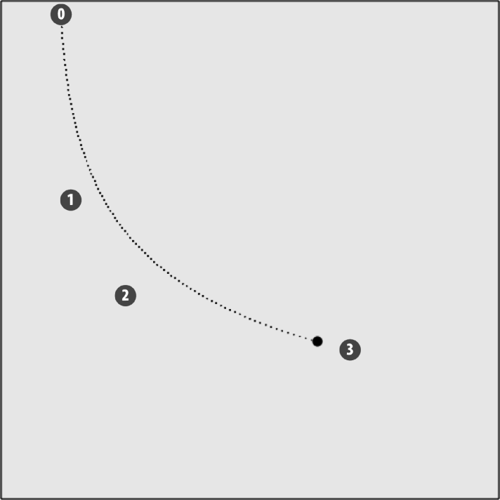

### 5.3.3　3次贝赛尔曲线运动

3次贝塞尔曲线可以用来定义对象的移动路径。Pierre Bezier在20世纪60年代首先普及了这些曲线。它们被广泛地应用于绘制2D矢量图形中，主要用于定义平滑曲线的绘制，也用于动画中的移动路径。

立方贝赛尔曲线通过4个不同的点——p0、p1、p2、p3创建。

+ p0：曲线的起始点，用x0和y0指代x坐标值和y坐标值。
+ p3：曲线的终止点，用x3和y3指代x坐标值和y坐标值。
+ p1和p2：曲线的控制点。曲线并不从这两个点通过，而是通过方程使用这两个点来决定曲线所走的弧形。用x0、x1、x2、x3和y0、y1、y2、y3指代x坐标值和y坐标值。

提示

> 理解贝塞尔曲线最大的难点就在于理解p1点和p2点。要理解这两个点和所绘曲线的关系，最简便的方式就是多练习几遍。

下面用这4个点计算6个系数值，用来得出在曲线上移动对象的x轴和y轴的坐标值，即ax、bx、cx、ay、by和cy。计算公示如下。

```javascript
cx = 3 (x1 - x0)
bx = 3 (x2 - x1)- cx
ax = x3 - x0 - cx - bx
cy = 3 (y1 - y0)
by = 3 (y2 - y1)- cy
ay = y3 - y0 - cy – by
```

计算完这6个参数之后，基于t值的变化使用下列方程即可找到x轴和y轴的坐标。t值指的是移动时间。

```javascript
x(t)= axt3 + bxt2 + cxt + x0
y(t)= ayt3 + byt2 + cyt + y0
```

对于我们来说，将通过对象移动的speed参数来增加t值。请注意，这个值不像本章其他地方用到的那样简单地等同于speed值。其原因在于：t值不是随着动画的时间推移而创建的。指定的速度值必须小于1，这样，曲线上的移动增量才足以令人看起来是动画的一部分。在示例中，如果t值的增速是.01，那么在移动曲线上将有100个点。这样做的好处是，当t值等于1时，即可得知对象已经完成移动。

在例5-11（CH5EX11.html）中，先在canvasApp()函数中创建贝塞尔曲线的4个点。

```javascript
var p0 = {x:60, y:10};
var p1 = {x:70, y:200};
var p2 = {x:125, y:295};
var p3 = {x:350, y:350};
```

然后，创建一个新的ball对象。它有两个与本章其他示例中不同的两个属性。speed值是.01，意味着对象沿曲线运动，通过100个点。t值从0开始，是指ball对象从p0开始。

```javascript
var ball = {x:0, y:0, speed:.01, t:0};
```

接下来，在drawScreen()函数中，通过这4个点（p0、p1、p2和p3）来计算贝塞尔曲线的系数值（ax、bx、cx、ay、by和cy）。

```javascript
var cx = 3 * (p1.x - p0.x);
var bx = 3 * (p2.x - p1.x)- cx;
var ax = p3.x - p0.x - cx - bx;
var cy = 3 * (p1.y - p0.y);
var by = 3 * (p2.y - p1.y)- cy;
var ay = p3.y - p0.y - cy - by;
```

然后，通过t值和系数值来计算移动对象的x轴和y轴的坐标值。首先，从ball对象中取出t值并存储在本地，以便在计算中使用。

```javascript
var t = ball.t;
```

下面为t值加上speed值，这样就可以计算贝塞尔曲线路径上的下一个点。

```javascript
ball.t += ball.speed;
```

然后，通过贝塞尔曲线方程来计算x轴和y轴的坐标值 (xt, yt)。

```javascript
var xt = ax*(t*t*t)+ bx*(t*t)+ cx*t + p0.x;
var yt = ay*(t*t*t)+ by*(t*t)+ cy*t + p0.y;
```

为ball对象的t值加上speed值，并检测其结果是否大于1。如果结果大于1，说明对象已经完成在曲线上的移动，就不用再继续增加了。

```javascript
ball.t += ball.speed;
if (ball.t > 1){
　　ball.t = 1;
}
```

最后，使用xt值和yt值在画布上绘制ball对象。

```javascript
context.arc(xt,yt,5,0,Math.PI*2,true);
```

例5-11在Web浏览器中的运行效果如图5-15所示。除了需要用points数组绘制点来显示路径外，还需绘制贝塞尔曲线的4个控制点，以说明这4个点和曲线的关系。请注意，曲线并不通过p1或者p2。


<center class="my_markdown"><b class="my_markdown">图5-15　在贝塞尔曲线上移动圆</b></center>

例5-11给出了CH5EX11.html文件中的全部代码，其中包括在画布上绘制显示贝塞尔曲线的点的代码。这段代码在drawScreen()函数的“//绘制点”注释之后可以找到。

例5-11　在立方贝赛尔曲线上移动

```javascript
<!doctype html>
<html lang="en">
<head>
<meta charset="UTF-8">
<title>CH5EX11: Moving On A Cubic Bezier Curve </title>
<script src="modernizr.js"></script>
<script type="text/javascript">
window.addEventListener('load', eventWindowLoaded, false);
function eventWindowLoaded(){
　 canvasApp();
}
function canvasSupport (){
　　 return Modernizr.canvas;
}
function canvasApp(){
　if (!canvasSupport()){
　　　　　return;
　　　　}
　var pointImage = new Image();
　pointImage.src = "point.png";
　function drawScreen (){
　　　context.fillStyle = '#EEEEEE';
　　　context.fillRect(0, 0, theCanvas.width, theCanvas.height);
　　　//边框
　　　context.strokeStyle = '#000000';
　　　context.strokeRect(1, 1, theCanvas.width-2, theCanvas.height-2);
　　　var t = ball.t;
　　　var cx = 3 * (p1.x - p0.x)
　　　var bx = 3 * (p2.x - p1.x)- cx;
　　　var ax = p3.x - p0.x - cx - bx;
　　　var cy = 3 * (p1.y - p0.y);
　　　var by = 3 * (p2.y - p1.y)- cy;
　　　var ay = p3.y - p0.y - cy - by;
　　　var xt = ax*(t*t*t)+ bx*(t*t)+ cx*t + p0.x;
　　　var yt = ay*(t*t*t)+ by*(t*t)+ cy*t + p0.y;
　　　ball.t += ball.speed;
　　　if (ball.t > 1){
　　　　 ball.t = 1;
　　　}
　　　//绘制点
　　　context.font ="10px sans";
　　　context.fillStyle = "#FF0000";
　　　context.beginPath();
　　　context.arc(p0.x,p0.y,8,0,Math.PI*2,true);
　　　context.closePath();
　　　context.fill();
　　　context.fillStyle = "#FFFFFF";
　　　context.fillText("0",p0.x-2,p0.y+2);
　　　context.fillStyle = "#FF0000";
　　　context.beginPath();
　　　context.arc(p1.x,p1.y,8,0,Math.PI*2,true);
　　　context.closePath();
　　　context.fill();
　　　context.fillStyle = "#FFFFFF";
　　　context.fillText("1",p1.x-2,p1.y+2);
　　　context.fillStyle = "#FF0000";
　　　context.beginPath();
　　　context.arc(p2.x,p2.y,8,0,Math.PI*2,true);
　　　context.closePath();
　　　context.fill();
　　　context.fillStyle = "#FFFFFF";
　　　context.fillText("2",p2.x-2, p2.y+2);
　　　context.fillStyle = "#FF0000";
　　　context.beginPath();
　　　context.arc(p3.x,p3.y,8,0,Math.PI*2,true);
　　　context.closePath();
　　　context.fill();
　　　context.fillStyle = "#FFFFFF";
　　　context.fillText("3",p3.x-2, p3.y+2);
　　　//绘制点来显示路径
　　　points.push({x:xt,y:yt});
　　　for (var i = 0; i< points.length; i++){
　　　　 context.drawImage(pointImage, points[i].x, points[i].y,1,1);
　　　}
　　　context.closePath();
　　　//绘制移动圆
　　　context.fillStyle = "#000000";
　　　context.beginPath();
　　　context.arc(xt,yt,5,0,Math.PI*2,true);
　　　context.closePath();
　　　context.fill();
　 }
　 var p0 = {x:60, y:10};
　 var p1 = {x:70, y:200};
　 var p2 = {x:125, y:295};
　 var p3 = {x:350, y:350};
　 var ball = {x:0, y:0, speed:.01, t:0};
　 var points = new Array();
　 theCanvas = document.getElementById("canvasOne");
　 context = theCanvas.getContext("2d");
　 function gameLoop() {
　　 window.setTimeout(gameLoop, 20);
　　 drawScreen()
　 }
　 gameLoop();
}
</script>
</head>
<body>
<div style="position: absolute; top: 50px; left: 50px;">
<canvas id="canvasOne" width="500" height="500">
 Your browser does not support HTML5 Canvas.
</canvas>
</div>
</body>
</html>
```

