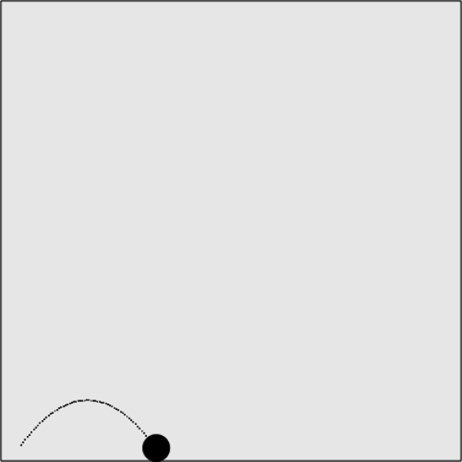

### 5.4.1　简单重力

可以通过对在矢量上移动的对象的y轴速度应用一个重力常数来实现简单而真实的重力效果。为此，选择一个重力值，比如.1，然后在每次调用drawScreen()函数的时候将它添加到对象的y轴速度中。

在这个例子中，模拟一个半径为15像素的球，从一个加农炮中发射出来落到画布底部附近。这个球将以每帧4像素的速度移动，发射角度为305°。这意味着，它将向画布的右上方移动。如果不添加重力，这个球将在移出画布前沿矢量移动（实际上，它将一直移动下去，只是看不见而已）。

创建类似效果的代码在前面曾经出现过了。在canvasApp()函数中，需要创建以下初始的变量。

```javascript
var speed = 4;
var angle = 305;
var radians = angle * Math.PI/ 180;
var radius = 15;
var vx = Math.cos(radians)* speed;
var vy = Math.sin(radians)* speed;
```

下面，创建这个球的起始点p1，然后创建一个动态对象，控制为ball对象创建的所有数值。

```javascript
var p1 = {x:20,y:theCanvas.height-radius};
var ball = {x:p1.x, y:p1.y, velocityx: vx, velocityy:vy, radius:radius};
```

如果要给应用程序增加重力，首先应该创建一个新的变量gravity并将其设为常数0.1。

```javascript
var gravity = .1;
```

接下来，在drawScreen()函数中，在将其绘制到画布上时，为ball对象应用这个重力值(ball.velocityy += gravity)。当这个球碰到“地面”（画布底部）时应该停止，因此，就要测试ball对象y坐标加上球的半径（radius）是否已经超出了画布底部边界（ball.y + ball.radius <= theCanvas.height）。如果是，就让这个球停止运动。

```javascript
if (ball.y + ball.radius <= theCanvas.height){
　 ball.velocityy += gravity;
} else {
　 ball.velocityx = 0;
　 ball.velocityy = 0;
　 ball.y = theCanvas.height - ball.radius;
}
```

下面，将x轴速度常数和新的y轴速度应用到ball对象中，并将其绘制到画布上。

```javascript
ball.y += ball.velocityy;
ball.x += ball.velocityx;
context.fillStyle = "#000000";
context.beginPath();
context.arc(ball.x,ball.y,ball.radius,0,Math.PI*2,true);
context.closePath();
context.fill();
```

对球应用简单重力后，沿矢量的移动路径如图5-18所示。图中用点指示路径。


<center class="my_markdown"><b class="my_markdown">图5-18　应用简单重力的矢量移动对象</b></center>

读者可以使用CH5EX14.html文件中的代码进行测试，也可以输入例5-14中的全部代码。

例5-14　简单重力

```javascript
<!doctype html>
<html lang="en">
<head>
<meta charset="UTF-8">
<title>CH5EX14: Simple Gravity</title>
<script src="modernizr.js"></script>
<script type="text/javascript">
window.addEventListener('load', eventWindowLoaded, false);
function eventWindowLoaded(){
　 canvasApp();
}
function canvasSupport (){
　　 return Modernizr.canvas;
}
function canvasApp(){
　　if (!canvasSupport()){
　　　　　　return;
　　　　}
　function drawScreen (){
　　　context.fillStyle = '#EEEEEE';
　　　context.fillRect(0, 0, theCanvas.width, theCanvas.height);
　　　//边框
　　　context.strokeStyle = '#000000';
　　　context.strokeRect(1, 1, theCanvas.width-2, theCanvas.height-2);
　　　if (ball.y + ball.radius <= theCanvas.height){
　　　　 ball.velocityy += gravity;
　　　} else {
　　　　 ball.velocityx = 0;
　　　　 ball.velocityy = 0;
　　　　 ball.y = theCanvas.height - ball.radius;
　　　}
　　　ball.y += ball.velocityy;
　　　ball.x += ball.velocityx;
　　　context.fillStyle = "#000000";
　　　context.beginPath();
　　　context.arc(ball.x,ball.y,ball.radius,0,Math.PI*2,true);
　　　context.closePath();
　　　context.fill();
　 }
　 var speed = 4;
　 var gravity = .1;
　 var angle = 305;
　 var radians = angle * Math.PI/ 180;
　 var radius = 15;
　 var vx = Math.cos(radians)* speed;
　 var vy = Math.sin(radians)* speed;
　 theCanvas = document.getElementById("canvasOne");
　 context = theCanvas.getContext("2d");
　 var p1 = {x:20,y:theCanvas.height-radius};
　 var ball = {x:p1.x, y:p1.y, velocityx: vx, velocityy:vy, radius:radius};
　 function gameLoop() {
　　 window.setTimeout(gameLoop, 20);
　　 drawScreen()
　 }
　 gameLoop();
}
</script>
</head>
<body>
<div style="position: absolute; top: 50px; left: 50px;">
<canvas id="canvasOne" width="500" height="500">
 Your browser does not support HTML5 Canvas.
</canvas>
</div>
</body>
</html>
```

