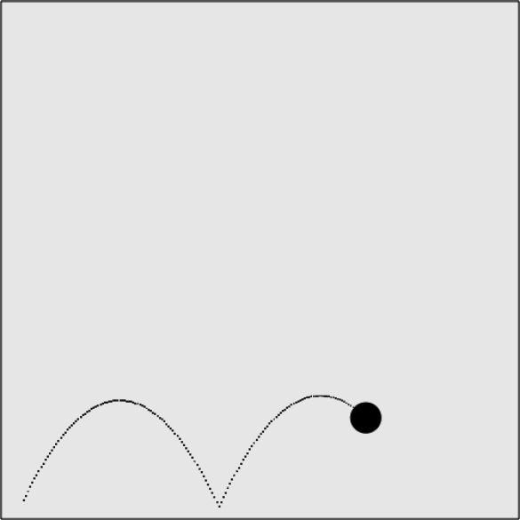

### 5.4.2　带反弹的简单重力

> 图5-18所示为应用了重力和反弹的球在矢量上移动。为使这个示例达到完美的反弹效果，可将canvasApp()函数中的矢量的角度调整为295。

例5-14中显示了炮弹发射出去的运行状况——在地面上一着陆就卡在那里没反应了。显然，再重的炮弹落地后也会反弹起来。

```javascript
var angle = 295;
```

为创建反弹效果，不需要改变很多代码。在drawScreen()函数中，每个帧都应用了gravity属性，那么相对于在球撞到画布地面时让它停止，只需简单地反转ball对象的y轴速度。

在CH5EX14.html文件中可以重置这段代码。

```javascript
if (ball.y + ball.radius <= theCanvas.height){
　 ball.velocityy += gravity;
} else {
　 ball.velocityx = 0;
　 ball.velocityy = 0;
　 ball.y = theCanvas.height - ball.radius;
}
```

以及重置：

```javascript
ball.velocityy += gravity;
if ((ball.y + ball.radius)> theCanvas.height){
　 ball.velocityy = -(ball.velocityy)
}
```

这段代码将使这个球在画布上反弹。由于它还在矢量上移动，并且在每次调用drawScreen()函数的时候应用重力，因此这个球还会由于重力的作用使y轴速度逆转且再次下落。

图5-19显示了应用反弹之后的炮弹运行效果。


<center class="my_markdown"><b class="my_markdown">图5-19　一个小球应用了重力和反弹效果后的矢量移动效果</b></center>

提示

例5-15提供了完整的代码。

例5-15　简单重力反弹

```javascript
<!doctype html>
<html lang="en">
<head>
<meta charset="UTF-8">
<title>CH5EX15: Gravity With A Bounce</title>
<script src="modernizr.js"></script>
<script type="text/javascript">
window.addEventListener('load', eventWindowLoaded, false);
function eventWindowLoaded(){
　 canvasApp();
}
function canvasSupport (){
　　 return Modernizr.canvas;
}
function canvasApp(){
　　if (!canvasSupport()){
　　　　　　return;
　　　　}
　function drawScreen (){
　　　context.fillStyle = '#EEEEEE';
　　　context.fillRect(0, 0, theCanvas.width, theCanvas.height);
　　　//边框
　　　context.strokeStyle = '#000000';
　　　context.strokeRect(1, 1, theCanvas.width-2, theCanvas.height-2);
　　　ball.velocityy += gravity;
　　　if ((ball.y + ball.radius)> theCanvas.height){
　　　　 ball.velocityy = -(ball.velocityy)
　　　}
　　　ball.y += ball.velocityy;
　　　ball.x += ball.velocityx;
　　　context.fillStyle = "#000000";
　　　context.beginPath();
　　　context.arc(ball.x,ball.y,ball.radius,0,Math.PI*2,true);
　　　context.closePath();
　　　context.fill();
　 }
　 var speed = 5;
　 var gravity = .1;
　 var angle = 295;
　 var radians = angle * Math.PI/ 180;
　 var radius = 15;
　 var vx = Math.cos(radians)* speed;
　 var vy = Math.sin(radians)* speed;
　 theCanvas = document.getElementById("canvasOne");
　 context = theCanvas.getContext("2d");
　 var p1 = {x:20,y:theCanvas.height-radius};
　 var ball = {x:p1.x, y:p1.y, velocityx: vx, velocityy:vy, radius:radius};
　 function gameLoop() {
　　 window.setTimeout(gameLoop, 20);
　　 drawScreen()
　 }
　 gameLoop();
}
</script>
</head>
<body>
<div style="position: absolute; top: 50px; left: 50px;">
<canvas id="canvasOne" width="500" height="500">
 Your browser does not support HTML5 Canvas.
</canvas>
</div>
</body>
</html>
```

