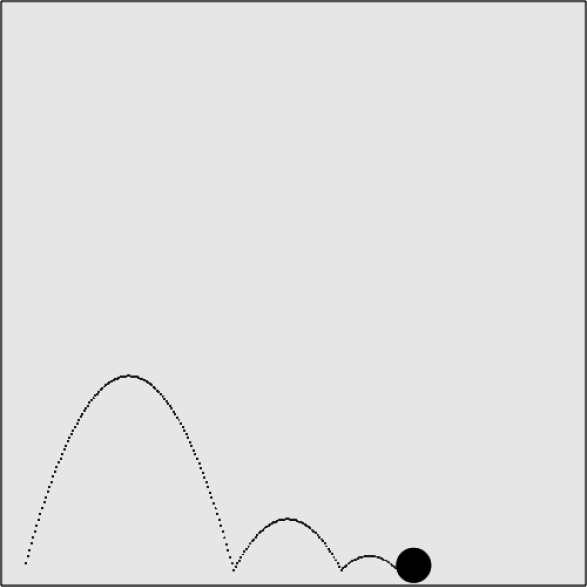

### 5.4.3　重力反弹及应用简单弹力

物理学中，当一个球从一个表面反弹回来，使球反弹的弹力取决于它含有多大的能量。当讨论球的碰撞时，已经涉及了一些能量守恒的概念。当模拟对象下落时，将对代码进行微调。在例5-15中，应用100%弹力时球会不停地反弹（这样相当于没有考虑弹力）。然而在现实生活中，球每次从表面反弹回来都会损失一部分能量。留下的能量取决于球的制作材料，反弹的表面也是如此。例如，在第一次反弹时，超级橡胶球会比炮弹具有更大的弹力，因而反弹得更高。它们在混凝土地面上会比在泥泞表面反弹得更高。最后，球的能量耗尽后，就会停在反弹表面上。

通过从地面反弹时，对球应用一个常数来模拟简单的弹力。在这个示例中，将speed设为每帧6像素，将angle设为285，gravity还是.1，将一个新的变量elasticity设为.5。简化起见，这里假设反弹的表面并不会对球的弹力有所增减。在canvasApp()中设置的新属性如下。

```javascript
var speed = 6;
var gravity = .1;
var elasticity = .5;
var angle = 285;
```

为ball对象添加新的elasticity属性的原因在于：与gravity不同，弹力描述的是对象自己的属性，而不是存在于的整个外界的属性。那么，使多个球拥有不同的弹力值很容易就能实现。

```javascript
var ball = {x:p1.x, y:p1.y, velocityx: vx, velocityy:vy, radius:radius,
　　elasticity: elasticity};
```

在drawScreen()函数中，仍然为y轴速度加上gravity数值（velocityy）。不过，相对于在ball对象撞到画布底部时简单的对y轴速度加以反向，这里还要将y轴速度与ball.elasticity属性中储存的elasticity数值相乘。这就对反弹应用了弹力，按照对象的elasticity百分比数值保留y轴速度。

```javascript
ball.velocityy += gravity;
if ((ball.y + ball.radius)> theCanvas.height){
　 ball.velocityy = -(ball.velocityy)*ball.elasticity;
}
ball.y += ball.velocityy;
ball.x += ball.velocityx;
```

在Web浏览器中运行该应用的效果如图5-20所示。


<center class="my_markdown"><b class="my_markdown">图5-20　应用弹力和重力的反弹球</b></center>

提示

> 应用gravity之后，反弹并不完全如人所想。重力总是使对象下落，所以，由于弹性碰撞导致的y轴速度损失十分明显。

完整代码如例5-16所示。

例5-16　重力反弹及弹力

```javascript
<!doctype html>
<html lang="en">
<head>
<meta charset="UTF-8">
<title>CH5EX16: Gravity With A Vector With Bounce And Elasticity</title>
<script src="modernizr.js"></script>
<script type="text/javascript">
window.addEventListener('load', eventWindowLoaded, false);
function eventWindowLoaded(){
　 canvasApp();
}
function canvasSupport (){
　　 return Modernizr.canvas;
}
function canvasApp(){
　　if (!canvasSupport()){
　　　　　　return;
　　　　}
　function drawScreen (){
　　　context.fillStyle = '#EEEEEE';
　　　context.fillRect(0, 0, theCanvas.width, theCanvas.height);
　　　//边框
　　　context.strokeStyle = '#000000';
　　　context.strokeRect(1, 1, theCanvas.width-2, theCanvas.height-2);
　　　ball.velocityy += gravity;
　　　if ((ball.y + ball.radius)> theCanvas.height){
　　　　 ball.velocityy = -(ball.velocityy)*ball.elasticity;
　　　}
　　　ball.y += ball.velocityy;
　　　ball.x += ball.velocityx;
　　　context.fillStyle = "#000000";
　　　context.beginPath();
　　　context.arc(ball.x,ball.y,ball.radius,0,Math.PI*2,true);
　　　context.closePath();
　　　context.fill();
　 }
　 var speed = 6;
　 var gravity = .1;
　 var elasticity = .5;
　 var angle = 285;
　 var radians = angle * Math.PI/ 180;
　 var radius = 15;
　 var vx = Math.cos(radians)* speed;
　 var vy = Math.sin(radians)* speed;
　 theCanvas = document.getElementById("canvasOne");
　 context = theCanvas.getContext("2d");
　 var p1 = {x:20,y:theCanvas.height-radius};
　 var ball = {x:p1.x, y:p1.y, velocityx: vx, velocityy:vy, radius:radius,
　　　 elasticity: elasticity};
　 function gameLoop() {
　　 window.setTimeout(gameLoop, 20);
　　 drawScreen()
　 }
　 gameLoop();
}
</script>
</head>
<body>
<div style="position: absolute; top: 50px; left: 50px;">
<canvas id="canvasOne" width="500" height="500">
Your browser does not support HTML5 Canvas.
</canvas>
</div>
</body>
</html>
```

