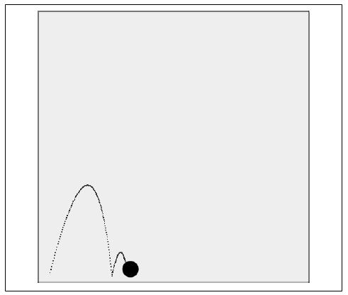

### 5.4.4　简单重力、弹力及摩擦力的综合

既然这个球已经可以在重力和弹力的影响下沿着矢量移动，这里还可以再增加一个因素以使动画更加真实。在前面的示例中，y轴速度受重力和弹力的影响，但是x轴方向上的速度并没有任何衰减。下面将通过在方程中添加摩擦力来解决这个问题。

在物理学中，摩擦力是抑制对象向前运动的力。之前在碰撞球中应用摩擦力时已经讲到了，这里实现摩擦力的方式非常类似，并且只影响x轴速度。为此，通过像重力减少y轴速度那样减少x轴速度来实现摩擦力。

使用例5-16中的代码，在canvasApp()函数中创建一个新的变量friction。这是每帧减少x轴速度的像素大小。

```javascript
var friction = .008;
```

注意，这个数值非常小。摩擦力的值不能太大，这样看起来会更真实——只需每次调用drawScreen()函数时均匀应用即可。在drawScreen()函数中，为x轴速度应用friction的方式如下。

```javascript
ball.velocityx = ball.velocityx - ( ball.velocityx*friction);
```

这种成比例的应用摩擦力的形式和碰撞球时使用的完全相同。不过，还要再强调的是，这次只应用于x轴速度。

图5-21显示了这个应用程序的最终版本在Web浏览器中的运行效果。


<center class="my_markdown"><b class="my_markdown">图5-21　应用重力、弹力和摩擦力的反弹球</b></center>

例5-17给出了CH5EX17.html文件中的全部代码，也是简单重力、简单弹力和简单摩擦力的最终代码。

例5-17　重力、反弹力和摩擦力

```javascript
<!doctype html>
<html lang="en">
<head>
<meta charset="UTF-8">
<title>CH5EX17: Gravity With A Vector With Bounce Friction</title>
<script src="modernizr.js"></script>
<script type="text/javascript">
window.addEventListener('load', eventWindowLoaded, false);
function eventWindowLoaded(){
　 canvasApp();
}
function canvasSupport (){
　　 return Modernizr.canvas;
}
function canvasApp(){
　　if (!canvasSupport()){
　　　　　　return;
　　　　}
　function drawScreen (){
　　　context.fillStyle = '#EEEEEE';
　　　context.fillRect(0, 0, theCanvas.width, theCanvas.height);
　　　//边框
　　　context.strokeStyle = '#000000';
　　　context.strokeRect(1, 1, theCanvas.width-2, theCanvas.height-2);
　　　ball.velocityx = ball.velocityx - ( ball.velocityx*friction);
　　　ball.velocityy += gravity;
　　　if ((ball.y + ball.radius)> theCanvas.height){
　　　　 ball.velocityy = -(ball.velocityy)*ball.elasticity;
　　　}
　　　ball.y += ball.velocityy;
　　　ball.x += ball.velocityx;
　　　context.fillStyle = "#000000";
　　　context.beginPath();
　　　context.arc(ball.x,ball.y,ball.radius,0,Math.PI*2,true);
　　　context.closePath();
　　　context.fill();
　 }
　 var speed = 6;
　 var gravity = .1;
　 var friction = .008;
　 var elasticity = .5;
　 var angle = 285;
　 var radians = angle * Math.PI/ 180;
　 var radius = 15;
　 var vx = Math.cos(radians)* speed;
　 var vy = Math.sin(radians)* speed;
　 theCanvas = document.getElementById("canvasOne");
　 context = theCanvas.getContext("2d");
　 var p1 = {x:20,y:theCanvas.height-radius};
　 var ball = {x:p1.x, y:p1.y, velocityx: vx, velocityy:vy, radius:radius,
　　　 elasticity: elasticity};
　 function gameLoop() {
　　 window.setTimeout(gameLoop, 20);
　　 drawScreen()
　 }
　 gameLoop();
}
</script>
</head>
<body>
<div style="position: absolute; top: 50px; left: 50px;">
<canvas id="canvasOne" width="500" height="500">
Your browser does not support HTML5 Canvas.
</canvas>
</div>
</body>
</html>
```

