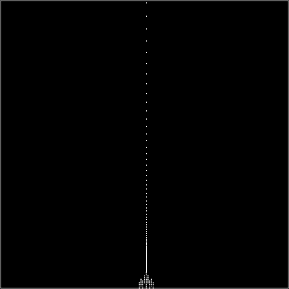

### 5.5.1　缓冲结束（飞船着陆）

缓冲结束的过程指在动画结束时的缓冲：对象从一点移动到另一点的过程中，出发时速度快，到达第二个点时减速。为说明这个概念，这里使用飞船着陆的例子。飞船出发时速度非常快，然后应用负推力来减速；当到达地面的时候，飞船将速度减慢到可以安全着陆。如果读者玩过游戏Lunar Lander，就能很准确地理解这里将要完成的事情。

为创建这种缓冲结束的效果，找出两个不同的点，将对象在它们之间移动。当对象移近第二个点时，以线性的方式减慢速度。首先计算两点间距离，然后选择一个百分比数值（easeValue），用来在那段距离中的每一帧移动对象。如同距离越来越短，需要移动的数量也越来越短。这使得对象看起来好像从开始到结束移动得越来越慢，如图5-22所示。这里绘制出显示飞船迫近屏幕底部的缓冲值的点，注意这些点会越来越近密，直到几乎重合。


<center class="my_markdown"><b class="my_markdown">图5-22　飞船着陆（缓冲结束）</b></center>

图5-22显示了CH5EX18.html文件的运行结果。现在，来看看这个示例的具体细节。首先，采用本章之前加载图像的方式加载ship.png图像文件。

```javascript
var shipImage;
function eventWindowLoaded(){
　 shipImage = new Image();
　 shipImage.src = "ship.png"
　 shipImage.onload = eventAssetsLoaded;
}
function eventAssetsLoaded(){
　 canvasApp();
}
```

然后，在canvasApp()函数中，创建一个名为easeValue的变量，代表飞船穿过两点间剩余距离的百分比。在这个示例中，将其设置为5% (.05)。

```javascript
var easeValue = .05;
```

接下来，创建两个点。起点p1，位于画布x轴的中间位置，位于y轴刚刚超过顶部的位置（−20）。终点p2，在x轴的位置与第一个点相同，圆周位置接近画布底部（470）。

```javascript
var p1 = {x:240,y:-20};
var p2 = {x:240,y:470};
```

最后，为ship对象创建一个动态对象，用于控制这些数值。

```javascript
var ship = {x:p1.x, y:p1.y, endx: p2.x, endy:p2.y, velocityx:0, velocityy:0};
```

在drawScreen()函数中，每一帧首先得出飞船和终点的距离，即用终点的x值和y值减去当前ship对象的x值和y值。在飞船飞离p1点驶近p2点的过程中，每次调用drawScreen()函数时这个距离都会变短。这里对x值和y值都进行了这项操作，而这个例子中只有y值会发生变化。

```javascript
var dx = ship.endx - ship.x;
var dy = ship.endy - ship.y;
```

每次得出这些距离之后，将其与easeValue变量相乘，以得出这次调用drawScreen()函数的x轴和y轴方向的速度。

```javascript
ship.velocityx = dx * easeValue;
ship.velocityy = dy * easeValue;
```

最后，应用这些值，将飞船绘制到画布上。

```javascript
ship.x += ship.velocityx;
ship.y += ship.velocityy;
context.drawImage(shipImage,ship.x,ship.y);
```

在Web浏览器中运行CH5EX18.html文件可以测试这个示例，或者手动输入例5-18所示的完整代码。

例5-18　缓冲结束（飞船着陆）

```javascript
<!doctype html>
<html lang="en">
<head>
<meta charset="UTF-8">
<title>CH5EX18: Easing Out (Landing The Ship)</title>
<script src="modernizr.js"></script>
<script type="text/javascript">
window.addEventListener('load', eventWindowLoaded, false);
var shipImage;
function eventWindowLoaded(){
　 shipImage = new Image();
　 shipImage.src = "ship.png"
　 shipImage.onload = eventAssetsLoaded;
}
function eventAssetsLoaded(){
　 canvasApp();
}
function canvasSupport (){
　　 return Modernizr.canvas;
}
function canvasApp(){
　 if (!canvasSupport()){
　　　　　 return;
}
　 var pointImage = new Image();
　 pointImage.src = "pointwhite.png";
　 function drawScreen (){
　　　 context.fillStyle = '#000000';
　　　 context.fillRect(0, 0, theCanvas.width, theCanvas.height);
　　　 //边框
　　　 context.strokeStyle = '#ffffff';
　　　 context.strokeRect(1, 1, theCanvas.width-2, theCanvas.height-2);
　　　 var dx = ship.endx - ship.x;
　　　 var dy = ship.endy - ship.y;
　　　 ship.velocityx = dx * easeValue;
　　　 ship.velocityy = dy * easeValue;
　　　 ship.x += ship.velocityx;
　　　 ship.y += ship.velocityy;
　　　 //绘制点来显示路径
　　　 points.push({x:ship.x,y:ship.y});
　　　 for (var i = 0; i< points.length; i++){
　　　　　context.drawImage(pointImage, points[i].x+shipImage.width/2, points[i].y,1,1);
　　　 }
　　　 context.drawImage(shipImage,ship.x,ship.y);
　 }
　 var easeValue = .05;
　 var p1 = {x:240,y:-20};
　 var p2 = {x:240,y:470};
　 var ship = {x:p1.x, y:p1.y, endx: p2.x, endy:p2.y, velocityx:0, velocityy:0};
　 var points = new Array();
　 theCanvas = document.getElementById("canvasOne");
　 context = theCanvas.getContext("2d");
　 function gameLoop() {
　　 window.setTimeout(gameLoop, 20);
　　 drawScreen()
　 }
　 gameLoop();
}
</script>
</head>
<body>
<div style="position: absolute; top: 50px; left: 50px;">
<canvas id="canvasOne" width="500" height="500">
Your browser does not support HTML5 Canvas.
</canvas>
</div>
</body>
</html>
```

提示

> 这个例子会显示点，但是因为背景是黑色的，所以加载了一个名为pointwhite.png的白色点图像取代全黑图像point.png。

