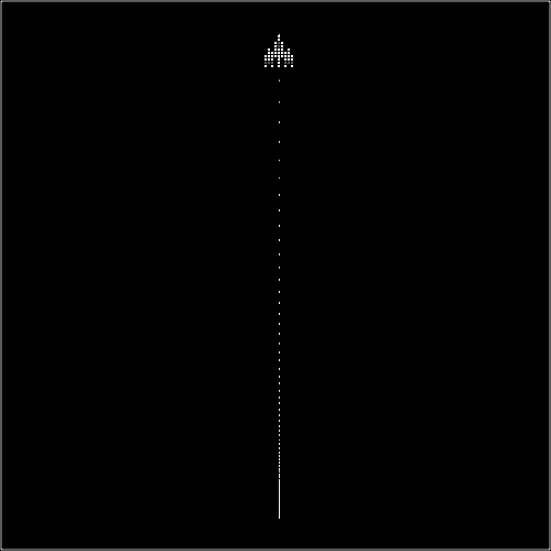

### 5.5.2　缓冲开始（起飞）

缓冲开始与缓冲结束相反。当动画缓冲开始时，飞机慢慢启动，但是会越来越快。如果对航天飞机起飞有印象，将会比较容易理解这些。推力建立后，飞船缓慢移动，然后在天空中越飞越快。这里将使用“起飞”的例子来开发一个缓冲开始的HTML5 Canvas动画的代码。

在canvasApp()中，这段代码与上一个例子基本相同——创建一个名为easeValue的变量。

```javascript
var easeValue = .05;
```

然后，就缓冲开始而言，求出相对于两点间剩余距离的百分比。这里只需要在每一帧为飞船速度加上一个常数即可。运行效果如图5-23所示。通过再次加上这些点来显示飞船起飞的动画是如何进行加速的。


<center class="my_markdown"><b class="my_markdown">图5-23　飞船起飞（缓冲开始）</b></center>

首先，将ship对象的起始点（p1）设置在画布的底部中间，然后将飞船起始速度（speed）设置得很低（每帧0.5像素），将angle设置为270（垂直画布向上）。然后，计算ship对象的x轴和y轴速度。

```javascript
var p1 = {x:240,y:470};
var tempSpeed = .5;
var tempAngle = 270 ;
var tempRadians = tempAngle * Math.PI/ 180;
var tempvelocityx = Math.cos(tempRadians)* tempSpeed;
var tempvelocityy = Math.sin(tempRadians)* tempSpeed;
var ship = {x:p1.x, y:p1.y, velocityx:tempvelocityx, velocityy:tempvelocityy};
```

在drawScreen()函数中，相对于找到两点间距离，在每帧为x轴和y轴方向的速度增加easeValue，并在绘制到画布之前将其应用到ship对象的x轴和y值上。这样就创建了线性加速，也就是预期的缓冲开始的效果。

```javascript
ship.velocityx = ship.velocityx + ( ship.velocityx*easeValue);
ship.velocityy = ship.velocityy + ( ship.velocityy*easeValue);
ship.x += ship.velocityx;
ship.y += ship.velocityy;
context.drawImage(shipImage,ship.x,ship.y);
```

运行CH5EX19.html文件可以查看运行效果，或者也可以手动输入例5-19中的代码。

例5-19　缓冲开始（起飞）

```javascript
<!doctype html>
<html lang="en">
<head>
<meta charset="UTF-8">
<title>CH5EX19: Taking Off (Fake Ease In)</title>
<script src="modernizr.js"></script>
<script type="text/javascript">
window.addEventListener('load', eventWindowLoaded, false);
var shipImage;
function eventWindowLoaded(){
　 shipImage = new Image();
　 shipImage.src = "ship.png"
　 shipImage.onload = eventAssetsLoaded;
}
function eventAssetsLoaded(){
　 canvasApp();
}
function canvasSupport (){
　 return Modernizr.canvas;
}
function canvasApp(){
　　if (!canvasSupport()){
　　　　　return;
　　　　}
　var pointImage = new Image();
　pointImage.src = "pointwhite.png";
　function drawScreen (){
　　　context.fillStyle = '#000000';
　　　context.fillRect(0, 0, theCanvas.width, theCanvas.height);
　　　//边框
　　　context.strokeStyle = '#ffffff';
　　　context.strokeRect(1, 1, theCanvas.width-2, theCanvas.height-2);
　　　ship.velocityx = ship.velocityx + ( ship.velocityx*easeValue);
　　　ship.velocityy = ship.velocityy + ( ship.velocityy*easeValue);
　　　ship.x += ship.velocityx;
　　　ship.y += ship.velocityy;
　　　//绘制点来显示路径
　　　points.push({x:ship.x,y:ship.y});
　　　for (var i = 0; i< points.length; i++){
　　　　 context.drawImage(pointImage, points[i].x+shipImage.width/2, points[i].y,1,1);
　　　}
　　　context.drawImage(shipImage,ship.x,ship.y);
　 }
　 var easeValue = .05;
　 var p1 = {x:240,y:470};
　 var tempX;
　 var tempY;
　 var tempSpeed = .5;
　 var tempAngle = 270 ;
　 var tempRadians = tempAngle * Math.PI/ 180;
　 var tempvelocityx = Math.cos(tempRadians)* tempSpeed;
　 var tempvelocityy = Math.sin(tempRadians)* tempSpeed;
　 var ship = {x:p1.x, y:p1.y, velocityx:tempvelocityx, velocityy:tempvelocityy};
　 var points = new Array();
　 theCanvas = document.getElementById("canvasOne");
　 context = theCanvas.getContext("2d");
　 function gameLoop() {
　　 window.setTimeout(gameLoop, 20);
　　 drawScreen()
　 }
　 gameLoop();
}
</script>
</head>
<body>
<div style="position: absolute; top: 50px; left: 50px;">
<canvas id="canvasOne" width="500" height="500">
Your browser does not support HTML5 Canvas.
</canvas>
</div>
</body>
</html>
```

提示

> 更多关于缓冲的信息可以到互联网查阅Robert Penner的缓冲方程，这些方程通过Javascript的jQuery来实现。

