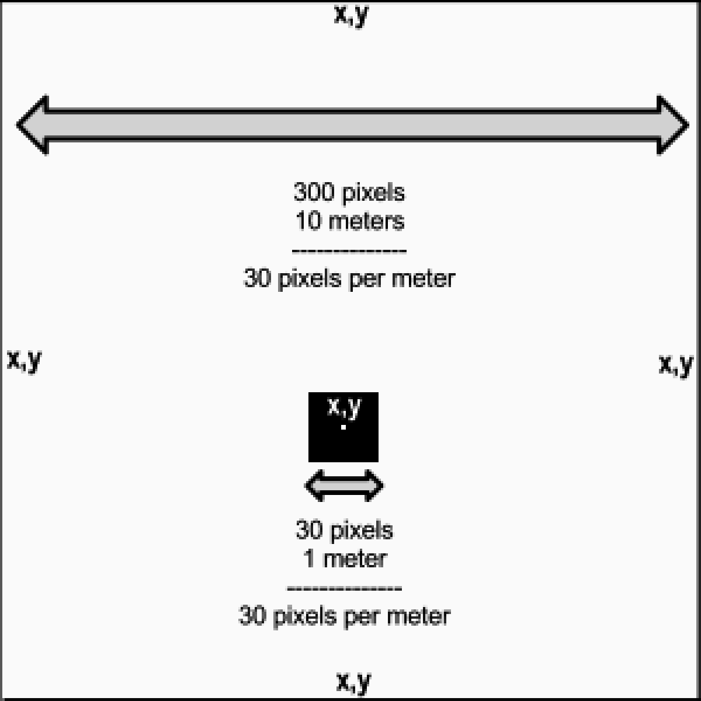

### 5.6.6　Box2dWeb中的单位

首先创建的Box2D对象是4面墙，用来定义一个装载小球的区域（一个500×400的画布）。这些墙模拟了之前在反弹球示例中定义的边界。把这些墙定义为动态对象，并放在一个数组中，每面墙的属性如下。

```javascript
{x:, x position, y: y position, w:width, h: height }
var wallDefs = new Array(
　 {x:8.3,y:.03,w:8.3 ,h:.03}, 　　　　　　　//上面的墙
　 {x:8.3,y:13.33,w:8.3 ,h:.03},　　　　　　//下面的墙
　 {x:0,y:6.67,w:.03 ,h:6.67},　　　　　　　//左面的墙
　 {x:16.7,y:6.67,w:.03 ,h:6.67} );　　　　//右面的墙
```

请注意，上面定义的这些值看起来与之前用到的值都不一样。这些值使用的是MTS单位。MTS单位是“meters-tonne-second”的缩写，即“米—吨—秒”，用于展现大空间和大物体。然而，由于在画布上的绘图单位是像素，因此需要一个方式能够在MTS单位和画布之间相互转换。

为了得到这些值，需要用“比例尺”将画布像素缩放到MTS单位。对于这个示例（以及本章其他的示例），将比例尺定为30，作为从像素转换到MTS的比例。

此外，Box2D中的对象在显示时有自己的原点——原点在中心（而不是左上角）。因此，要进行转换。图5-25展示了如何对墙进行单位转换和原点平移。


<center class="my_markdown"><b class="my_markdown">图5-25　在Box2D中将MTS单位转换为像素</b></center>

为了获得墙的大小（宽和高），需要将所有Canvas中的值除以30。为了获得位置，除了上述操作外，还要确保以物体中心为原点，而不是以物体的左上角为原点。

此外，传入Box2D的setAsBox()方法的宽度和高度的值都将会是给定宽度和高度的一半（本章稍后部分将讨论setAsBox方法）。

所以，对于顶部的墙，在画布上定义的高度是1像素，按照上面的方法进行转换，得到的代码如下。

```javascript
{x:250/30, y:1/30, w:500/2/30, h:1/30}
```

或者可以写为：

```javascript
{x:8.3,y:.03,w:8.33 ,h:.03}, 　　　　//上面的墙
```

其他的墙通过同样的计算就可以将像素值转换为MTS单位。现在，利用那些单位做一些事情。

关于比例尺的值有一件非常有意思的事情：将MTS单位转为像素或将像素转为MTS单位使用统一的值时，这个值可以是任何数值，仅需要保持一致即可。然而，这个值确实会对物理世界产生影响。它的大小与世界中模型的尺寸成反比。这个值越小，世界中的物体就越大，反之亦然。可以通过改变这个值来调整用户所模拟的世界中的物理量。

