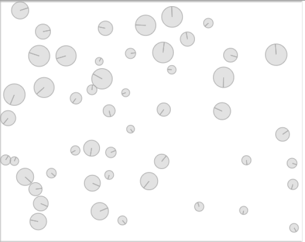

### 5.6.11　重温反弹球

回忆一下，CH5EX7.html中的小球是如何相互碰撞和弹开的？对上一个示例做一些小修改，然后就可以得到一个与反弹球示例类似的世界了。

首先，在世界定义中修改重力属性。是的，y轴方向不再有重力。不再从侧面观察小球，而是从顶部俯瞰（就好像在俯瞰一个扁平的二维世界）。将演示中的小球数量从50改为30。

```javascript
var world = new b2World(new b2Vec2(0,0),　true);
var numBalls = 50;
```

因为这个世界中没有重力，所以需要在演示开始的时候想办法让小球动起来。为此，为每个小球随机添加一个x轴方向的速度和一个y轴方向的速度，用它们作为参数创建一个b2Vec2()的对象，然后在调用小球的SetLinearVelocity()方法的时候将其传入。

```javascript
var xVelocity = Math.floor(Math.random() * 10) -5;
var yVelocity = Math.floor(Math.random() * 10) -5;
newBall.SetLinearVelocity(new b2Vec2(xVelocity,yVelocity))
```

读者只需要进行以上改动，就可以将下落球演示修改为与之类似的反弹球演示。

读者可以打开本书代码包中的CH5EX21.html文件进行测试。最终结果如图5-26所示。


<center class="my_markdown"><b class="my_markdown">图5-26　Box2D中的反弹球</b></center>

如你所见，学习Box2D需要花费一些时间，但是一旦读者掌握了它，只需要编写很少的代码就可以完成很复杂的效果。

